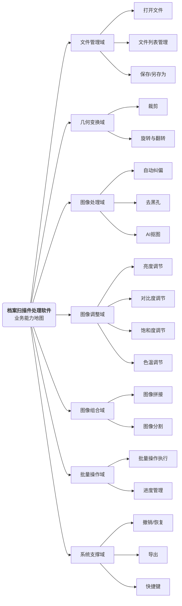
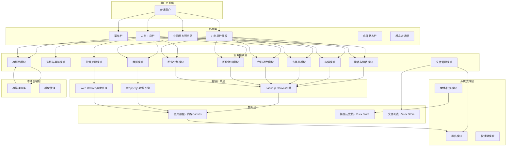

# 业务需求与业务架构文档（档案扫描件处理软件）

## 文档说明

本文档为档案扫描件处理软件的业务需求与业务架构设计文档，适用于**本地Web端图片处理工具**类型产品。本产品为纯本地运行的工具型应用，聚焦图片处理核心功能，以浏览器为载体、本地轻量后端为支撑，实现图片的查看、编辑、处理与导出。

---

### 一、文档基础信息

| 项目名称 | 档案扫描件处理软件 | 文档版本 | V1.0 |
| -------- | ------------------ | -------- | ---- |
| 编写人 | <br /> | 编写日期 | <br /> |
| 评审人 | <br /> | 评审日期 | <br /> |
| 归档日期 | <br /> | 归档编号 | <br /> |
| 业务领域 | 图像处理 / 档案管理 | 文档状态 | □ 草稿 □ 评审中 □ 已归档 □ 已废弃 |
| 平台类型 | □ 业务服务平台 □ 单位数字化平台 ☑ 本地工具型应用 | | |

---

### 二、业务背景与价值

#### 2.1 需求来源

□ 政策驱动

☑ 内部痛点（详细说明：日常工作中涉及大量扫描件、文档图片的处理需求，现有方案要么依赖专业PS软件（学习成本高、安装部署重），要么使用在线工具（存在隐私泄露风险、大文件上传慢），缺少一款轻量、本地化、专注图片处理的工具）

☑ 外部驱动（详细说明：档案数字化、无纸化办公趋势加速，扫描件处理需求持续增长；同时隐私保护意识增强，用户更倾向本地处理而非上传云端）

□ 战略落地

□ 其他

#### 2.2 行业/单位现状与痛点分析

1. 现状分析：档案数字化进程加速，各企事业单位均产生大量扫描件图片需要二次处理（纠偏、去黑边、裁剪、拼接等），但现有工具无法兼顾"轻量易用"和"功能专业"两个维度。

2. 现有痛点：
   - 流程痛点：使用专业PS软件处理简单图片操作（如旋转、裁剪）需要启动重量级应用，流程繁琐；使用在线工具需上传下载，效率低下
   - 数据痛点：扫描件、证件等敏感图片上传至在线工具有隐私泄露风险，无法满足数据安全合规要求
   - 协同痛点：批量处理场景下，需逐张操作，缺乏批量执行能力，重复劳动量大
   - 管理痛点：处理后的图片散落各处，缺乏统一的文件管理和导出规范

#### 2.3 核心业务价值（量化）

1. 效率价值：常规图片处理操作（旋转、裁剪、调色等）时效提升80%以上；批量处理场景下减少人工重复操作90%以上

2. 管理价值：本地化处理确保图片数据100%不离开本机，满足隐私安全合规要求

3. 协同价值：统一的处理工具和导出规范，确保产出图片格式、质量一致性

---

### 三、产品定义

明确产品研发背景、服务对象、核心业务及目标，定位清晰：

1. 研发背景：档案数字化及日常办公场景中，扫描件/文档图片处理需求频繁，但现有工具要么过于专业（PS）要么存在隐私风险（在线工具），亟需一款轻量、本地化、专注图片处理的工具型应用

2. 服务对象：需要处理扫描件/文档图片的办公人员，包括但不限于档案管理员、行政人员、人事专员等，无角色区分，打开即用

3. 核心业务：图片的查看、编辑与处理，包括裁剪、旋转、纠偏、去黑孔、AI抠图、亮度/对比度调节、图像拼接、图像分割、批量处理、导出等核心功能

4. 核心目标：
   - 业务目标：实现图片处理全流程本地化闭环，覆盖日常90%以上的图片处理需求
   - 管理目标：统一图片处理工具标准，规范处理流程与输出质量
   - 协同目标：批量处理能力减少重复劳动，提升团队整体效率
   - 技术目标：建立轻量本地前端+AI推理后端的可扩展架构，前端基于Canvas实现图片处理，后端专注AI模型推理

---

### 四、产品边界

明确产品与内部其他系统、外部第三方的对接范围及方式，界定功能边界：

| 对接类型 | 对接对象 | 对接形式及内容 |
| -------- | -------- | -------------- |
| 本地后端 | AI推理服务 | HTTP API调用，提供AI抠图推理能力，模型本地部署 |
| 本地文件系统 | 用户磁盘 | 浏览器File API / 后端代理，实现文件打开与保存 |
| 内部组件 | Fabric.js | 前端Canvas渲染与交互引擎 |
| 内部组件 | Cropper.js | 前端裁剪交互组件 |

**功能边界说明：**

- 本产品为图片处理工具，不涉及图片拍摄、扫描等功能
- 不涉及用户账号体系、权限管理、云存储等功能
- 不涉及在线协作、多人编辑等功能
- AI能力仅限于抠图推理，不涉及图像生成、风格迁移等AIGC功能

---

### 五、核心模块划分

说明：本产品为本地工具型应用，按功能域划分模块，聚焦图片处理全流程。

#### 5.1 模块划分总览

| 模块域 | 模块名称 | 核心功能概述 | 优先级 |
| ------ | -------- | ------------ | ------ |
| 文件管理 | 文件管理模块 | 图片文件的打开、保存、导出、文件列表管理 | P0 |
| 基础操作 | 选择与导航模块 | 选择工具、移动画布、缩放查看 | P0 |
| 几何变换 | 裁剪模块 | 自由裁剪、固定比例裁剪、固定尺寸裁剪 | P0 |
| 几何变换 | 旋转与翻转模块 | 左旋/右旋90°、任意角度旋转、水平/垂直翻转 | P0 |
| 图像处理 | 纠偏模块 | 自动检测倾斜角度并纠偏、灵敏度调节、手动微调 | P0 |
| 图像处理 | 去黑孔模块 | 自动去黑边、自动去装订孔、灵敏度调节、手动框选 | P0 |
| 图像处理 | AI抠图模块 | 智能前景/背景分离、边缘羽化、边缘平滑、背景替换 | P1 |
| 图像调整 | 色彩调整模块 | 亮度、对比度、饱和度、色温调节 | P0 |
| 图像组合 | 图像拼接模块 | 水平/垂直拼接、间距设置、对齐方式 | P1 |
| 图像组合 | 图像分割模块 | 水平/垂直分割、等分/自定义比例 | P1 |
| 批量操作 | 批量处理模块 | 多文件批量执行同一操作序列、进度管理 | P1 |
| 系统支撑 | 撤销/恢复模块 | 操作历史的撤销与恢复，会话内有效 | P0 |
| 系统支撑 | 导出模块 | 多格式导出（JPG/PNG/PDF）、质量控制、命名规则 | P0 |
| 系统支撑 | 快捷键模块 | 全局快捷键管理、自定义快捷键 | P2 |

#### 5.2 模块详细说明

**模块1：文件管理模块**

- 模块定位：产品的入口与出口，管理图片文件从打开到保存的完整生命周期
- 核心功能：
  - 功能1：拖拽或点击打开图片文件，支持JPG、PNG、BMP、TIFF、WebP格式，单文件最大50MB
  - 功能2：文件列表管理，支持多文件打开与切换，显示缩略图、文件名、尺寸、大小
  - 功能3：保存当前编辑结果
  - 功能4：另存为指定格式和路径
- 使用角色：所有用户（无角色区分）
- 数据产出：文件列表数据、当前编辑文件索引

**模块2：选择与导航模块**

- 模块定位：基础交互模块，为其他工具提供选择与画布导航能力
- 核心功能：
  - 功能1：选择工具，用于点击选中图片元素
  - 功能2：移动画布工具，拖拽平移画布视图
  - 功能3：缩放查看（放大、缩小、适应窗口、实际大小100%）
- 使用角色：所有用户
- 数据产出：当前缩放比例、视口偏移量

**模块3：裁剪模块**

- 模块定位：图片几何变换的核心模块，裁剪掉图片中不需要的区域
- 核心功能：
  - 功能1：自由裁剪，拖拽框选裁剪区域
  - 功能2：固定比例裁剪（1:1、4:3、16:9、3:2、2:3）
  - 功能3：固定尺寸裁剪，输入目标宽高像素值
  - 功能4：裁剪区域参数精确输入（X、Y、宽度、高度）
- 使用角色：所有用户
- 数据产出：裁剪区域坐标参数、裁剪后图片

**模块4：旋转与翻转模块**

- 模块定位：图片几何变换模块，调整图片方向
- 核心功能：
  - 功能1：左旋90°快捷操作
  - 功能2：右旋90°快捷操作
  - 功能3：任意角度旋转（-360°~360°），带角度指示器可视化
  - 功能4：水平翻转
  - 功能5：垂直翻转
- 使用角色：所有用户
- 数据产出：旋转角度、翻转状态

**模块5：纠偏模块**

- 模块定位：扫描件特有处理模块，自动检测并纠正图片倾斜
- 核心功能：
  - 功能1：基于传统图像算法（霍夫变换）自动检测倾斜角度
  - 功能2：灵敏度调节滑块，控制检测精度
  - 功能3：手动微调角度（精度0.1°）
  - 功能4：一键应用纠偏
- 使用角色：所有用户
- 数据产出：检测角度、纠正后角度、灵敏度参数

**模块6：去黑孔模块**

- 模块定位：扫描件特有处理模块，去除扫描产生的黑边和装订孔
- 核心功能：
  - 功能1：自动去黑边，检测并填充图片边缘黑色区域
  - 功能2：自动去装订孔，检测并填充装订孔洞
  - 功能3：灵敏度调节
  - 功能4：填充颜色设置（默认白色）
  - 功能5：手动框选区域进行去黑孔处理
  - 功能6：预览与应用
- 使用角色：所有用户
- 数据产出：去黑边/去装订孔开关状态、灵敏度、填充颜色

**模块7：AI抠图模块**

- 模块定位：基于AI推理的智能抠图模块，实现前景与背景分离
- 核心功能：
  - 功能1：自动识别模式，AI模型自动检测前景轮廓
  - 功能2：手动框选模式，框定抠图区域后AI处理
  - 功能3：边缘羽化调节（0~20）
  - 功能4：边缘平滑调节（0~100）
  - 功能5：背景颜色替换
  - 功能6：背景透明（输出PNG透明背景）
  - 功能7：预览与应用
- 使用角色：所有用户
- 数据产出：抠图模式、边缘参数、背景设置

**模块8：色彩调整模块**

- 模块定位：图片色彩与明暗调节模块
- 核心功能：
  - 功能1：亮度调节（-100~100）
  - 功能2：对比度调节（-100~100）
  - 功能3：饱和度调节（-100~100）
  - 功能4：色温调节（-100~100）
  - 功能5：一键重置所有参数
- 使用角色：所有用户
- 数据产出：亮度、对比度、饱和度、色温参数值

**模块9：图像拼接模块**

- 模块定位：多图组合模块，将多张图片拼接为一张
- 核心功能：
  - 功能1：水平拼接，图片从左到右排列
  - 功能2：垂直拼接，图片从上到下排列
  - 功能3：间距设置
  - 功能4：对齐方式（顶部/居中/底部对齐，或左侧/居中/右侧对齐）
  - 功能5：待拼接图片选择与排序
- 使用角色：所有用户
- 数据产出：拼接方向、间距、对齐方式、图片排列顺序

**模块10：图像分割模块**

- 模块定位：单图拆分模块，将一张图片分割为多部分
- 核心功能：
  - 功能1：水平分割，沿水平方向切割
  - 功能2：垂直分割，沿垂直方向切割
  - 功能3：分割数量设置（2~10）
  - 功能4：等分模式，均匀切割
  - 功能5：自定义比例模式，按指定比例切割
  - 功能6：分割预览
- 使用角色：所有用户
- 数据产出：分割方向、数量、模式、比例参数

**模块11：批量处理模块**

- 模块定位：效率提升模块，对多张图片批量执行同一操作序列
- 核心功能：
  - 功能1：选择处理操作（裁剪、旋转、调色、去黑孔、纠偏等，可多选组合）
  - 功能2：待处理文件选择（勾选/全选）
  - 功能3：处理进度显示与取消
  - 功能4：批量处理结果汇总
- 使用角色：所有用户
- 数据产出：操作序列、处理进度、结果状态

**模块12：撤销/恢复模块**

- 模块定位：系统支撑模块，提供操作回退能力
- 核心功能：
  - 功能1：撤销上一步操作（Ctrl+Z）
  - 功能2：恢复已撤销的操作（Ctrl+Y）
  - 功能3：操作历史列表展示（最多保留20步）
  - 功能4：历史记录仅当前会话有效，关闭应用即清空
- 使用角色：所有用户
- 数据产出：操作历史栈、当前历史指针位置

**模块13：导出模块**

- 模块定位：产出输出模块，将处理结果导出为指定格式
- 核心功能：
  - 功能1：导出格式选择（JPG、PNG、PDF）
  - 功能2：输出质量控制（1%~100%，JPG格式）
  - 功能3：保存位置选择
  - 功能4：文件命名规则（保持原名、自动编号、自定义前缀）
- 使用角色：所有用户
- 数据产出：导出格式、质量、路径、命名规则

**模块14：快捷键模块**

- 模块定位：效率辅助模块，提供键盘快捷操作能力
- 核心功能：
  - 功能1：全局快捷键映射（文件操作、编辑操作、工具切换）
  - 功能2：快捷键查看与帮助
  - 功能3：恢复默认快捷键
- 使用角色：所有用户
- 数据产出：快捷键映射表

---

### 六、用户角色清单

| 用户角色 | 角色描述 | 所属部门 | 核心工作职责 | 权限范围 |
| -------- | -------- | -------- | ------------ | -------- |
| 普通用户 | 需要处理图片的办公人员 | 不限 | 打开图片、执行图片处理操作、导出结果 | 全部功能，无权限限制 |

> 说明：本产品为本地工具型应用，无需登录，无角色区分，所有用户拥有全部功能权限。

---

### 七、业务场景分析

梳理产品支撑的业务场景及核心业务能力：



#### 7.1 核心业务场景清单

场景1：扫描件纠偏处理（角色：普通用户，核心动作：打开扫描件→自动检测倾斜角度→应用纠偏→导出，预期结果：倾斜的扫描件被自动校正为水平方向）

场景2：扫描件去黑边/装订孔（角色：普通用户，核心动作：打开扫描件→开启自动去黑边/去装订孔→调整灵敏度→应用→导出，预期结果：扫描件边缘黑边和装订孔被去除并填充为指定颜色）

场景3：图片裁剪（角色：普通用户，核心动作：打开图片→选择裁剪工具→框选裁剪区域/输入裁剪参数→应用裁剪，预期结果：图片被裁剪为指定区域）

场景4：证件照/图片抠图（角色：普通用户，核心动作：打开图片→选择AI抠图→自动识别前景→调整边缘参数→选择背景→应用抠图，预期结果：前景被分离，背景替换为指定颜色或透明）

场景5：多图拼接（角色：普通用户，核心动作：打开多张图片→选择拼接工具→选择方向/间距/对齐→执行拼接，预期结果：多张图片被拼接为一张完整图片）

场景6：图片分割（角色：普通用户，核心动作：打开图片→选择分割工具→设置方向/数量/模式→执行分割，预期结果：图片被分割为指定数量的子图）

场景7：批量处理扫描件（角色：普通用户，核心动作：打开多张扫描件→选择批量处理→勾选操作（纠偏+去黑孔+裁剪）→开始处理→等待完成→批量导出，预期结果：多张扫描件统一执行相同操作序列）

场景8：图片色彩调整（角色：普通用户，核心动作：打开图片→选择亮度/对比度工具→调节参数→预览效果→应用，预期结果：图片明暗、色彩达到预期效果）

#### 7.2 核心业务流程清单

流程1：单图处理流程

```
节点1：打开图片文件（拖拽/点击/文件列表选择）
节点2：在画布中查看与浏览图片
节点3：选择工具执行图片处理操作（裁剪/旋转/纠偏/去黑孔/抠图/调色等）
节点4：预览处理效果，不满意则撤销重做
节点5：确认处理结果，导出为指定格式
```

流程2：批量处理流程

```
节点1：打开多张图片文件
节点2：选择批量处理功能
节点3：勾选需要执行的操作序列（裁剪/旋转/调色/去黑孔/纠偏等）
节点4：选择待处理的文件范围
节点5：开始批量处理，监控进度
节点6：处理完成后逐张检查或批量导出
```

流程3：图像拼接流程

```
节点1：打开需要拼接的多张图片
节点2：选择图像拼接工具
节点3：选择待拼接图片并调整顺序
节点4：设置拼接方向（水平/垂直）、间距、对齐方式
节点5：执行拼接，预览结果
节点6：确认后导出
```

流程4：图像分割流程

```
节点1：打开需要分割的图片
节点2：选择图像分割工具
节点3：设置分割方向（水平/垂直）、数量、模式（等分/自定义）
节点4：查看分割预览
节点5：执行分割
节点6：导出分割后的子图
```

---

### 八、数据业务化需求

本产品为本地工具型应用，数据业务化核心目标：确保图片处理过程中的操作可追溯、可回退，支持操作参数的复用与批量执行，保障本地数据安全。

| 角色 | 具体数据业务化需求 |
| ---- | ------------------ |
| 普通用户 | 1. 操作历史记录可追溯，支持撤销/恢复任意步骤；2. 批量处理时操作参数可复用，避免重复配置；3. 图片元信息（尺寸、DPI、格式、文件大小）实时展示 |
| 批量处理 | 1. 处理进度实时可监控；2. 处理结果（成功/失败/跳过）可汇总展示；3. 失败项支持查看原因与重试 |

---

### 九、业务架构图

绘制包含各模块、用户角色、业务流程、数据流转的架构图：



---

### 十、约束与依赖

#### 10.1 平台专属约束

1. 本地工具型应用约束：纯本地运行，无需网络连接（AI抠图功能除外，依赖本地后端服务）；图片数据不离开本机，确保隐私安全；无需用户账号体系，打开即用。

#### 10.2 核心约束与依赖

1. 浏览器约束：需运行在支持Canvas 2D、File API、Web Worker的现代浏览器（Chrome 90+、Edge 90+、Firefox 90+）；单张图片最大50MB，受浏览器内存限制，超大图片处理可能出现性能瓶颈

2. 系统依赖：AI抠图功能依赖本地后端推理服务，需先启动后端服务方可使用；前端基于Vue 2 + Fabric.js + Cropper.js构建，依赖这些库的能力边界

3. 格式约束：支持输入格式为JPG、PNG、BMP、TIFF、WebP；导出格式为JPG、PNG、PDF

4. 性能约束：操作历史栈上限20步，超出后自动丢弃最早的记录；批量处理采用Web Worker异步执行，避免阻塞UI线程

---

### 十一、风险与初步应对

| 风险类型 | 风险描述 | 初步应对思路 | 风险责任人 | 备注 |
| -------- | -------- | ------------ | ---------- | ---- |
| 技术风险 | 大尺寸图片（>50MB或>10000px）处理时浏览器内存溢出 | 1. 设置文件大小上限提示；2. 大图分块处理；3. Web Worker分担计算压力 | 前端开发 | 无 |
| 技术风险 | AI抠图模型推理速度慢，影响用户体验 | 1. 模型轻量化优化；2. 推理过程展示进度；3. 提供预览模式快速查看 | 后端开发 | 无 |
| 业务风险 | 纠偏算法检测精度不足，特殊文档（纯色、低对比度）无法准确检测 | 1. 提供手动微调能力；2. 灵敏度参数可调；3. 算法持续优化 | 前端开发 | 无 |
| 实施风险 | 本地后端服务的部署与启动增加用户使用门槛 | 1. 提供一键启动脚本；2. 前端检测后端状态并友好提示；3. AI功能标记为可选 | 全栈开发 | 无 |
| 安全风险 | 本地存储的临时图片数据可能被其他程序读取 | 1. 处理完成后及时清理临时数据；2. 图片仅存于内存，不写入磁盘临时文件 | 前端开发 | 无 |

---

### 十二、相关参考文档

1. 过往同类项目文档：无

2. 政策法规/行业规范：《中华人民共和国档案法》关于档案数字化的相关要求；《个人信息保护法》关于个人敏感信息处理的规定

3. 技术参考文档：
   - Fabric.js 官方文档：http://fabricjs.com/
   - Cropper.js 官方文档：https://fengyuanchen.github.io/cropperjs/
   - Vue 2 官方文档：https://v2.cn.vuejs.org/
   - ONNX Runtime Web 文档（AI模型前端推理备选方案）

4. 原型参考：design/02PRD文档/页面原型/001-原型.png

---

### 十三、评审意见与修改记录

| 评审轮次 | 评审问题 | 修改方案 | 修改人 | 修改日期 | 修改说明 |
| -------- | -------- | -------- | ------ | -------- | -------- |
| | | | | | |
