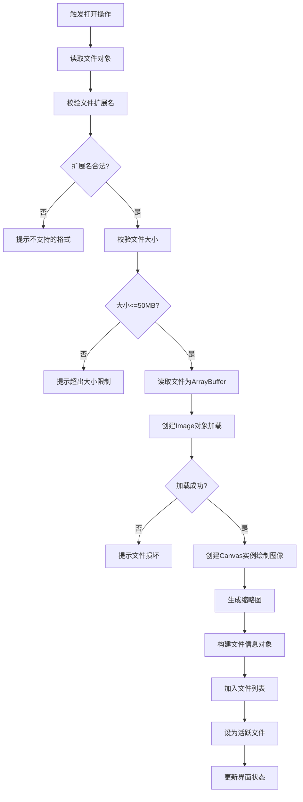
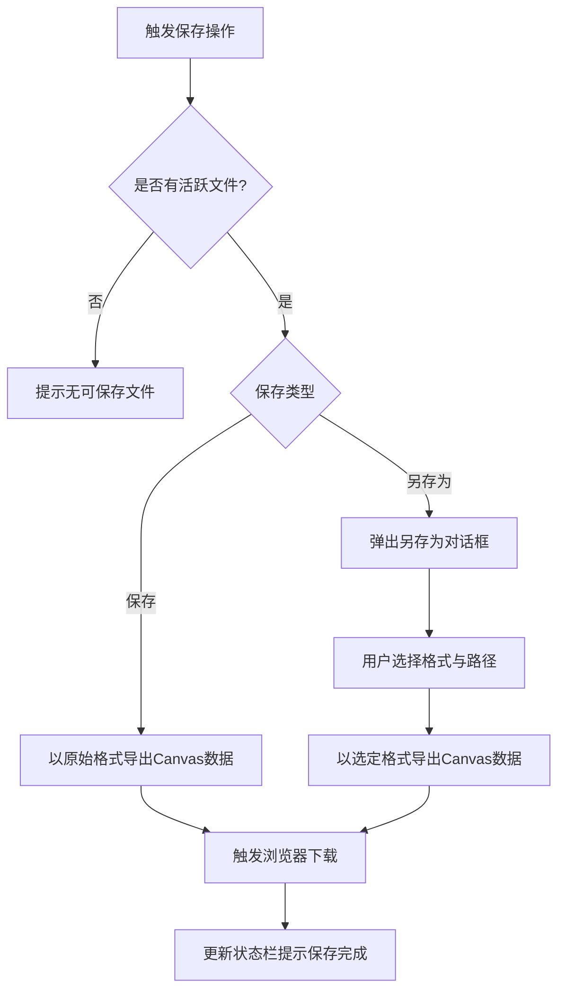
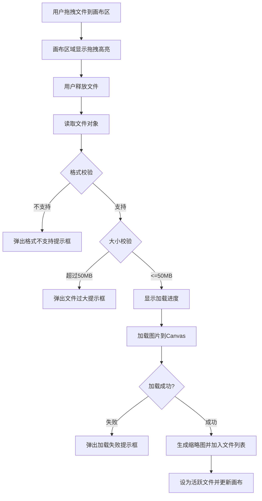

# 档案扫描件处理软件 PRD分册-F001-文件管理模块需求规格说明书

| 文档编号 | PRD-ARCHSCAN-F001-V1.0 | 文档版本 | V1.0 |
| :--- | :--------------------- | :--- | :------- |
| 所属总册 | PRD-ARCHSCAN-V1.0 档案扫描件处理软件产品需求规格说明书 | 编写人 | / |
| 编写日期 | / | 评审人 | 待定 |
| 评审日期 | 待定 | 归档日期 | 待定 |
| 文档状态 | □ 草稿 □ 评审中 □ 已归档 □ 已废弃 | 模块编号 | M001 |

***

## 修订记录

| 版本号 | 修订日期 | 修订人 | 修订内容 | 审核人 |
| :--- | :---- | :---- | :--- | :---- |
| V1.0 | / | / | 首次发布 | 待定 |

***

## 目录

1. [模块概述](#1-模块概述)
2. [业务流程](#2-业务流程)
3. [功能需求与页面设计](#3-功能需求与页面设计)
4. [异常处理](#4-异常处理)
5. [附录](#5-附录)

***

## 1. 模块概述

### 1.1 模块说明

文件管理模块（M001）是产品的入口与出口，管理图片文件从打开到保存的完整生命周期。该模块承载用户与本地文件系统交互的全部能力，包括文件的打开加载、列表管理、编辑保存和另存导出四项核心功能。

**核心业务价值**：
- 提供拖拽/点击多方式打开图片，降低文件加载门槛
- 多文件列表管理，支持批量场景下的文件切换与浏览
- 保存与另存为能力，确保编辑结果的持久化

### 1.2 用户角色与权限

本产品为纯本地运行工具，无需登录，无角色区分。所有用户拥有全部功能权限。

### 1.3 与其他模块的关系

| 关联模块 | 关联关系说明 | 数据流向 |
| :----- | :----- | :------------- |
| M002 选择与导航模块 | 选择与导航需先加载图片文件 | 输出（提供文件上下文） |
| M011 批量处理模块 | 批量处理需先打开多张图片文件 | 输出（提供文件列表） |
| M013 导出模块 | 导出需先有已加载的图片文件 | 输出（提供当前编辑数据） |

***

## 2. 业务流程

### 2.1 文件打开流程

### 2.2 保存与另存为流程

***

## 3. 功能需求与页面设计

### 3.1 功能清单

| 功能编号 | 功能名称 | 功能说明 | 优先级 |
| :--------- | :---- | :---- | :---- |
| F001-01 | 打开图片文件 | 拖拽或点击打开图片文件，支持JPG/JPEG/PNG | 高 |
| F001-02 | 文件列表管理 | 多文件打开与切换，显示缩略图、文件名、尺寸、大小 | 高 |
| F001-03 | 保存当前编辑 | 以原始格式保存当前编辑结果到本地 | 高 |
| F001-04 | 另存为 | 以指定格式和路径保存当前编辑结果 | 高 |

### 3.2 F001-01 打开图片文件

#### 3.2.1 功能详情

| 需求编号 | F001-01 |
| :--- | :---------------------------------------------- |
| 功能概述 | 支持用户通过拖拽或点击方式打开图片文件 |
| 业务描述 | 用户启动应用后，可通过将图片文件拖拽到画布区域，或点击打开按钮/菜单项/快捷键，选择本地图片文件加载到应用中进行编辑 |
| 需求描述 | 1. 支持拖拽文件到画布预览区打开 2. 支持点击工具栏打开按钮弹出系统文件对话框 3. 支持菜单栏"文件>打开"打开文件 4. 支持快捷键Ctrl+O打开文件 5. 支持的文件格式：JPG、JPEG、PNG 6. 单文件最大50MB，超出提示拒绝加载 7. 文件加载期间显示加载状态 |
| 行为者 | 普通用户 |
| 前置条件 | 应用已启动 |
| 后置条件 | 文件加载成功，加入文件列表，画布显示图片，状态栏更新文件计数 |
| 界面描述 | 画布预览区空状态时显示虚线框拖拽引导区域（含上传图标、提示文字、打开按钮）；工具栏含打开按钮图标 |
| 业务规则 | 1. 输入格式限定为ENUM-001所列格式 2. 单文件大小上限50MB 3. 图片数据仅存于浏览器内存Canvas 4. 支持同时打开多个文件 5. 文件加载失败时弹出错误提示且不加入列表 6. 格式校验不区分大小写 |
| 异常流程 | 1. 格式不支持：弹出提示框，文件不加入列表 2. 文件超限：弹出提示框拒绝加载 3. 文件损坏：弹出提示框，释放已分配内存 4. 内存不足：弹出提示，建议关闭部分文件重试 |
| 验收标准 | 1. 给定应用已启动，当用户拖拽一张2MB的JPG文件到画布区域，则文件成功加载，画布显示图片，文件列表新增记录 2. 给定应用已启动，当用户尝试打开60MB文件，则弹出提示并拒绝加载 3. 给定应用已启动，当用户尝试打开SVG文件，则弹出格式不支持提示 |

#### 3.2.2 页面设计

**页面类型**：工具面板页（嵌入画布预览区空状态）

如原型图所示：design/02PRD文档/页面原型/001-原型.png

##### 3.2.2.1 交互流程

### 3.3 F001-02 文件列表管理

#### 3.3.1 功能详情

| 需求编号 | F001-02 |
| :--- | :---------------------------------------------- |
| 功能概述 | 管理已打开的多文件，支持切换浏览和信息展示 |
| 业务描述 | 用户打开多个文件后，通过文件列表面板查看所有已打开文件的缩略图、文件名、尺寸和大小，可点击切换当前编辑的活跃文件，也可关闭不需要的文件 |
| 需求描述 | 1. 文件列表按打开顺序排列显示 2. 每项显示缩略图(48x48px)、文件名、尺寸、大小 3. 活跃文件高亮显示（左侧主色竖条） 4. 点击某项切换为活跃文件 5. 悬停显示关闭按钮，点击关闭文件 6. 支持快捷键Ctrl+Tab/Ctrl+Shift+Tab切换 7. 文件数更新状态栏显示"n/m" |
| 行为者 | 普通用户 |
| 前置条件 | 至少已打开一个文件 |
| 后置条件 | 活跃文件切换，画布与属性面板同步更新 |
| 界面描述 | 可折叠面板，宽度220px，位于工具栏左侧或底部，面板标题"文件列表"含折叠按钮 |
| 业务规则 | 1. 活跃文件在列表中高亮显示 2. 切换文件时画布、属性面板、工具状态同步切换 3. 关闭活跃文件时自动激活相邻文件 4. 关闭最后一个文件时清空列表，恢复空状态引导 5. 每个文件维护独立操作历史栈（上限20步） 6. 缩略图实时反映当前编辑状态 |
| 异常流程 | 1. 快速连续切换文件：每次切换完成后再响应下一次 2. 同时关闭多个文件：逐个处理 |
| 验收标准 | 1. 给定文件列表有3个文件，当用户点击第3个文件项，则活跃文件切换为第3个，状态栏显示"3/3" 2. 给定文件列表有3个文件，当用户关闭第2个文件，则列表更新为2个文件 |

### 3.4 F001-03 保存当前编辑

#### 3.4.1 功能详情

| 需求编号 | F001-03 |
| :--- | :---------------------------------------------- |
| 功能概述 | 将当前编辑结果以原始格式保存到本地 |
| 业务描述 | 用户完成图片编辑后，可通过保存功能将当前画布内容持久化到本地磁盘 |
| 需求描述 | 1. 保存格式与原文件格式一致 2. 文件名规则：原文件名_编辑.扩展名 3. 支持快捷键Ctrl+S 4. 保存后编辑状态和操作历史栈不变 |
| 行为者 | 普通用户 |
| 前置条件 | 至少有一个活跃文件 |
| 后置条件 | 浏览器触发文件下载到本地 |
| 界面描述 | 工具栏保存按钮图标+菜单栏"文件>保存"+快捷键Ctrl+S |
| 业务规则 | 1. 保存格式与原文件格式一致 2. 保存的文件名为"原文件名_编辑" 3. 不支持自动保存 4. 保存操作不影响操作历史栈 |
| 验收标准 | 1. 给定已打开scan001.jpg并做了裁剪，当用户按Ctrl+S，则下载scan001_编辑.jpg包含裁剪结果 2. 给定已打开photo.png，当用户点击保存，则下载photo_编辑.png |

### 3.5 F001-04 另存为

#### 3.5.1 功能详情

| 需求编号 | F001-04 |
| :--- | :---------------------------------------------- |
| 功能概述 | 以用户指定的格式和参数保存当前编辑结果 |
| 业务描述 | 用户完成编辑后，可通过另存为选择不同的导出格式（JPG/PNG/PDF），并可设置JPG质量参数 |
| 需求描述 | 1. 可选格式：JPG、PNG、PDF（ENUM-002） 2. JPG格式提供质量滑块（1-100，默认85） 3. 默认格式与原文件格式一致 4. 文件名可修改 5. 快捷键Ctrl+Shift+S |
| 行为者 | 普通用户 |
| 前置条件 | 至少有一个活跃文件 |
| 后置条件 | 浏览器以指定格式触发文件下载 |
| 界面描述 | 模态对话框：400px宽，含文件名输入框、格式下拉选择框、JPG质量滑块、确认/取消按钮 |
| 业务规则 | 1. 格式选择JPG时显示质量滑块，PNG/PDF时隐藏 2. 选择PDF时触发导出模块流程 3. 默认文件名"原文件名_编辑" 4. 文件名为空时确认按钮置灰 |
| 验收标准 | 1. 给定已打开scan001.jpg，当用户另存为选择PNG格式，则下载scan001_编辑.png 2. 给定已打开图片，当用户另存为选择JPG质量90，则下载的JPG图片按90%质量压缩 |

***

## 4. 异常处理

### 4.1 异常场景清单

| 异常编号 | 异常场景 | 异常描述 | 处理方式 |
| :--- | :----- | :---- | :--------------- |
| E001 | 不支持的文件格式 | 用户打开的文件扩展名不在允许范围内 | 弹出提示"不支持的文件格式，仅支持JPG、JPEG、PNG格式" |
| E002 | 文件超过大小限制 | 文件大小超过50MB | 弹出提示"文件大小超过50MB限制，无法加载" |
| E003 | 文件损坏 | Image对象加载失败(onerror) | 弹出提示"文件加载失败，文件可能已损坏或格式异常" |
| E004 | 文件读取失败 | FileReader读取错误 | 弹出提示"文件读取失败，请检查文件是否可访问" |
| E005 | 内存不足 | 加载大尺寸图片时浏览器内存溢出 | 弹出提示"内存不足，请尝试关闭部分已打开文件后重试" |
| E006 | Canvas导出失败 | Canvas.toBlob抛出异常 | 弹出提示"保存失败，请重试" |
| E007 | 无活跃文件时保存 | 用户在无文件状态下触发保存 | 弹出提示"当前没有可保存的文件" |

### 4.2 边界场景处理

| 场景 | 预期行为 |
| :----- | :-------- |
| 打开正好50MB的文件 | 正常加载，不触发超限提示 |
| 文件扩展名为.jpg但实际内容为PNG | 以实际内容加载 |
| 文件名为大写.JPG | 正常加载，格式校验不区分大小写 |
| 同时拖入多个文件 | 逐个校验并加载 |
| 打开0字节文件 | 加载失败，触发文件损坏提示 |
| 保存时文件名为空 | 确认按钮置灰，不允许提交 |

***

## 5. 附录

### 5.1 枚举值引用清单

| 本模块使用场景 | 枚举编号 | 枚举名称 | 说明 |
| :------ | :---------- | :----- | :---- |
| 打开文件格式校验 | ENUM-001 | 输入文件格式 | jpg/jpeg/png |
| 另存为格式选项 | ENUM-002 | 导出文件格式 | jpg/png/pdf |

### 5.2 名词解释

| 名词 | 说明 |
| :----- | :---- |
| 活跃文件 | 当前在画布预览区显示并处于编辑状态的文件，同一时刻只有一个 |
| 文件列表 | 应用中已打开的所有文件的有序集合 |
| 缩略图 | 文件列表中展示的缩小版预览图，48x48px |
| 原格式保存 | 保存时保持与输入文件相同的格式 |

### 5.3 相关参考文档

| 文档名称 | 文档路径 | 备注 |
| :----------- | :------ | :------ |
| PRD总册-档案扫描件处理软件 | design/02PRD文档/PRD总册-产品需求规格说明书.md | 所属总册 |

***

## V2版本新增与优化说明

| 版本 | 核心改进 |
| :- | :------------------ |
| V1 | 首次发布 |
