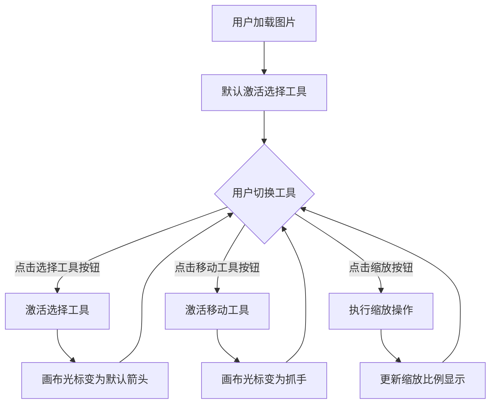
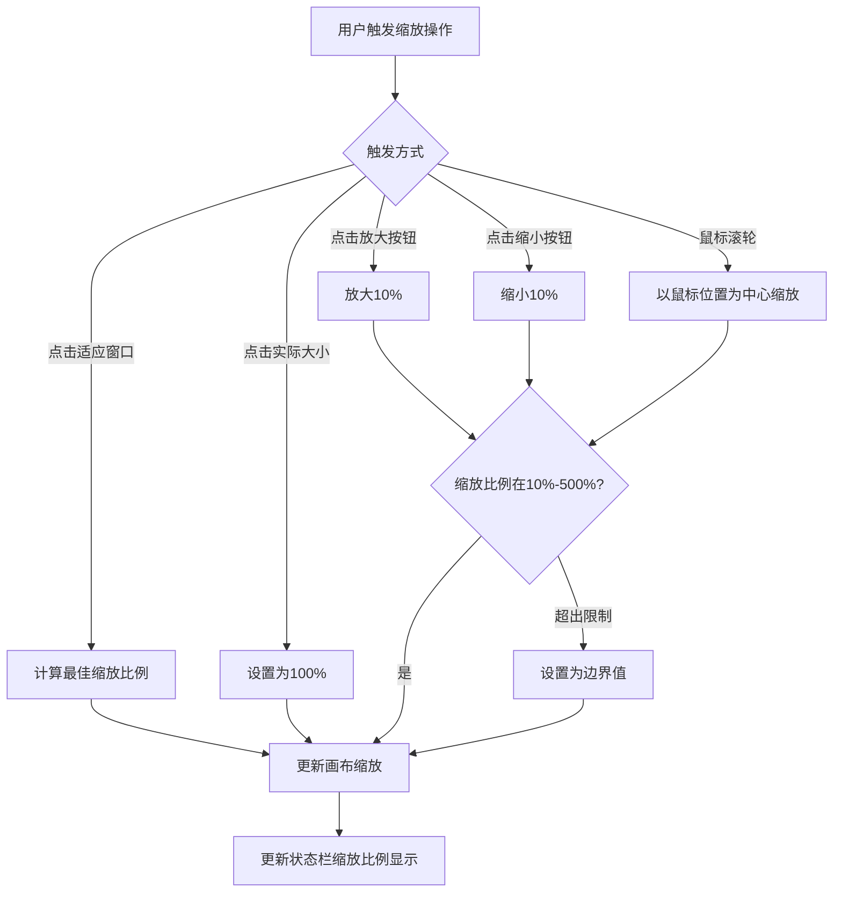
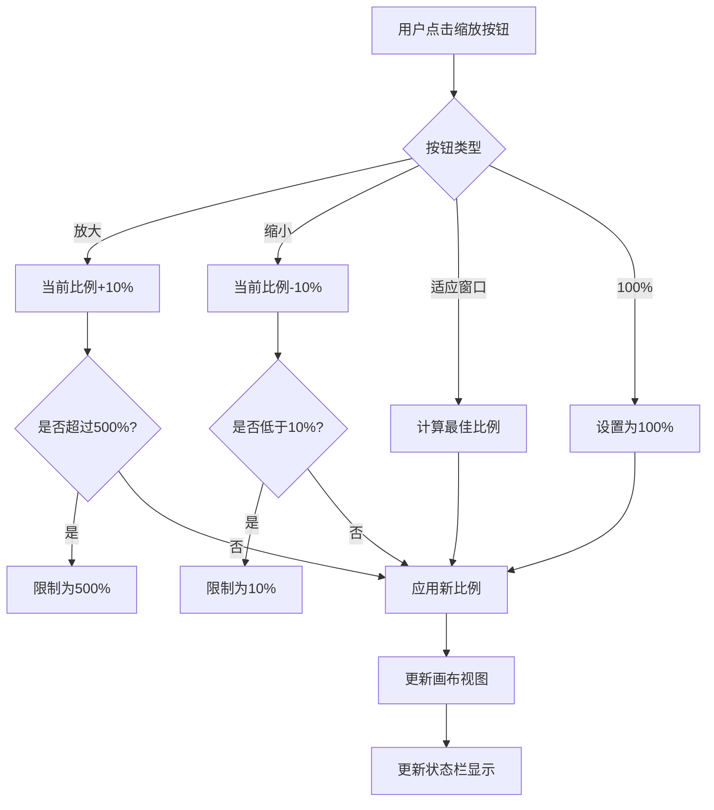

# 档案扫描件处理软件 PRD分册-F002-选择与导航模块需求规格说明书

| 文档编号 | PRD-ARCHSCAN-F002-V1.0 | 文档版本 | V1.0 |
| :--- | :--------------------- | :--- | :------- |
| 所属总册 | PRD-ARCHSCAN-V1.0 档案扫描件处理软件产品需求规格说明书 | 编写人 | / |
| 编写日期 | / | 评审人 | 待定 |
| 评审日期 | 待定 | 归档日期 | 待定 |
| 文档状态 | □ 草稿 □ 评审中 □ 已归档 □ 已废弃 | 模块编号 | M002 |

***

## 修订记录

| 版本号 | 修订日期 | 修订人 | 修订内容 | 审核人 |
| :--- | :---- | :---- | :--- | :---- |
| V1.0 | / | / | 首次发布 | 待定 |

***

## 目录

1. [模块概述](#1-模块概述)
2. [业务流程](#2-业务流程)
3. [功能需求与页面设计](#3-功能需求与页面设计)
4. [异常处理](#4-异常处理)
5. [附录](#5-附录)

***

## 1. 模块概述

### 1.1 模块说明

选择与导航模块（M002）是产品的基础交互模块，为其他工具提供选择与画布导航能力。用户在加载图片后，通过本模块实现选中图片元素、平移画布视图、缩放查看等基础操作。

**核心业务价值**：
- 提供选择工具用于点击选中图片元素，为后续编辑操作提供目标
- 提供移动画布工具，支持大图平移浏览
- 提供缩放控制，支持放大查看细节、缩小概览全貌

### 1.2 用户角色与权限

本产品为纯本地运行工具，无需登录，无角色区分。所有用户拥有全部功能权限。

### 1.3 与其他模块的关系

| 关联模块 | 关联关系说明 | 数据流向 |
| :----- | :----- | :------------- |
| M001 文件管理模块 | 需先加载图片文件后才能操作 | 输入（接收文件上下文） |
| M003 裁剪模块 | 裁剪区域框选依赖画布交互 | 输出（提供画布坐标系） |
| M004 旋转与翻转模块 | 旋转操作依赖画布渲染 | 输出（提供画布渲染上下文） |

***

## 2. 业务流程

### 2.1 工具切换流程

### 2.2 画布缩放流程

***

## 3. 功能需求与页面设计

### 3.1 功能清单

| 功能编号 | 功能名称 | 功能说明 | 优先级 |
| :--------- | :---- | :---- | :---- |
| F002-01 | 选择工具 | 点击选中图片元素，提供框选交互基础 | 高 |
| F002-02 | 移动画布工具 | 拖拽平移画布视图，浏览大图不同区域 | 高 |
| F002-03 | 缩放查看 | 放大、缩小、适应窗口、实际大小100% | 高 |

### 3.2 F002-01 选择工具

#### 3.2.1 功能详情

| 需求编号 | F002-01 |
| :--- | :---------------------------------------------- |
| 功能概述 | 提供鼠标选择交互，用于点击选中画布中的图片元素 |
| 业务描述 | 用户激活选择工具后，可通过单击选中画布中的图片，选中的图片周围显示边框和控制点，为后续编辑操作（如裁剪、旋转等）提供操作目标 |
| 需求描述 | 1. 激活选择工具时鼠标光标变为默认箭头 2. 单击图片选中并显示选中边框 3. 再次单击空白区域取消选中 4. 按Esc键取消选中 5. 选中状态在切换工具后保留 |
| 行为者 | 普通用户 |
| 前置条件 | 已加载图片文件 |
| 后置条件 | 图片显示选中状态（边框+控制点） |
| 界面描述 | 工具栏-选择组，选择按钮图标，激活时高亮；快捷键V |
| 业务规则 | 1. 选中图片显示蓝色边框（1px solid #1890ff） 2. 选中状态在切换工具后自动取消 |
| 验收标准 | 1. 给定画布上有图片，当用户点击选择工具后单击图片，则图片显示选中边框 |

### 3.3 F002-02 移动画布工具

#### 3.3.1 功能详情

| 需求编号 | F002-02 |
| :--- | :---------------------------------------------- |
| 功能概述 | 通过拖拽平移画布视图，方便浏览大图的不同区域 |
| 业务描述 | 当图片超出画布可视区域时，用户可激活移动画布工具，通过鼠标拖拽平移画布视口，查看图片其他部分 |
| 需求描述 | 1. 激活移动工具时鼠标光标变为抓手形状 2. 按住鼠标左键拖拽平移画布视图 3. 拖拽过程中显示平滑移动效果 4. 空格键临时切换移动工具（当前为其他工具时） |
| 行为者 | 普通用户 |
| 前置条件 | 已加载图片文件 |
| 后置条件 | 画布视口偏移量更新 |
| 界面描述 | 工具栏-选择组，移动按钮图标，激活时高亮；快捷键H |
| 业务规则 | 1. 移动范围限制在画布边界内 2. 空格键临时切换为移动工具，松开恢复原工具 3. 支持鼠标滚轮+Ctrl缩放后自动平移调整 |
| 验收标准 | 1. 给定图片超出画布可视区域，当用户激活移动工具后拖拽，则画布视图平滑平移 |

### 3.4 F002-03 缩放查看

#### 3.4.1 功能详情

| 需求编号 | F002-03 |
| :--- | :---------------------------------------------- |
| 功能概述 | 提供多种方式控制画布缩放，方便用户查看图片细节或全貌 |
| 业务描述 | 用户通过工具栏缩放按钮、快捷键或鼠标滚轮，对画布预览区进行缩放操作，支持放大、缩小、适应窗口、实际大小100%四种模式 |
| 需求描述 | 1. 放大按钮：每次点击放大10%，最大500% 2. 缩小按钮：每次点击缩小10%，最小10% 3. 适应窗口：自动计算使图片完全适配画布预览区 4. 实际大小100%：重置为1:1显示 5. 鼠标滚轮+Ctrl键缩放 6. 状态栏实时显示当前缩放比例 |
| 行为者 | 普通用户 |
| 前置条件 | 已加载图片文件 |
| 后置条件 | 画布缩放比例更新，画布视图刷新 |
| 界面描述 | 工具栏-缩放组，含放大(+)、缩小(-)、适应窗口、100%四个按钮；状态栏显示缩放比例 |
| 业务规则 | 1. 缩放范围限制在10%-500% 2. 适应窗口模式不设置固定比例，根据画布尺寸动态计算 3. 适应窗口后显示实际缩放百分比数值 |
| 验收标准 | 1. 给定画布缩放比例为100%，当用户点击放大按钮，则缩放比例更新为110% 2. 给定画布缩放比例已达500%，当用户再次点击放大按钮，则保持500%不变 3. 给定画布缩放比例为100%，当用户点击适应窗口，则图片自动适配画布尺寸 |

#### 3.4.2 页面设计

**页面类型**：工具面板页

如原型图所示：design/02PRD文档/页面原型/001-原型.png

##### 3.4.2.1 交互流程

***

## 4. 异常处理

### 4.1 异常场景清单

| 异常编号 | 异常场景 | 异常描述 | 处理方式 |
| :--- | :----- | :---- | :--------------- |
| E001 | 无文件时操作 | 用户未加载图片时点击工具切换 | 工具按钮可切换但画布无响应 |
| E002 | 缩放超出限制 | 缩放比例达到500%或10%边界 | 到达边界后按钮置灰或循环显示提示 |

### 4.2 边界场景处理

| 场景 | 预期行为 |
| :----- | :-------- |
| 大图缩放后内存占用过高 | 缩放操作后及时释放低分辨率缓存 |
| 极速拖拽移动 | 跟随鼠标位置实时更新，不累积延迟 |

***

## 5. 附录

### 5.1 枚举值引用清单

本模块不涉及自定义枚举值，引用总册中全局定义。

### 5.2 名词解释

| 名词 | 说明 |
| :----- | :---- |
| 选择工具 | 用于点击选中画布中图片元素的交互模式 |
| 移动工具 | 用于拖拽平移画布视图的交互模式 |
| 适应窗口 | 自动计算缩放比例使图片完全适配画布可视区域 |
| 实际大小 | 以1:1原始像素尺寸显示图片 |

### 5.3 相关参考文档

| 文档名称 | 文档路径 | 备注 |
| :----------- | :------ | :------ |
| PRD总册-档案扫描件处理软件 | design/02PRD文档/PRD总册-产品需求规格说明书.md | 所属总册 |
| F003-几何变换模块分册 | design/02PRD文档/F003-几何变换模块分册.md | 下游依赖模块 |
