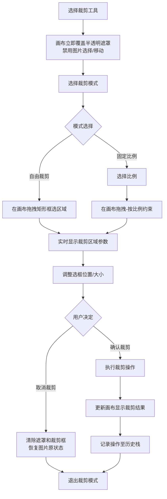
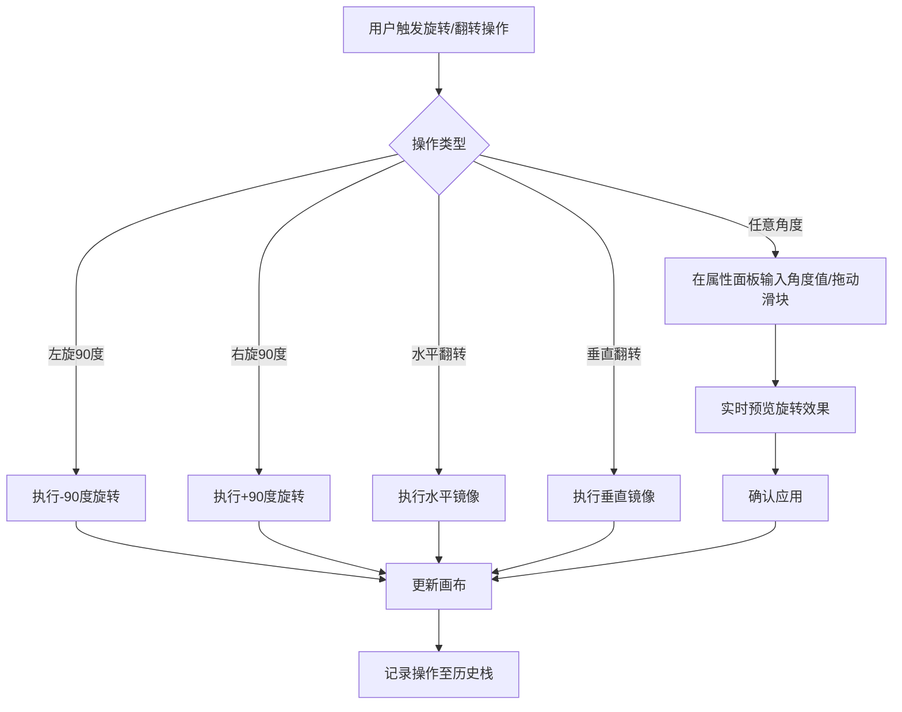
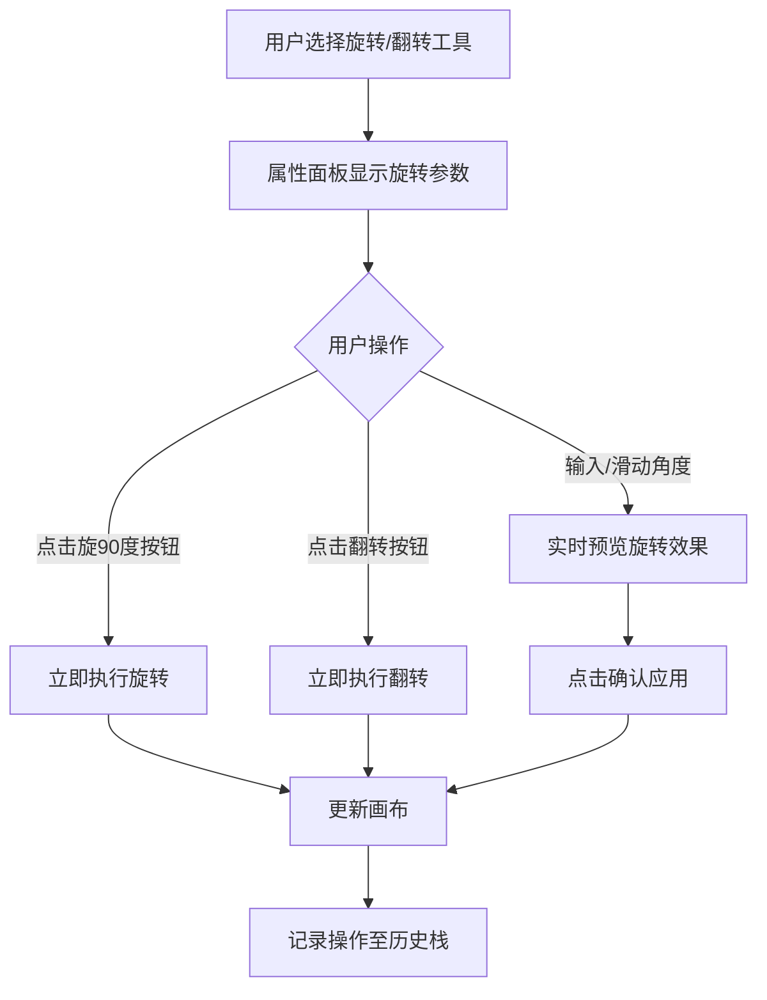

# 档案扫描件处理软件 PRD分册-F003-几何变换模块需求规格说明书

| 文档编号 | PRD-ARCHSCAN-F003-V1.0 | 文档版本 | V1.0 |
| :--- | :--------------------- | :--- | :------- |
| 所属总册 | PRD-ARCHSCAN-V1.0 档案扫描件处理软件产品需求规格说明书 | 编写人 | / |
| 编写日期 | / | 评审人 | 待定 |
| 评审日期 | 待定 | 归档日期 | 待定 |
| 文档状态 | □ 草稿 □ 评审中 □ 已归档 □ 已废弃 | 模块编号 | M003/M004 |

***

## 修订记录

| 版本号 | 修订日期 | 修订人 | 修订内容 | 审核人 |
| :--- | :---- | :---- | :--- | :---- |
| V1.0 | / | / | 首次发布 | 待定 |
| V1.1 | 2026-06-16 | | 补充 F003-01 裁剪模式互斥规则、遮罩立即显示机制、取消裁剪流程、遮罩截断修复 | 待定 |
| V1.2 | 2026-06-16 | | 补全撤销恢复交互约束：裁剪前状态快照必须在遮罩清除之后保存，确保撤销恢复的是原图而非带遮罩层的脏状态 | 待定 |

***

## 目录

1. [模块概述](#1-模块概述)
2. [业务流程](#2-业务流程)
3. [功能需求与页面设计](#3-功能需求与页面设计)
4. [异常处理](#4-异常处理)
5. [附录](#5-附录)

***

## 1. 模块概述

### 1.1 模块说明

几何变换模块包含裁剪（M003）和旋转与翻转（M004）两个子模块，处理图片的几何形状变换。裁剪模块负责去除图片不需要的区域，旋转与翻转模块负责调整图片的方向。

**核心业务价值**：
- 裁剪：自由裁剪、固定比例裁剪，满足不同场景的裁切需求
- 旋转与翻转：快速校正图片方向，支持任意角度旋转

### 1.2 用户角色与权限

本产品为纯本地运行工具，无需登录，无角色区分。所有用户拥有全部功能权限。

### 1.3 与其他模块的关系

| 关联模块 | 关联关系说明 | 数据流向 |
| :----- | :----- | :------------- |
| M002 选择与导航模块 | 裁剪模式激活时，M002 的选择和画布平移功能被禁用（模式互斥）。裁剪区域框选依赖画布坐标系，但不依赖 M002 的交互能力 | 输入（复用画布坐标系） |
| M002 选择与导航模块 | 旋转操作依赖画布渲染上下文 | 输入（接收画布渲染上下文） |
| M012 撤销/恢复模块 | 裁剪/旋转操作需记录至操作历史栈 | 输出（提交操作记录） |

***

## 2. 业务流程

### 2.1 裁剪流程

### 2.2 旋转与翻转流程

***

## 3. 功能需求与页面设计

### 3.1 功能清单

| 功能编号 | 功能名称 | 功能说明 | 优先级 |
| :--------- | :---- | :---- | :---- |
| F003-01 | 自由裁剪 | 拖拽出矩形区域裁剪，无比例约束 | 高 |
| F003-02 | 固定比例裁剪 | 按预设比例约束框选（1:1、4:3、16:9、3:2、2:3） | 高 |
| F003-03 | 左旋/右旋90度 | 快捷旋转90度操作 | 高 |
| F003-04 | 任意角度旋转 | 输入-360度到360度任意角度旋转 | 高 |
| F003-05 | 水平翻转 | 图片水平镜像翻转 | 高 |
| F003-06 | 垂直翻转 | 图片垂直镜像翻转 | 高 |

### 3.2 F003-01 自由裁剪

#### 3.2.1 功能详情

| 需求编号 | F003-01 |
| :--- | :---------------------------------------------- |
| 功能概述 | 用户通过鼠标拖拽出矩形区域进行裁剪，无比例约束 |
| 业务描述 | 激活裁剪工具后，画布立即覆盖全幅半透明遮罩（突出裁剪区域），用户拖拽绘制矩形裁剪框。裁剪模式期间，底层图片禁止响应选择/移动事件，所有鼠标拖拽行为均为绘制裁剪框。松开鼠标完成框选后可拖动选区调整位置或拖拽控制点调整大小，按 Esc 或点击取消按钮可退出裁剪模式并清除遮罩。确认后执行裁切并关闭裁剪模式。非自由绘制不规则轨迹 |
| 需求描述 | 1. 激活裁剪工具后画布立即叠加全幅半透明 rgba(0,0,0,0.35) 遮罩覆盖整个画布 2. 遮罩层拦截底层图片的鼠标事件，确保裁剪模式下图片不可选中、不可平移 3. 鼠标在遮罩上按下并拖拽时实时绘制矩形裁剪框（裁剪框区域内为透明，露出原图） 4. 松开鼠标后裁剪框确定，支持拖动调整位置、拖拽四角和边中点控制点调整大小 5. 裁剪区域参数（X、Y、宽、高）在属性面板实时显示 6. 支持以下方式确认裁剪：双击裁剪框 / 点击"应用裁剪"按钮 7. 支持以下方式取消裁剪：按 Esc / 点击"取消"按钮，取消后遮罩和裁剪框清除，图片恢复原状态 8. 确认裁剪后执行裁切，操作记录至历史栈 |
| 行为者 | 普通用户 |
| 前置条件 | 已加载图片 |
| 后置条件 | 裁剪操作记录至历史栈，画布显示裁剪结果 |
| 界面描述 | 工具栏-裁剪组，裁剪按钮（快捷键C）；属性面板显示裁剪区域参数（X、Y、宽、高像素值实时更新）；画布底部工具属性栏含"应用裁剪""取消"按钮 |
| 业务规则 | 1. 裁剪区域不能超出图片在画布上的显示边界（以图片 getScaledWidth/Height 为准） 2. 裁剪最小尺寸为10x10像素 3. 双击裁剪区域确认裁剪 4. 进入裁剪模式时禁止 M002 选择与导航的全部交互能力 5. 裁剪模式与移动画布、选择工具互斥（同一时刻只能激活一种模式） |
| 验收标准 | 1. 给定画布有图片，当用户点击裁剪工具，则画布立即覆盖半透明遮罩，图片不可选中不可拖动 2. 给定裁剪模式已激活，当用户拖拽出矩形区域后双击确认，则图片被裁切为选定矩形区域 3. 给定裁剪模式已激活，当用户按 Esc，则遮罩和裁剪框清除，图片恢复原状 |

### 3.3 F003-02 固定比例裁剪

#### 3.3.1 功能详情

| 需求编号 | F003-02 |
| :--- | :---------------------------------------------- |
| 功能概述 | 按预设宽高比例约束裁剪框 |
| 业务描述 | 用户选择固定比例裁剪后选择比例（1:1、4:3、16:9、3:2、2:3），拖拽时裁剪框保持所选比例约束 |
| 需求描述 | 1. 提供比例选择下拉：1:1、4:3、16:9、3:2、2:3（ENUM-011） 2. 拖拽时裁剪框保持所选宽高比 3. 支持切换横竖比例 |
| 行为者 | 普通用户 |
| 前置条件 | 已加载图片 |
| 后置条件 | 裁剪操作记录至历史栈 |
| 界面描述 | 属性面板-比例下拉选择器 |
| 验收标准 | 1. 给定用户选择16:9比例裁剪，当用户拖拽框选，则裁剪框始终保持16:9宽高比 |

### 3.4 F003-03 左旋/右旋90度

#### 3.4.1 功能详情

| 需求编号 | F003-03 |
| :--- | :---------------------------------------------- |
| 功能概述 | 快捷将图片左旋或右旋90度 |
| 业务描述 | 用户点击左旋90度按钮或右旋90度按钮，图片立即旋转，无需确认 |
| 需求描述 | 1. 左旋90度：图片逆时针旋转90度 2. 右旋90度：图片顺时针旋转90度 3. 连续点击可多次旋转 4. 每次旋转记录至操作历史栈 |
| 行为者 | 普通用户 |
| 前置条件 | 已加载图片 |
| 后置条件 | 图片旋转，操作记录至历史栈 |
| 界面描述 | 工具栏-旋转组，左旋按钮、右旋按钮 |
| 验收标准 | 1. 给定图片朝上，当用户点击右旋90度，则图片顺时针旋转90度 |

### 3.5 F003-04 任意角度旋转

#### 3.5.1 功能详情

| 需求编号 | F003-04 |
| :--- | :---------------------------------------------- |
| 功能概述 | 用户输入任意角度值旋转图片 |
| 业务描述 | 用户在属性面板的角度输入框中输入数值（-360度~360度）或通过滑块调节，图片实时预览旋转效果，确认后应用 |
| 需求描述 | 1. 角度输入框：-360~360度范围，支持输入整数 2. 角度滑块：-360~360度 3. 实时预览旋转效果 4. 确认按钮应用旋转 5. 重置按钮恢复0度 |
| 行为者 | 普通用户 |
| 前置条件 | 已加载图片 |
| 后置条件 | 图片旋转，操作记录至历史栈 |
| 界面描述 | 属性面板-角度输入框、角度滑块、确认按钮、重置按钮 |
| 验收标准 | 1. 给定用户输入45度，则图片实时预览旋转45度效果，确认后应用 |

### 3.6 F003-05/F003-06 水平/垂直翻转

#### 3.6.1 功能详情

| 需求编号 | F003-05/F003-06 |
| :--- | :---------------------------------------------- |
| 功能概述 | 将图片沿水平或垂直方向镜像翻转 |
| 业务描述 | 用户点击水平翻转或垂直翻转按钮，图片立即沿对应轴镜像翻转 |
| 需求描述 | 1. 水平翻转：图片左右镜像（ENUM-012） 2. 垂直翻转：图片上下镜像（ENUM-012） 3. 可多次翻转叠加 |
| 行为者 | 普通用户 |
| 前置条件 | 已加载图片 |
| 后置条件 | 图片翻转，操作记录至历史栈 |
| 界面描述 | 工具栏-旋转组，水平翻转按钮、垂直翻转按钮 |
| 验收标准 | 1. 给定图片有一行文字，当用户点击水平翻转，则文字左右镜像显示 |

#### 3.6.2 页面设计

**页面类型**：工具面板页

如原型图所示：design/02PRD文档/页面原型/001-原型.png

##### 3.6.2.1 交互流程

***

## 4. 异常处理

### 4.1 异常场景清单

| 异常编号 | 异常场景 | 异常描述 | 处理方式 |
| :--- | :----- | :---- | :--------------- |
| E001 | 无图片时裁剪 | 用户未加载图片时激活裁剪工具 | 裁剪工具不可用或提示先加载图片 |
| E002 | 裁剪区域过小 | 拖拽裁剪区域小于10x10像素 | 限制最小裁剪尺寸 |
| E003 | 裁剪区域溢出 | 拖拽裁剪框超出图片边界 | 限制裁剪框不能超出图片边界 |
| E004 | 角度输入非法 | 用户输入非数字或超出范围 | 输入框校验，超出范围时自动限制为边界值 |

### 4.2 边界场景处理

| 场景 | 预期行为 |
| :----- | :-------- |
| 大图旋转后画布尺寸变化 | 自动调整画布容器适应旋转后的图片尺寸 |
| 连续快速旋转 | 每次旋转独立记录至历史栈，支持逐级撤销 |

***

## 5. 附录

### 5.1 枚举值引用清单

| 本模块使用场景 | 枚举编号 | 枚举名称 | 说明 |
| :------ | :---------- | :----- | :---- |
| 裁剪模式 | ENUM-010 | 裁剪模式 | free/ratio |
| 固定比例选择 | ENUM-011 | 裁剪比例 | 1:1/4:3/16:9/3:2/2:3 |
| 翻转操作 | ENUM-012 | 翻转方向 | horizontal/vertical |

### 5.2 名词解释

| 名词 | 说明 |
| :----- | :---- |
| 裁剪框 | 画布上用于标识裁剪区域的矩形选框，含控制点 |
| 控制点 | 裁剪框四角和边中点的拖拽手柄，用于调整裁剪区域大小 |
| 半透明遮罩 | 裁剪区域外部覆盖的半透明层，突出显示裁剪区域 |

### 5.3 相关参考文档

| 文档名称 | 文档路径 | 备注 |
| :----------- | :------ | :------ |
| PRD总册-档案扫描件处理软件 | design/02PRD文档/PRD总册-产品需求规格说明书.md | 所属总册 |
| F002-选择与导航模块分册 | design/02PRD文档/F002-选择与导航模块分册.md | 依赖的上游模块 |
