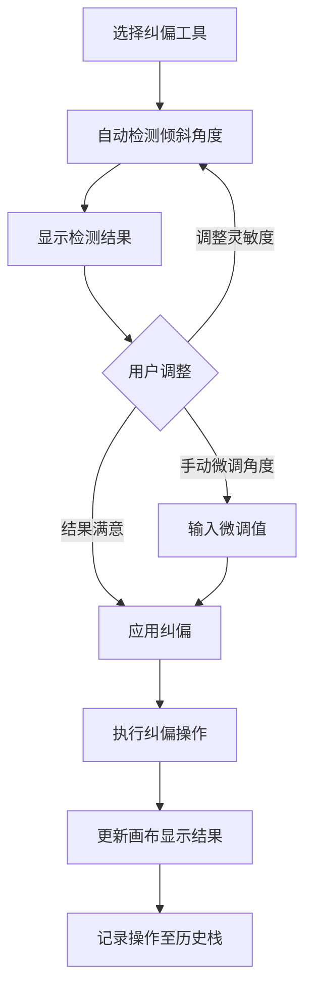
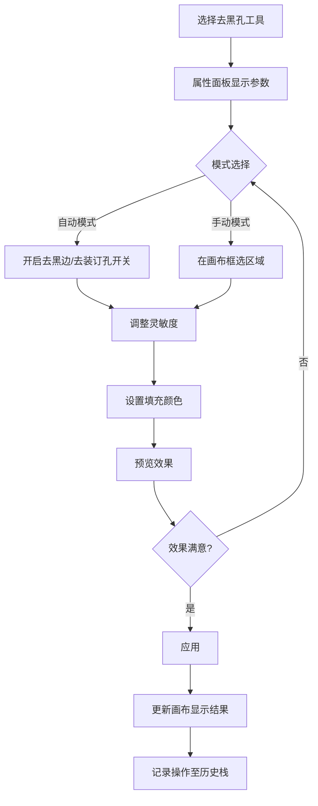
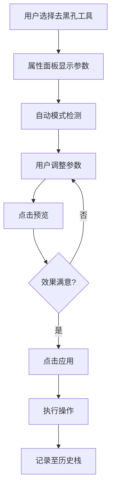

# 档案扫描件处理软件 PRD分册-F004-图像处理模块需求规格说明书

| 文档编号 | PRD-ARCHSCAN-F004-V1.0 | 文档版本 | V1.0 |
| :--- | :--------------------- | :--- | :------- |
| 所属总册 | PRD-ARCHSCAN-V1.0 档案扫描件处理软件产品需求规格说明书 | 编写人 | / |
| 编写日期 | / | 评审人 | 待定 |
| 评审日期 | 待定 | 归档日期 | 待定 |
| 文档状态 | □ 草稿 □ 评审中 □ 已归档 □ 已废弃 | 模块编号 | M005/M006 |

***

## 修订记录

| 版本号 | 修订日期 | 修订人 | 修订内容 | 审核人 |
| :--- | :---- | :---- | :--- | :---- |
| V1.0 | / | / | 首次发布 | 待定 |

***

## 目录

1. [模块概述](#1-模块概述)
2. [业务流程](#2-业务流程)
3. [功能需求与页面设计](#3-功能需求与页面设计)
4. [异常处理](#4-异常处理)
5. [附录](#5-附录)

***

## 1. 模块概述

### 1.1 模块说明

图像处理模块包含纠偏（M005）和去黑孔（M006）两个子模块，专为扫描件处理场景设计。纠偏模块自动检测并校正扫描图片的倾斜角度，去黑孔模块自动去除扫描产生的黑边和装订孔洞。

**核心业务价值**：
- 纠偏：基于霍夫变换自动检测倾斜角度，支持灵敏度调节和手动微调
- 去黑孔：自动识别并去除黑边和装订孔，支持填充颜色设置和手动框选

### 1.2 用户角色与权限

本产品为纯本地运行工具，无需登录，无角色区分。所有用户拥有全部功能权限。

### 1.3 与其他模块的关系

| 关联模块 | 关联关系说明 | 数据流向 |
| :----- | :----- | :------------- |
| M012 撤销/恢复模块 | 纠偏/去黑孔操作需记录至操作历史栈 | 输出（提交操作记录） |

***

## 2. 业务流程

### 2.1 纠偏流程

### 2.2 去黑孔流程

***

## 3. 功能需求与页面设计

### 3.1 功能清单

| 功能编号 | 功能名称 | 功能说明 | 优先级 |
| :--------- | :---- | :---- | :---- |
| F004-01 | 自动检测倾斜角度 | 基于霍夫变换算法自动检测图片倾斜角度 | 高 |
| F004-02 | 灵敏度调节 | 控制纠偏检测精度的滑块调节 | 高 |
| F004-03 | 手动微调角度 | 手动输入或拖动调整纠偏角度（精度0.1度） | 高 |
| F004-04 | 一键应用纠偏 | 将检测/调整后的角度应用到图片 | 高 |
| F004-05 | 自动去黑边 | 检测并填充图片边缘黑色区域 | 高 |
| F004-06 | 自动去装订孔 | 检测并填充装订孔洞 | 高 |
| F004-07 | 灵敏度调节(去黑孔) | 控制去黑孔检测精度 | 高 |
| F004-08 | 填充颜色设置 | 设置去黑孔后的填充颜色（默认白色） | 高 |
| F004-09 | 手动框选去黑孔 | 手动框选特定区域进行去黑孔处理 | 高 |
| F004-10 | 预览与应用 | 预览去黑孔效果后确认应用 | 高 |

### 3.2 F004-01 自动检测倾斜角度

#### 3.2.1 功能详情

| 需求编号 | F004-01 |
| :--- | :---------------------------------------------- |
| 功能概述 | 自动检测扫描件图片的倾斜角度 |
| 业务描述 | 用户选择纠偏工具后，系统自动基于传统图像算法（霍夫变换）检测图片的倾斜角度，并在属性面板显示检测结果 |
| 需求描述 | 1. 激活纠偏工具时自动检测倾斜角度 2. 检测到的角度值显示在属性面板 3. 画布上叠加角度参考线辅助查看 |
| 行为者 | 普通用户 |
| 前置条件 | 已加载图片 |
| 后置条件 | 检测角度显示在属性面板 |
| 界面描述 | 属性面板-纠偏参数区：角度显示、灵敏度滑块、微调输入 |
| 业务规则 | 1. 检测范围为-45度~45度 2. 检测精度受灵敏度参数影响 3. 纯色或低对比度图片检测精度可能下降 |
| 验收标准 | 1. 给定一张倾斜15度的扫描件图片，当用户选择纠偏工具，则属性面板显示检测角度约为15度 |

### 3.3 F004-02 灵敏度调节

#### 3.3.1 功能详情

| 需求编号 | F004-02 |
| :--- | :---------------------------------------------- |
| 功能概述 | 通过滑块调节纠偏检测的灵敏度 |
| 业务描述 | 用户通过拖动灵敏度滑块调整纠偏算法的检测灵敏度，灵敏度越高检测越精细但也更容易受到噪点干扰 |
| 需求描述 | 1. 灵敏度滑块范围1-10（默认5） 2. 调整后重新检测倾斜角度 3. 实时显示当前灵敏度值 |
| 行为者 | 普通用户 |
| 前置条件 | 纠偏工具已激活 |
| 后置条件 | 重新检测角度 |
| 界面描述 | 属性面板-灵敏度滑块 |
| 验收标准 | 1. 给定灵敏度为5，当用户拖动滑块到7，则纠偏算法重新检测并更新角度值 |

### 3.4 F004-03 手动微调角度

#### 3.3.1 功能详情

| 需求编号 | F004-03 |
| :--- | :---------------------------------------------- |
| 功能概述 | 用户手动微调纠偏角度 |
| 业务描述 | 当自动检测的角度不够精确时，用户可通过输入框或微调按钮手动调整纠偏角度 |
| 需求描述 | 1. 角度输入框：精度0.1度 2. 微调按钮：+0.1度/-0.1度/+1度/-1度 3. 调整范围-45度~45度 4. 调整时图片实时预览旋转效果 |
| 行为者 | 普通用户 |
| 前置条件 | 纠偏工具已激活 |
| 后置条件 | 角度值更新，预览效果 |
| 界面描述 | 属性面板-角度微调区：数值输入框、微调按钮 |
| 验收标准 | 1. 给定检测角度为15.0度，当用户点击+0.1度按钮，则角度更新为15.1度 |

### 3.5 F004-04 一键应用纠偏

#### 3.3.1 功能详情

| 需求编号 | F004-04 |
| :--- | :---------------------------------------------- |
| 功能概述 | 将纠偏结果正式应用到图片 |
| 业务描述 | 用户确认纠偏角度满意后点击应用按钮，系统执行纠偏操作并更新画布 |
| 需求描述 | 1. 应用按钮在确认纠偏角度后点击 2. 执行后图片被旋转校正 3. 操作记录至历史栈 4. 图片边缘空白区域自动填充为白色 |
| 行为者 | 普通用户 |
| 前置条件 | 已检测或调整好纠偏角度 |
| 后置条件 | 图片纠偏完成，操作记录至历史栈 |
| 界面描述 | 属性面板-应用按钮 |
| 验收标准 | 1. 给定角度15度，当用户点击应用按钮，则图片被校正为水平方向 |

### 3.6 F004-05 自动去黑边

#### 3.6.1 功能详情

| 需求编号 | F004-05 |
| :--- | :---------------------------------------------- |
| 功能概述 | 自动检测并填充扫描件边缘黑色区域 |
| 业务描述 | 开启自动去黑边开关后，系统检测图片边缘像素，自动识别黑色/深色区域并将其填充为指定颜色 |
| 需求描述 | 1. 开关控制去黑边功能启用/禁用 2. 检测图片边缘黑色区域（ENUM-020） 3. 自动识别装订孔（圆孔区域）（ENUM-020） 4. 填充颜色默认为白色 5. 支持预览效果 |
| 行为者 | 普通用户 |
| 前置条件 | 已加载图片 |
| 后置条件 | 画布预览去黑边效果 |
| 界面描述 | 属性面板-去黑孔参数区：开关按钮、填充颜色选择器、灵敏度滑块、预览/应用按钮 |
| 业务规则 | 1. 去黑边检测范围：图片边缘向内50px区域 2. 黑色阈值受灵敏度参数影响 3. 装订孔检测模式可独立开关 |
| 验收标准 | 1. 给定扫描件图片有黑边，当用户开启自动去黑边并点击预览，则黑边被检测并标记为填充区域 |

### 3.7 F004-06 自动去装订孔

#### 3.7.1 功能详情

| 需求编号 | F004-06 |
| :--- | :---------------------------------------------- |
| 功能概述 | 自动检测并填充扫描件中的装订孔洞 |
| 业务描述 | 开启去装订孔开关后，系统自动检测图片中圆形装订孔区域并将其填充为指定颜色 |
| 需求描述 | 1. 开关控制去装订孔功能启用/禁用 2. 自动检测圆形孔洞区域 3. 与去黑边可同时开启 4. 填充颜色与去黑边一致 |
| 行为者 | 普通用户 |
| 前置条件 | 已加载图片 |
| 后置条件 | 画布预览去装订孔效果 |
| 验收标准 | 1. 给定扫描件有装订孔，当用户开启去装订孔，则装订孔被检测并填充 |

### 3.8 F004-07/F004-08 灵敏度调节/填充颜色设置

#### 3.8.1 功能详情

| 需求编号 | F004-07 |
| :--- | :---------------------------------------------- |
| 功能概述 | 调节去黑孔检测的灵敏度阈值 |
| 业务描述 | 用户拖动滑块调节去黑孔算法的检测灵敏度 |
| 需求描述 | 1. 灵敏度滑块范围1-10（默认5） 2. 数值越高检测越敏感 |
| 验收标准 | 1. 给定灵敏度为5，当用户拖动到7，则重新检测并更新预览效果 |

| 需求编号 | F004-08 |
| :--- | :---------------------------------------------- |
| 功能概述 | 设置去黑孔后的填充颜色 |
| 业务描述 | 用户通过颜色选择器设置填充颜色，去黑孔后的空白区域将填充为该颜色 |
| 需求描述 | 1. 颜色选择器支持选取任意颜色 2. 预设颜色：白色（默认）、灰色、黑色 3. 支持输入hex颜色值 4. 修改后实时更新预览 |
| 验收标准 | 1. 给定填充颜色为白色，当用户选择红色，则预览中填充区域变为红色 |

### 3.9 F004-09 手动框选去黑孔

#### 3.9.1 功能详情

| 需求编号 | F004-09 |
| :--- | :---------------------------------------------- |
| 功能概述 | 用户手动在画布上框选特定区域进行去黑孔处理 |
| 业务描述 | 当自动检测无法覆盖特定区域时，用户可手动框选指定区域进行去黑孔处理 |
| 需求描述 | 1. 切换至手动框选模式 2. 在画布上拖拽框选矩形区域 3. 对框选区域应用去黑孔算法 4. 支持框选多个区域 |
| 行为者 | 普通用户 |
| 前置条件 | 已加载图片 |
| 后置条件 | 框选区域被处理 |
| 验收标准 | 1. 给定图片有黑斑未被自动检测，当用户手动框选该区域，则该区域被处理 |

### 3.10 F004-10 预览与应用

#### 3.10.1 功能详情

| 需求编号 | F004-10 |
| :--- | :---------------------------------------------- |
| 功能概述 | 预览去黑孔效果后确认应用 |
| 业务描述 | 用户调整完去黑孔参数后，先预览效果，满意后点击应用按钮正式执行 |
| 需求描述 | 1. 预览按钮：实时显示处理效果 2. 应用按钮：正式应用操作 3. 取消按钮：恢复原始状态 |
| 验收标准 | 1. 给定参数已配置好，当用户点击预览，则画布显示处理效果预览 |

#### 3.10.2 页面设计

**页面类型**：工具面板页

如原型图所示：design/02PRD文档/页面原型/001-原型.png

##### 3.10.2.1 交互流程

***

## 4. 异常处理

### 4.1 异常场景清单

| 异常编号 | 异常场景 | 异常描述 | 处理方式 |
| :--- | :----- | :---- | :--------------- |
| E001 | 纠偏检测无结果 | 纯色图片无法检测倾斜角度 | 提示"未检测到明显倾斜，建议手动微调" |
| E002 | 去黑孔误检 | 非黑边区域被误判为黑边 | 提供灵敏度调节减少误检，提供手动撤销 |
| E003 | 纠偏后边缘空白 | 旋转校正后图片四个角出现空白 | 自动填充为白色，提供裁剪选项去除空白区 |
| E004 | 去黑孔过度处理 | 灵敏度太高导致内容区域被填充 | 降低灵敏度重新处理 |

### 4.2 边界场景处理

| 场景 | 预期行为 |
| :----- | :-------- |
| 图片本身无倾斜 | 检测角度显示约0度，应用后无变化 |
| 图片无黑边 | 去黑边检测不到黑色区域，提示"未检测到黑边" |
| 图片黑白颜色 | 去黑孔算法需区分内容黑边与真实黑边 |
| 角度超出-45~45度 | 提示用户分多次旋转校正 |

***

## 5. 附录

### 5.1 枚举值引用清单

| 本模块使用场景 | 枚举编号 | 枚举名称 | 说明 |
| :------ | :---------- | :----- | :---- |
| 去黑孔选项 | ENUM-020 | 去黑孔选项 | black_edge/hole |

### 5.2 名词解释

| 名词 | 说明 |
| :----- | :---- |
| 霍夫变换 | 一种用于检测图像中直线等几何形状的特征提取算法 |
| 灵敏度 | 控制算法检测精度的参数，值越高检测越敏感 |
| 装订孔 | 扫描件上由于装订产生的圆形孔洞 |
| 黑边 | 扫描时产生的图片边缘黑色区域 |

### 5.3 相关参考文档

| 文档名称 | 文档路径 | 备注 |
| :----------- | :------ | :------ |
| PRD总册-档案扫描件处理软件 | design/02PRD文档/PRD总册-产品需求规格说明书.md | 所属总册 |
| F003-几何变换模块分册 | design/02PRD文档/F003-几何变换模块分册.md | 关联模块 |
