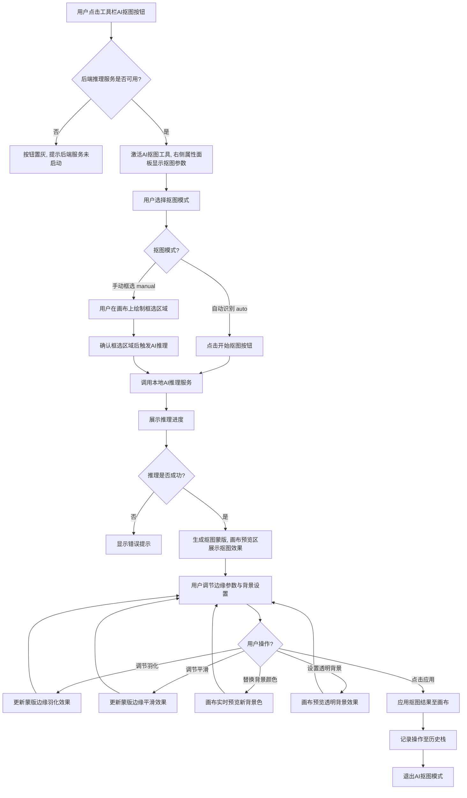
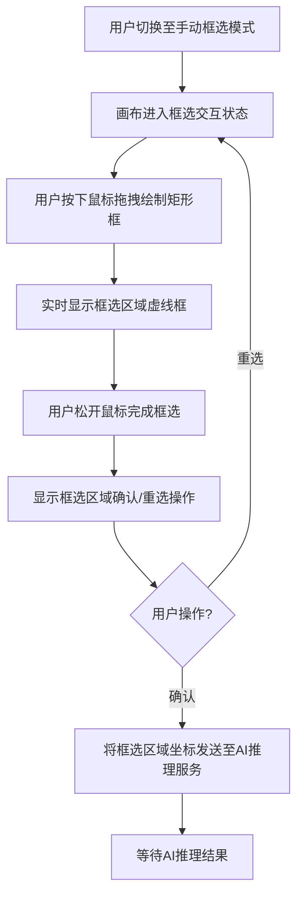
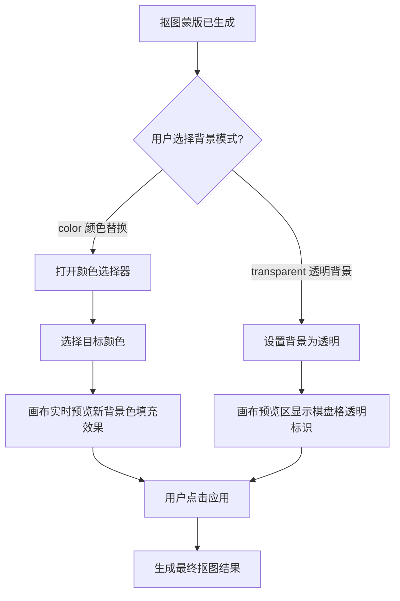
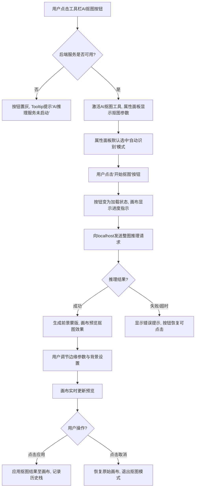
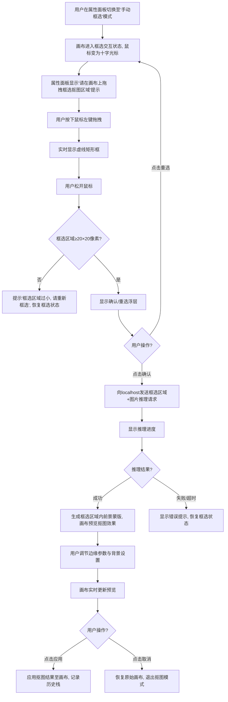
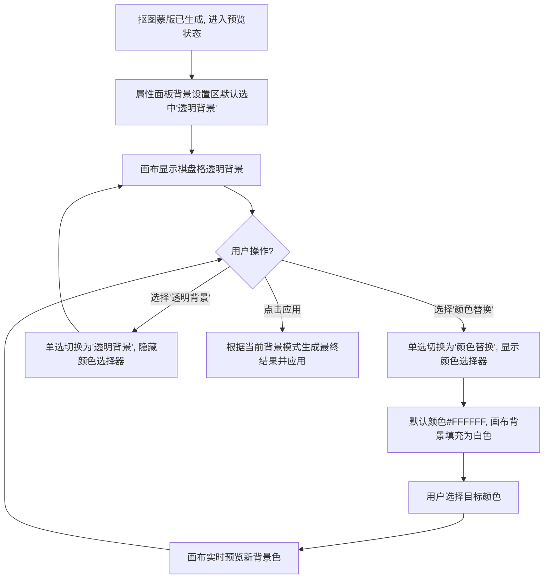
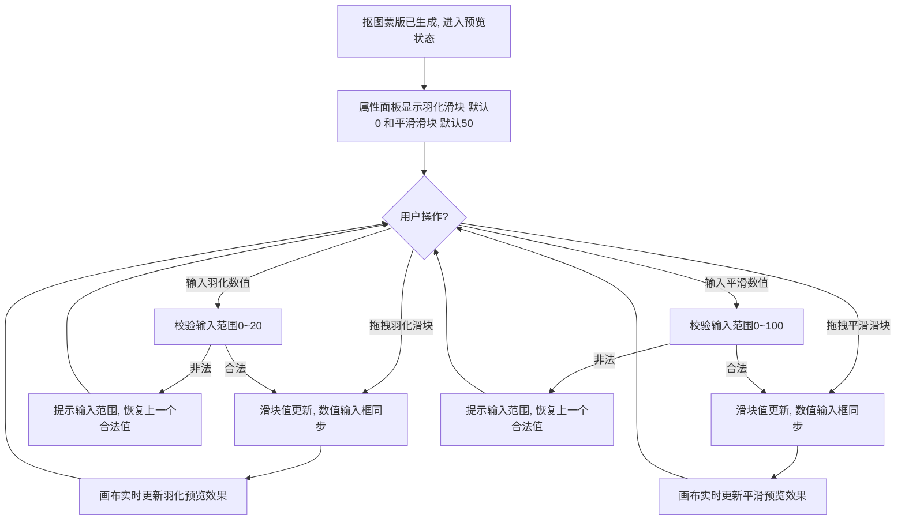

# F005-AI抠图模块分册

| 属性 | 值 |
|------|------|
| 文档编号 | PRD-ARCHSCAN-F005-V1.0 |
| 所属总册 | PRD-ARCHSCAN-V1.0 |
| 模块编号 | M007 |
| 模块名称 | AI抠图模块 |
| 版本 | V1.0 |

---

## 1 模块概述

### 1.1 模块说明

AI抠图模块（M007）是档案扫描件处理软件的智能图像处理模块，基于本地AI推理服务实现前景与背景的自动分离。模块提供自动识别与手动框选两种抠图模式，支持边缘羽化、边缘平滑参数调节，以及背景颜色替换与透明背景输出，帮助用户快速完成档案扫描件中印章、签名、证件照等前景元素的提取。

**核心定位**：基于AI推理的智能抠图模块，实现前景与背景分离。

**优先级**：中。

**技术依赖**：

- 前端：Vue 2 + Fabric.js + Cropper.js
- 后端：本地AI推理服务（localhost通信，不涉及外网传输）
- AI抠图推理响应时间：≤5秒（1080p图片）

### 1.2 用户角色与权限

本产品为纯本地Web端图片处理工具，无需登录，无角色区分。所有用户拥有全部功能权限。

| 角色名称 | 说明 | 权限范围 |
|----------|------|----------|
| 默认用户 | 本地使用产品的所有操作者 | 全部功能（自动识别、手动框选、边缘调节、背景设置、预览与应用） |

### 1.3 与其他模块的关系

| 关联模块 | 模块编号 | 关系类型 | 关系说明 |
|----------|----------|----------|----------|
| 撤销/恢复模块 | M012 | 依赖 | AI抠图操作需记录至操作历史栈，用户可通过M012撤销抠图结果 |
| 本地AI推理服务 | - | 依赖 | AI抠图功能依赖本地后端推理服务，后端未启动时该功能不可用 |
| 图像画布模块 | - | 关联 | 抠图结果应用后更新画布内容，画布预览区展示抠图效果 |
| 工具栏模块 | - | 关联 | 工具栏左侧包含AI抠图入口按钮 |

---

## 2 业务流程

### 2.1 AI抠图主流程



### 2.2 手动框选子流程



### 2.3 背景处理子流程



---

## 3 功能需求与页面设计

### 3.1 功能清单

| 功能编号 | 功能名称 | 优先级 | 功能描述 |
|----------|----------|--------|----------|
| F005-01 | 自动识别模式 | 高 | AI模型自动检测前景轮廓，无需用户指定区域 |
| F005-02 | 手动框选模式 | 高 | 用户框定抠图区域后AI处理，缩小推理范围 |
| F005-03 | 边缘羽化调节 | 中 | 调节抠图边缘羽化程度，范围0~20 |
| F005-04 | 边缘平滑调节 | 中 | 调节抠图边缘平滑程度，范围0~100 |
| F005-05 | 背景颜色替换 | 中 | 将抠图背景替换为指定颜色 |
| F005-06 | 背景透明 | 中 | 输出PNG透明背景 |
| F005-07 | 预览与应用 | 高 | 预览抠图效果并应用至画布 |

### 3.2 功能详情

#### F005-01 自动识别模式

| 属性 | 内容 |
|------|------|
| 功能编号 | F005-01 |
| 功能名称 | 自动识别模式 |
| 优先级 | 高 |
| 功能描述 | 用户无需手动指定区域，AI模型自动检测图片前景轮廓并生成蒙版 |
| 输入 | 当前画布图片 |
| 输出 | 前景蒙版 |
| 前置条件 | 1. 画布已加载图片；2. 本地AI推理服务正常运行 |
| 后置条件 | 生成前景蒙版，进入抠图预览状态 |
| 枚举引用 | ENUM-021 抠图模式 = auto |

**业务规则**：

| 规则编号 | 规则描述 |
|----------|----------|
| F005-01-R01 | 自动识别模式下，对整张画布图片进行AI推理 |
| F005-01-R02 | 推理请求仅发送至localhost，不涉及外网传输 |
| F005-01-R03 | 推理响应时间应≤5秒（1080p图片），超时按异常处理 |
| F005-01-R04 | 推理过程中展示进度指示，用户不可重复触发推理 |

**验收标准**：

| 验收编号 | 验收标准 |
|----------|----------|
| F005-01-A01 | 给定[画布已加载图片且后端服务正常]，当[用户选择自动识别模式并点击开始抠图]，则[向本地后端发送整图推理请求，展示推理进度] |
| F005-01-A02 | 给定[AI推理进行中]，当[用户再次点击开始抠图按钮]，则[按钮不可点击，防止重复触发] |
| F005-01-A03 | 给定[AI推理完成]，当[推理返回成功结果]，则[生成前景蒙版并在画布预览区展示抠图效果] |
| F005-01-A04 | 给定[AI推理超时或失败]，当[推理返回错误]，则[显示错误提示信息，用户可重新触发] |

---

#### F005-02 手动框选模式

| 属性 | 内容 |
|------|------|
| 功能编号 | F005-02 |
| 功能名称 | 手动框选模式 |
| 优先级 | 高 |
| 功能描述 | 用户在画布上绘制矩形框选区域，AI仅对框选范围内进行推理处理 |
| 输入 | 用户绘制的矩形区域坐标 |
| 输出 | 框选区域内的前景蒙版 |
| 前置条件 | 1. 画布已加载图片；2. 本地AI推理服务正常运行 |
| 后置条件 | 生成框选区域内的前景蒙版，进入抠图预览状态 |
| 枚举引用 | ENUM-021 抠图模式 = manual |

**业务规则**：

| 规则编号 | 规则描述 |
|----------|----------|
| F005-02-R01 | 手动框选模式下，用户需先绘制矩形框选区域，再触发AI推理 |
| F005-02-R02 | 框选区域最小尺寸为20×20像素，小于此尺寸提示用户重新框选 |
| F005-02-R03 | 框选区域绘制完成后显示确认/重选操作，用户确认后才触发推理 |
| F005-02-R04 | AI推理仅处理框选区域，未框选区域不参与推理 |
| F005-02-R05 | 框选区域超出画布边界时，自动裁剪至画布有效范围内 |

**验收标准**：

| 验收编号 | 验收标准 |
|----------|----------|
| F005-02-A01 | 给定[画布已加载图片且后端服务正常]，当[用户切换至手动框选模式]，则[画布进入框选交互状态，鼠标变为十字光标] |
| F005-02-A02 | 给定[手动框选模式激活]，当[用户拖拽绘制矩形区域]，则[实时显示虚线矩形框，松开鼠标后显示确认/重选操作] |
| F005-02-A03 | 给定[框选区域尺寸小于20×20像素]，当[用户松开鼠标]，则[提示"框选区域过小，请重新框选"，不触发推理] |
| F005-02-A04 | 给定[用户确认框选区域]，当[点击确认按钮]，则[将框选区域坐标与图片数据发送至本地后端进行AI推理] |
| F005-02-A05 | 给定[用户点击重选]，当[重选操作触发]，则[清除当前框选区域，画布恢复至框选交互状态] |

---

#### F005-03 边缘羽化调节

| 属性 | 内容 |
|------|------|
| 功能编号 | F005-03 |
| 功能名称 | 边缘羽化调节 |
| 优先级 | 中 |
| 功能描述 | 调节抠图边缘的羽化程度，使边缘过渡更柔和 |
| 输入 | 羽化值（0~20） |
| 输出 | 羽化处理后的蒙版边缘 |
| 前置条件 | 抠图蒙版已生成 |
| 后置条件 | 蒙版边缘按羽化值更新 |

**业务规则**：

| 规则编号 | 规则描述 |
|----------|----------|
| F005-03-R01 | 羽化值范围为0~20，默认值为0（无羽化） |
| F005-03-R02 | 羽化值步进为1，仅接受整数 |
| F005-03-R03 | 调节羽化值后实时更新画布预览效果 |
| F005-03-R04 | 羽化值越大，边缘过渡越柔和；值为0时边缘清晰无过渡 |

**验收标准**：

| 验收编号 | 验收标准 |
|----------|----------|
| F005-03-A01 | 给定[抠图蒙版已生成]，当[用户调节边缘羽化滑块至指定值]，则[画布实时预览对应羽化效果] |
| F005-03-A02 | 给定[羽化值为0]，当[查看抠图边缘]，则[边缘清晰无过渡] |
| F005-03-A03 | 给定[羽化值为20]，当[查看抠图边缘]，则[边缘呈现最大程度柔和过渡] |

---

#### F005-04 边缘平滑调节

| 属性 | 内容 |
|------|------|
| 功能编号 | F005-04 |
| 功能名称 | 边缘平滑调节 |
| 优先级 | 中 |
| 功能描述 | 调节抠图边缘的平滑程度，减少锯齿感 |
| 输入 | 平滑值（0~100） |
| 输出 | 平滑处理后的蒙版边缘 |
| 前置条件 | 抠图蒙版已生成 |
| 后置条件 | 蒙版边缘按平滑值更新 |

**业务规则**：

| 规则编号 | 规则描述 |
|----------|----------|
| F005-04-R01 | 平滑值范围为0~100，默认值为50 |
| F005-04-R02 | 平滑值步进为1，仅接受整数 |
| F005-04-R03 | 调节平滑值后实时更新画布预览效果 |
| F005-04-R04 | 平滑值越大，边缘越平滑；值为0时保留原始边缘细节 |

**验收标准**：

| 验收编号 | 验收标准 |
|----------|----------|
| F005-04-A01 | 给定[抠图蒙版已生成]，当[用户调节边缘平滑滑块至指定值]，则[画布实时预览对应平滑效果] |
| F005-04-A02 | 给定[平滑值为0]，当[查看抠图边缘]，则[保留原始边缘细节，可能存在锯齿] |
| F005-04-A03 | 给定[平滑值为100]，当[查看抠图边缘]，则[边缘最大程度平滑，锯齿消除] |

---

#### F005-05 背景颜色替换

| 属性 | 内容 |
|------|------|
| 功能编号 | F005-05 |
| 功能名称 | 背景颜色替换 |
| 优先级 | 中 |
| 功能描述 | 将抠图后的背景区域替换为用户指定的颜色 |
| 输入 | 目标背景颜色值 |
| 输出 | 背景色替换后的预览效果 |
| 前置条件 | 抠图蒙版已生成 |
| 后置条件 | 背景区域填充为指定颜色 |
| 枚举引用 | ENUM-022 抠图背景 = color |

**业务规则**：

| 规则编号 | 规则描述 |
|----------|----------|
| F005-05-R01 | 背景颜色替换模式下，背景区域填充为用户选定的纯色 |
| F005-05-R02 | 颜色选择器支持HEX色值输入和色板选取 |
| F005-05-R03 | 选择颜色后画布实时预览背景色替换效果 |
| F005-05-R04 | 默认替换颜色为白色（#FFFFFF） |
| F005-05-R05 | 背景颜色替换与透明背景互斥，选择其一自动取消另一选项 |

**验收标准**：

| 验收编号 | 验收标准 |
|----------|----------|
| F005-05-A01 | 给定[抠图蒙版已生成]，当[用户选择背景颜色替换模式]，则[显示颜色选择器，默认颜色为白色] |
| F005-05-A02 | 给定[用户选择目标颜色]，当[颜色确认]，则[画布实时预览背景区域填充为目标颜色的效果] |
| F005-05-A03 | 给定[背景颜色替换模式已激活]，当[用户切换至透明背景模式]，则[取消颜色替换，背景切换为透明] |

---

#### F005-06 背景透明

| 属性 | 内容 |
|------|------|
| 功能编号 | F005-06 |
| 功能名称 | 背景透明 |
| 优先级 | 中 |
| 功能描述 | 将抠图后的背景区域设为透明，输出PNG透明背景 |
| 输入 | 无额外输入 |
| 输出 | PNG透明背景的抠图结果 |
| 前置条件 | 抠图蒙版已生成 |
| 后置条件 | 背景区域为透明，画布显示棋盘格标识 |
| 枚举引用 | ENUM-022 抠图背景 = transparent |

**业务规则**：

| 规则编号 | 规则描述 |
|----------|----------|
| F005-06-R01 | 透明背景模式下，背景区域像素alpha通道设为0 |
| F005-06-R02 | 画布预览区以棋盘格图案标识透明区域 |
| F005-06-R03 | 应用结果后输出格式为PNG（保留透明通道），非JPEG |
| F005-06-R04 | 透明背景与颜色替换互斥，选择其一自动取消另一选项 |
| F005-06-R05 | 透明背景为默认选中的背景模式 |

**验收标准**：

| 验收编号 | 验收标准 |
|----------|----------|
| F005-06-A01 | 给定[抠图蒙版已生成]，当[用户选择透明背景模式]，则[画布预览区显示棋盘格透明标识，背景区域为透明] |
| F005-06-A02 | 给定[透明背景模式下点击应用]，当[抠图结果应用至画布]，则[输出PNG格式图片，背景区域alpha通道为0] |
| F005-06-A03 | 给定[透明背景模式已激活]，当[用户切换至背景颜色替换模式]，则[取消透明背景，背景填充为选定颜色] |

---

#### F005-07 预览与应用

| 属性 | 内容 |
|------|------|
| 功能编号 | F005-07 |
| 功能名称 | 预览与应用 |
| 优先级 | 高 |
| 功能描述 | 实时预览抠图效果（含边缘参数与背景设置），确认后应用至画布 |
| 输入 | 抠图蒙版 + 边缘参数 + 背景设置 |
| 输出 | 应用抠图结果后的画布图像 |
| 前置条件 | 抠图蒙版已生成 |
| 后置条件 | 1. 画布图像更新为抠图结果；2. 操作记录至历史栈（上限20步） |

**业务规则**：

| 规则编号 | 规则描述 |
|----------|----------|
| F005-07-R01 | 预览模式下，用户调节边缘参数和背景设置时画布实时更新预览 |
| F005-07-R02 | 点击"应用"按钮后，将抠图结果（含边缘参数和背景设置）合并至画布 |
| F005-07-R03 | 应用操作记录至操作历史栈，上限20步（全局规则） |
| F005-07-R04 | 点击"取消"按钮后，放弃抠图结果，恢复原始画布状态 |
| F005-07-R05 | 预览模式下支持切换抠图模式重新推理，替换当前蒙版 |

**验收标准**：

| 验收编号 | 验收标准 |
|----------|----------|
| F005-07-A01 | 给定[抠图蒙版已生成]，当[用户调节任意边缘参数或背景设置]，则[画布实时更新预览效果] |
| F005-07-A02 | 给定[用户对预览效果满意]，当[点击应用按钮]，则[抠图结果合并至画布，操作记录至历史栈，退出抠图模式] |
| F005-07-A03 | 给定[用户对预览效果不满意]，当[点击取消按钮]，则[放弃抠图结果，画布恢复原始状态，退出抠图模式] |
| F005-07-A04 | 给定[操作历史栈已满20步]，当[应用抠图结果]，则[最早的一条历史记录被移除，新增当前操作记录] |
| F005-07-A05 | 给定[预览模式中]，当[用户切换抠图模式重新触发推理]，则[替换当前蒙版，画布更新为新蒙版预览效果] |

---

### 3.3 页面设计

#### 3.3.1 工具栏区域（左侧112px，双列）

| 元素 | 位置 | 说明 |
|------|------|------|
| AI抠图按钮 | 处理组内 | 图标+悬浮提示"AI抠图"；后端不可用时置灰，悬浮提示"AI推理服务未启动" |

#### 3.3.2 属性面板区域（右侧280px）

属性面板在AI抠图工具激活时，工具属性标签页显示以下内容：

| 区段 | 元素 | 类型 | 说明 |
|------|------|------|------|
| 抠图模式 | 模式选择 | 单选按钮组 | 两个选项：自动识别 / 手动框选；默认选中"自动识别" |
| 抠图模式 | 开始抠图按钮 | 按钮 | 自动识别模式下显示，点击触发AI推理；推理中显示加载状态 |
| 抠图模式 | 框选提示 | 文字提示 | 手动框选模式下显示"请在画布上拖拽框选抠图区域" |
| 边缘参数 | 羽化滑块 | 滑块+数值输入 | 范围0~20，步进1，默认值0 |
| 边缘参数 | 平滑滑块 | 滑块+数值输入 | 范围0~100，步进1，默认值50 |
| 背景设置 | 背景模式 | 单选按钮组 | 两个选项：颜色替换 / 透明背景；默认选中"透明背景" |
| 背景设置 | 颜色选择器 | 颜色选择组件 | 仅在"颜色替换"模式下显示；支持HEX输入与色板选取，默认#FFFFFF |
| 操作按钮 | 应用按钮 | 主按钮 | 应用抠图结果至画布 |
| 操作按钮 | 取消按钮 | 次按钮 | 放弃抠图结果，退出抠图模式 |

**属性面板布局示意**：

```
┌─────────────────────────┐
│  工具属性                │
├─────────────────────────┤
│  抠图模式                │
│  ○ 自动识别  ○ 手动框选  │
│  [开始抠图]              │
├─────────────────────────┤
│  边缘参数                │
│  羽化  ──●────────  0   │
│  平滑  ──────●────  50  │
├─────────────────────────┤
│  背景设置                │
│  ○ 颜色替换  ● 透明背景  │
│  [■ #FFFFFF]             │
├─────────────────────────┤
│  [应用]    [取消]        │
└─────────────────────────┘
```

#### 3.3.3 画布预览区（中央）

| 状态 | 画布显示 |
|------|----------|
| 工具未激活 | 正常显示图片 |
| 自动识别推理中 | 图片上方叠加半透明遮罩，中央显示进度指示器 |
| 手动框选模式 | 鼠标变为十字光标，拖拽时显示虚线矩形框 |
| 预览模式-透明背景 | 抠图结果叠加于棋盘格透明标识之上 |
| 预览模式-颜色替换 | 抠图结果叠加于指定纯色背景之上 |

---

### 3.4 交互流程

#### 3.4.1 自动识别模式交互流程



#### 3.4.2 手动框选模式交互流程



#### 3.4.3 背景设置交互流程



#### 3.4.4 边缘参数调节交互流程



---

## 4 异常处理

### 4.1 异常场景清单

| 异常编号 | 异常场景 | 触发条件 | 处理方式 | 用户提示 |
|----------|----------|----------|----------|----------|
| F005-EX01 | 后端推理服务未启动 | 用户点击AI抠图按钮时检测不到本地推理服务 | 按钮置灰不可点击 | 悬浮提示"AI推理服务未启动，请检查后端服务" |
| F005-EX02 | 推理请求超时 | AI推理响应时间超过5秒（1080p图片） | 中断请求，恢复可操作状态 | "AI推理超时，请重试" |
| F005-EX03 | 推理服务返回错误 | 后端返回非200状态码或业务错误 | 显示错误信息，恢复可操作状态 | "AI推理失败：{错误详情}，请重试" |
| F005-EX04 | 画布未加载图片 | 用户点击AI抠图按钮但画布为空 | 不激活抠图工具 | "请先加载图片" |
| F005-EX05 | 网络连接异常 | localhost通信失败（如端口未监听） | 视为后端服务不可用处理 | "无法连接AI推理服务，请检查后端服务是否启动" |
| F005-EX06 | 图片过大导致推理失败 | 图片分辨率远超1080p，推理内存不足 | 提示用户缩小图片后重试 | "图片过大，AI推理失败，建议缩小图片后重试" |
| F005-EX07 | 框选区域过小 | 手动框选区域小于20×20像素 | 不触发推理，提示重新框选 | "框选区域过小，请重新框选" |

### 4.2 边界场景

| 边界编号 | 边界场景 | 触发条件 | 处理方式 |
|----------|----------|----------|----------|
| F005-BD01 | 羽化值边界 | 输入羽化值小于0或大于20 | 自动修正为0或20 |
| F005-BD02 | 平滑值边界 | 输入平滑值小于0或大于100 | 自动修正为0或100 |
| F005-BD03 | 框选区域与画布边界重合 | 框选区域刚好贴边或超出画布 | 自动裁剪至画布有效范围 |
| F005-BD04 | 推理返回空蒙版 | AI推理结果无前景区域（蒙版全为0） | 提示未检测到前景，建议手动框选 | 
| F005-BD05 | 推理返回全前景蒙版 | AI推理结果蒙版全为1（全图为前景） | 提示检测到全前景，建议手动框选缩小范围 |
| F005-BD06 | 操作历史栈满 | 历史栈已达20步上限时应用抠图结果 | 移除最早一条记录，新增当前操作 |
| F005-BD07 | 推理中切换模式 | 推理进行中用户切换抠图模式 | 等待当前推理完成后允许切换，推理中模式选择置灰 |
| F005-BD08 | 推理中退出抠图 | 推理进行中用户点击取消 | 中断推理请求，恢复原始画布 |

### 4.3 错误码

| 错误码 | 错误名称 | 触发场景 | HTTP状态码 | 处理建议 |
|--------|----------|----------|------------|----------|
| M007-E001 | SERVICE_UNAVAILABLE | 后端推理服务未启动 | - | 检查后端服务是否启动 |
| M007-E002 | INFERENCE_TIMEOUT | 推理请求超时 | 408 | 重试或缩小图片 |
| M007-E003 | INFERENCE_FAILED | 推理服务返回错误 | 500 | 查看错误详情，重试 |
| M007-E004 | IMAGE_NOT_LOADED | 画布未加载图片 | - | 先加载图片 |
| M007-E005 | CONNECTION_ERROR | localhost通信失败 | - | 检查后端服务端口 |
| M007-E006 | IMAGE_TOO_LARGE | 图片过大导致推理内存不足 | 413 | 缩小图片后重试 |
| M007-E007 | ROI_TOO_SMALL | 框选区域过小 | 400 | 重新框选更大区域 |
| M007-E008 | EMPTY_MASK | 推理返回空蒙版 | 200 | 切换手动框选模式 |
| M007-E009 | FULL_FOREGROUND | 推理返回全前景蒙版 | 200 | 切换手动框选模式 |

---

## 5 附录

### 5.1 枚举值引用

| 枚举编号 | 枚举名称 | 枚举值 | 值说明 |
|----------|----------|--------|--------|
| ENUM-021 | 抠图模式 | auto | 自动识别模式，AI自动检测前景轮廓 |
| ENUM-021 | 抠图模式 | manual | 手动框选模式，用户框定区域后AI处理 |
| ENUM-022 | 抠图背景 | color | 背景颜色替换，填充指定颜色 |
| ENUM-022 | 抠图背景 | transparent | 背景透明，输出PNG透明背景 |

### 5.2 名词解释

| 术语 | 英文 | 解释 |
|------|------|------|
| AI抠图 | AI Image Matting | 基于人工智能模型的前景与背景分离技术 |
| 蒙版 | Mask | AI推理生成的灰度图像，标识前景与背景区域的隶属度 |
| 羽化 | Feather | 对蒙版边缘进行柔化处理，使前景与背景过渡更自然 |
| 平滑 | Smoothing | 对蒙版边缘进行平滑处理，减少锯齿感 |
| 前景 | Foreground | 图片中需要保留的主体区域 |
| 背景 | Background | 图片中需要去除或替换的非主体区域 |
| 框选区域 | Region of Interest (ROI) | 手动框选模式下用户指定的矩形区域 |
| 推理服务 | Inference Service | 本地运行的AI模型推理后端服务 |
| 棋盘格 | Checkerboard | 透明区域的视觉标识，交替显示灰色方格 |
| 操作历史栈 | Operation History Stack | 记录用户操作步骤的数据结构，支持撤销/恢复，上限20步 |

### 5.3 参考文档

| 文档编号 | 文档名称 | 版本 | 说明 |
|----------|----------|------|------|
| PRD-ARCHSCAN-V1.0 | 档案扫描件处理软件PRD总册 | V1.0 | 产品整体需求与全局业务规则 |
| PRD-ARCHSCAN-F012-V1.0 | 撤销/恢复模块分册 | V1.0 | 操作历史栈详细设计 |
| - | Fabric.js 官方文档 | v4.x | 画布操作与图像处理API参考 |
| - | Cropper.js 官方文档 | v1.x | 裁剪交互API参考 |
