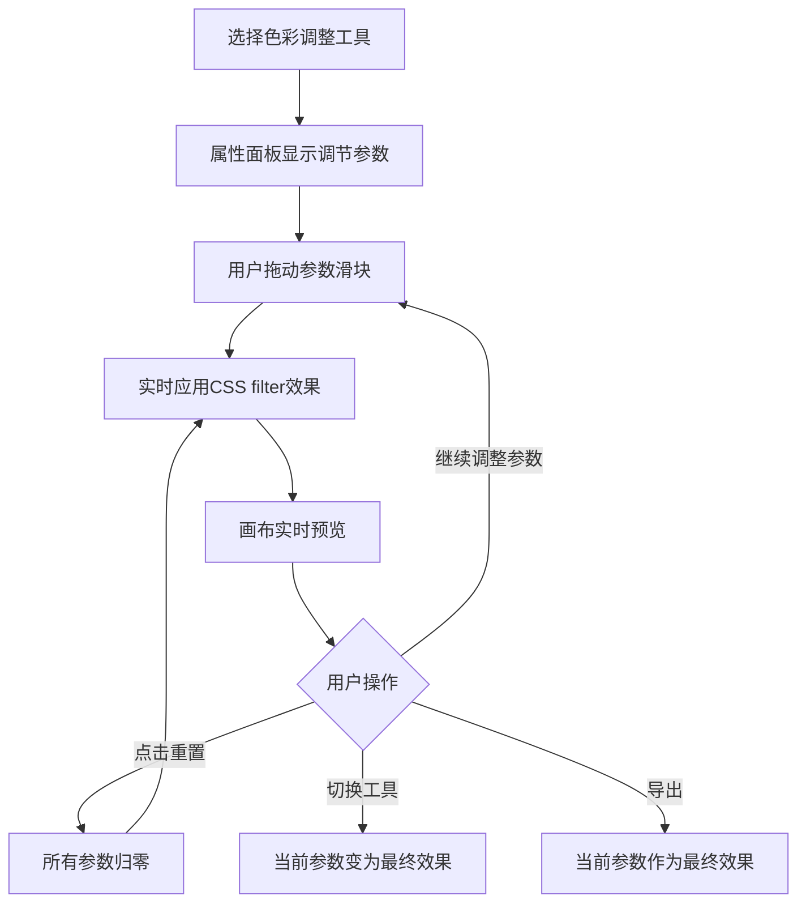
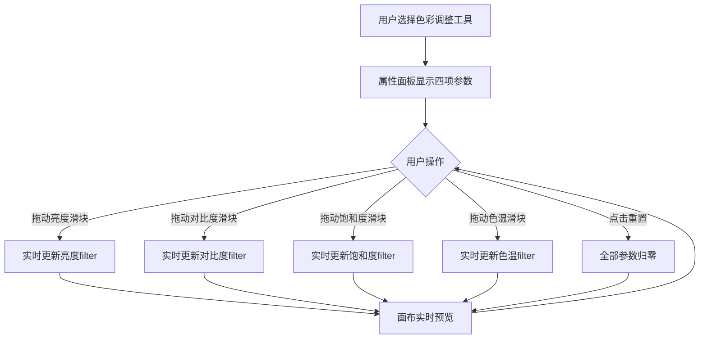

# 档案扫描件处理软件 PRD分册-F006-色彩调整模块需求规格说明书

| 文档编号 | PRD-ARCHSCAN-F006-V1.0 | 文档版本 | V1.0 |
| :--- | :--------------------- | :--- | :------- |
| 所属总册 | PRD-ARCHSCAN-V1.0 档案扫描件处理软件产品需求规格说明书 | 编写人 | / |
| 编写日期 | / | 评审人 | 待定 |
| 评审日期 | 待定 | 归档日期 | 待定 |
| 文档状态 | □ 草稿 □ 评审中 □ 已归档 □ 已废弃 | 模块编号 | M008 |

***

## 修订记录

| 版本号 | 修订日期 | 修订人 | 修订内容 | 审核人 |
| :--- | :---- | :---- | :--- | :---- |
| V1.0 | / | / | 首次发布 | 待定 |

***

## 目录

1. [模块概述](#1-模块概述)
2. [业务流程](#2-业务流程)
3. [功能需求与页面设计](#3-功能需求与页面设计)
4. [异常处理](#4-异常处理)
5. [附录](#5-附录)

***

## 1. 模块概述

### 1.1 模块说明

色彩调整模块（M008）提供图片色彩与明暗的精细调节能力。用户可通过滑块调节亮度、对比度、饱和度、色温四项参数，所有调节实时预览。

**核心业务价值**：
- 四项核心色彩参数全覆盖：亮度、对比度、饱和度、色温
- 实时预览效果，所见即所得
- 一键重置所有参数，快速恢复原始状态

### 1.2 用户角色与权限

本产品为纯本地运行工具，无需登录，无角色区分。所有用户拥有全部功能权限。

### 1.3 与其他模块的关系

| 关联模块 | 关联关系说明 | 数据流向 |
| :----- | :----- | :------------- |
| M012 撤销/恢复模块 | 色彩调整操作需记录至操作历史栈（应用后） | 输出（提交操作记录） |

***

## 2. 业务流程

### 2.1 色彩调整流程

***

## 3. 功能需求与页面设计

### 3.1 功能清单

| 功能编号 | 功能名称 | 功能说明 | 优先级 |
| :--------- | :---- | :---- | :---- |
| F006-01 | 亮度调节 | 调节图片整体明暗程度（-100~100） | 高 |
| F006-02 | 对比度调节 | 调节图片明暗反差（-100~100） | 高 |
| F006-03 | 饱和度调节 | 调节图片色彩鲜艳度（-100~100） | 高 |
| F006-04 | 色温调节 | 调节图片色温冷暖（-100~100） | 高 |
| F006-05 | 一键重置 | 将所有调节参数恢复为默认值0 | 高 |

### 3.2 F006-01 亮度调节

#### 3.2.1 功能详情

| 需求编号 | F006-01 |
| :--- | :---------------------------------------------- |
| 功能概述 | 调节图片整体亮度 |
| 业务描述 | 用户通过拖动亮度滑块，调整图片的整体明暗程度，调节时画布实时预览效果 |
| 需求描述 | 1. 亮度滑块范围-100~100（默认0） 2. 调节时画布实时预览 3. 支持输入框直接输入数值 4. 滑块附带数值标签实时显示当前值 |
| 行为者 | 普通用户 |
| 前置条件 | 已加载图片 |
| 后置条件 | 画布实时更新亮度效果 |
| 界面描述 | 属性面板-色彩调整区：亮度滑块+数值输入+标签"亮度" |
| 业务规则 | 1. 亮度参数通过CSS filter实现实时预览 2. 切换工具时CSS filter效果转为Canvas实际像素 |
| 验收标准 | 1. 给定图片亮度默认0，当用户拖动滑块到50，则图片整体变亮 |
| 异常流程 | 调节过程中如浏览器出现渲染性能问题，降级使用低分辨率预览 |

### 3.3 F006-02 对比度调节

#### 3.3.1 功能详情

| 需求编号 | F006-02 |
| :--- | :---------------------------------------------- |
| 功能概述 | 调节图片明暗对比度 |
| 业务描述 | 用户通过拖动对比度滑块，调整图片的明暗反差程度 |
| 需求描述 | 1. 对比度滑块范围-100~100（默认0） 2. 调节时画布实时预览 3. 支持输入框直接输入数值 |
| 行为者 | 普通用户 |
| 前置条件 | 已加载图片 |
| 后置条件 | 画布实时更新对比度效果 |
| 界面描述 | 属性面板-对比度滑块+数值输入+标签"对比度" |
| 验收标准 | 1. 给定图片对比度默认0，当用户拖动滑块到-50，则图片明暗反差减小、整体发灰 |

### 3.4 F006-03 饱和度调节

#### 3.4.1 功能详情

| 需求编号 | F006-03 |
| :--- | :---------------------------------------------- |
| 功能概述 | 调节图片色彩饱和度 |
| 业务描述 | 用户通过拖动饱和度滑块，调整图片的色彩鲜艳程度 |
| 需求描述 | 1. 饱和度滑块范围-100~100（默认0） 2. 调节时画布实时预览 3. 滑到-100时图片变为灰度 |
| 行为者 | 普通用户 |
| 前置条件 | 已加载图片 |
| 后置条件 | 画布实时更新饱和度效果 |
| 界面描述 | 属性面板-饱和度滑块+数值输入+标签"饱和度" |
| 验收标准 | 1. 给定图片饱和度默认0，当用户拖动滑块到-100，则图片变为黑白灰度效果 |

### 3.5 F006-04 色温调节

#### 3.5.1 功能详情

| 需求编号 | F006-04 |
| :--- | :---------------------------------------------- |
| 功能概述 | 调节图片色温冷暖 |
| 业务描述 | 用户通过拖动色温滑块，调整图片的冷暖色调，负值偏蓝（冷色）、正值偏黄（暖色） |
| 需求描述 | 1. 色温滑块范围-100~100（默认0） 2. 调节时画布实时预览 3. 蓝色标签（冷）和橙色标签（暖）标识方向 |
| 行为者 | 普通用户 |
| 前置条件 | 已加载图片 |
| 后置条件 | 画布实时更新色温效果 |
| 界面描述 | 属性面板-色温滑块+数值输入+标签"色温"，滑块两端标注"冷""暖" |
| 验收标准 | 1. 给定图片色温默认0，当用户拖动滑块到50，则图片色调偏暖（偏黄） |

### 3.6 F006-05 一键重置

#### 3.6.1 功能详情

| 需求编号 | F006-05 |
| :--- | :---------------------------------------------- |
| 功能概述 | 将所有色彩调整参数恢复为初始值 |
| 业务描述 | 用户点击重置按钮，所有调节参数（亮度、对比度、饱和度、色温）同时归零，图片恢复原始效果 |
| 需求描述 | 1. 重置按钮一键操作 2. 所有参数同时归零 3. 画布立即恢复原始效果 |
| 行为者 | 普通用户 |
| 前置条件 | 至少一项参数不为0 |
| 后置条件 | 所有参数归零，图片恢复原始效果 |
| 界面描述 | 属性面板-重置按钮 |
| 验收标准 | 1. 给定用户已将亮度调至50、对比度调至30，当用户点击重置，则亮度和对比度同时归零 |

#### 3.6.2 页面设计

**页面类型**：工具面板页

如原型图所示：design/02PRD文档/页面原型/001-原型.png

##### 3.6.2.1 交互流程

***

## 4. 异常处理

### 4.1 异常场景清单

| 异常编号 | 异常场景 | 异常描述 | 处理方式 |
| :--- | :----- | :---- | :--------------- |
| E001 | 无图片时调节 | 用户未加载图片时调整参数 | 参数滑块可用但画布无变化，提示"请先加载图片" |
| E002 | 参数输入非法 | 用户输入非数值或超出范围 | 输入框校验，超出范围时自动限制为边界值 |

### 4.2 边界场景处理

| 场景 | 预期行为 |
| :----- | :-------- |
| 所有参数同时调至极值 | 四项CSS filter叠加正常渲染，无冲突 |
| 切换文件后参数状态 | 切换文件时参数恢复默认值，不影响新文件的原始状态 |
| 连续高频调节 | 使用requestAnimationFrame节流，避免过度渲染 |

***

## 5. 附录

### 5.1 枚举值引用清单

| 本模块使用场景 | 枚举编号 | 枚举名称 | 说明 |
| :------ | :---------- | :----- | :---- |
| 参数标识 | ENUM-050 | 调节参数 | brightness/contrast/saturation/temperature |

### 5.2 名词解释

| 名词 | 说明 |
| :----- | :---- |
| CSS filter | 浏览器CSS滤镜功能，可在不修改原始像素数据的情况下实时改变图片显示效果 |
| 色温 | 图片色调的冷暖程度，负值偏蓝冷色调，正值偏黄暖色调 |

### 5.3 相关参考文档

| 文档名称 | 文档路径 | 备注 |
| :----------- | :------ | :------ |
| PRD总册-档案扫描件处理软件 | design/02PRD文档/PRD总册-产品需求规格说明书.md | 所属总册 |
