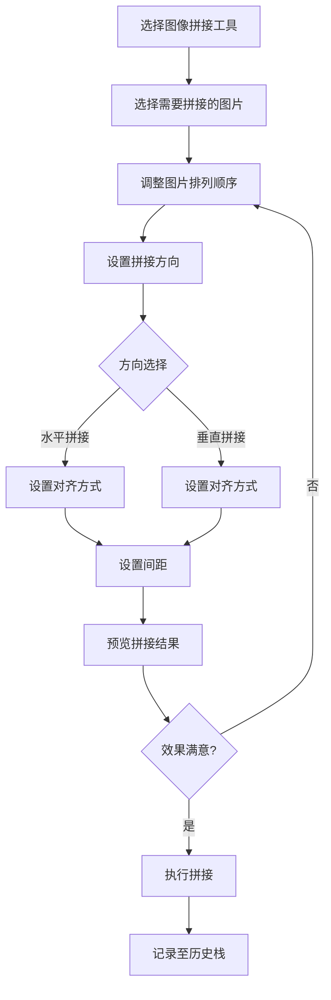
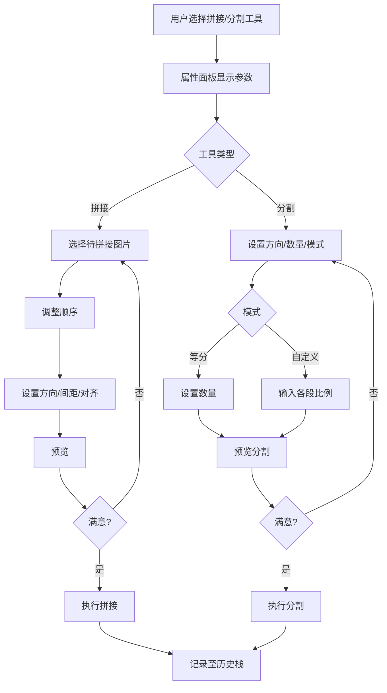

# 档案扫描件处理软件 PRD分册-F007-图像组合模块需求规格说明书

| 文档编号 | PRD-ARCHSCAN-F007-V1.0 | 文档版本 | V1.0 |
| :--- | :--------------------- | :--- | :------- |
| 所属总册 | PRD-ARCHSCAN-V1.0 档案扫描件处理软件产品需求规格说明书 | 编写人 | / |
| 编写日期 | / | 评审人 | 待定 |
| 评审日期 | 待定 | 归档日期 | 待定 |
| 文档状态 | □ 草稿 □ 评审中 □ 已归档 □ 已废弃 | 模块编号 | M009/M010 |

***

## 修订记录

| 版本号 | 修订日期 | 修订人 | 修订内容 | 审核人 |
| :--- | :---- | :---- | :--- | :---- |
| V1.0 | / | / | 首次发布 | 待定 |

***

## 目录

1. [模块概述](#1-模块概述)
2. [业务流程](#2-业务流程)
3. [功能需求与页面设计](#3-功能需求与页面设计)
4. [异常处理](#4-异常处理)
5. [附录](#5-附录)

***

## 1. 模块概述

### 1.1 模块说明

图像组合模块包含图像拼接（M009）和图像分割（M010）两个子模块。拼接模块将多张图片合并为一张完整图片，分割模块将一张图片拆分为多个子图，满足文档组合与拆分场景的需求。

**核心业务价值**：
- 拼接：支持水平/垂直拼接，可自定义间距、对齐方式和图片排列顺序
- 分割：支持等分和自定义比例分割，适合文档拆分场景

### 1.2 用户角色与权限

本产品为纯本地运行工具，无需登录，无角色区分。所有用户拥有全部功能权限。

### 1.3 与其他模块的关系

| 关联模块 | 关联关系说明 | 数据流向 |
| :----- | :----- | :------------- |
| M012 撤销/恢复模块 | 拼接/分割操作需记录至操作历史栈 | 输出（提交操作记录） |
| M013 导出模块 | 拼接/分割结果需通过导出模块保存 | 输出（传递结果给导出模块） |

***

## 2. 业务流程

### 2.1 图像拼接流程



### 2.2 图像分割流程

```mermaid
flowchart TD
    A[选择图像分割工具] --> B[设置分割方向]
    B --> C{方向选择}
    C -->|水平分割| D[设置分割数量/比例]
    C -->|垂直分割| D
    D --> E{模式选择}
    E -->|等分模式| F[设置等分数(2-10)]
    E -->|自定义比例| G[设置各段比例]
    F --> H[预览分割效果]
    G --> H
    H --> I{满意?}
    I -->|否| D
    I -->|是| J[执行分割]
    J --> K[记录至历史栈]
```

***

## 3. 功能需求与页面设计

### 3.1 功能清单

| 功能编号 | 功能名称 | 功能说明 | 优先级 |
| :--------- | :---- | :---- | :---- |
| F007-01 | 水平拼接 | 图片从左到右水平排列拼接 | 中 |
| F007-02 | 垂直拼接 | 图片从上到下垂直排列拼接 | 中 |
| F007-03 | 间距设置 | 设置拼接图片之间的间距（像素） | 中 |
| F007-04 | 对齐方式 | 水平拼接时设置顶部/居中/底部对齐，垂直拼接时设置左侧/居中/右侧对齐 | 中 |
| F007-05 | 图片选择与排序 | 选择待拼接图片并调整排列顺序 | 中 |
| F007-06 | 水平分割 | 沿水平方向将图片切割为多段 | 中 |
| F007-07 | 垂直分割 | 沿垂直方向将图片切割为多段 | 中 |
| F007-08 | 分割数量设置 | 设置分割数量（2-10） | 中 |
| F007-09 | 等分模式 | 均匀切割，每段尺寸相同 | 中 |
| F007-10 | 自定义比例模式 | 按指定比例切割，各段可不同 | 中 |
| F007-11 | 分割预览 | 预览分割效果 | 中 |

### 3.2 F007-01 水平拼接

#### 3.2.1 功能详情

| 需求编号 | F007-01 |
| :--- | :---------------------------------------------- |
| 功能概述 | 将多张图片按水平方向从左到右拼接为一张图片 |
| 业务描述 | 用户选择多张图片后，系统按用户设定的顺序从左到右水平排列拼接为一张大图 |
| 需求描述 | 1. 图片从左到右依次排列（ENUM-030）<br>2. 拼接后的总宽度为所有图片宽度之和+间距之和<br>3. 拼接后的总高度为各图片最大高度 |
| 行为者 | 普通用户 |
| 前置条件 | 文件列表中至少有两张图片 |
| 后置条件 | 拼接结果展示在画布上 |
| 界面描述 | 属性面板-拼接参数区：方向选择、间距滑块、对齐方式选择、图片列表 |
| 业务规则 | 1. 拼接方向默认水平<br>2. 图片顺序按列表拖拽调整<br>3. 可使用部分图片参与拼接 |
| 验收标准 | 1. 给定文件列表有3张图片，当用户选择水平拼接并确认，则3张图片从左到右拼接为一张 |

### 3.3 F007-02 垂直拼接

#### 3.3.1 功能详情

| 需求编号 | F007-02 |
| :--- | :---------------------------------------------- |
| 功能概述 | 将多张图片按垂直方向从上到下拼接为一张图片 |
| 业务描述 | 用户选择多张图片后，系统按顺序从上到下垂直排列拼接 |
| 需求描述 | 1. 图片从上到下依次排列（ENUM-030）<br>2. 拼接后的总高度为所有图片高度之和+间距之和<br>3. 拼接后的总宽度为各图片最大宽度 |
| 验收标准 | 1. 给定文件列表有3张图片，当用户选择垂直拼接并确认，则3张图片从上到下拼接为一张 |

### 3.4 F007-03 间距设置

#### 3.4.1 功能详情

| 需求编号 | F007-03 |
| :--- | :---------------------------------------------- |
| 功能概述 | 设置拼接图片之间的间距（像素） |
| 业务描述 | 用户通过滑块或输入框设置拼接图片之间的空白间隔 |
| 需求描述 | 1. 间距范围0-100像素（默认0）<br>2. 间距填充白色<br>3. 调节后预览实时更新 |
| 验收标准 | 1. 给定默认间距为0，当用户设置间距为20，则拼接后的图片之间有20px白色间隔 |

### 3.5 F007-04 对齐方式

#### 3.5.1 功能详情

| 需求编号 | F007-04 |
| :--- | :---------------------------------------------- |
| 功能概述 | 设置拼接时图片的对齐方式 |
| 业务描述 | 水平拼接时各图片高度可能不同，用户可选择顶部/居中/底部对齐（ENUM-031）；垂直拼接时各图片宽度可能不同，用户可选择左侧/居中/右侧对齐（ENUM-031） |
| 需求描述 | 1. 水平拼接：顶部对齐/居中对齐/底部对齐<br>2. 垂直拼接：左侧对齐/居中对齐/右侧对齐 |
| 验收标准 | 1. 给定水平拼接，图片高度不一致，当用户选择顶部对齐，则所有图片顶部对齐 |

### 3.6 F007-05 图片选择与排序

#### 3.6.1 功能详情

| 需求编号 | F007-05 |
| :--- | :---------------------------------------------- |
| 功能概述 | 从文件列表中选择待拼接的图片并调整顺序 |
| 业务描述 | 用户从文件列表中勾选需要参与拼接的图片，并通过拖拽调整它们的排列顺序 |
| 需求描述 | 1. 文件列表中每张图片可选/取消勾选<br>2. 已选图片可拖拽排序<br>3. 至少选择2张图片才能执行拼接 |
| 验收标准 | 1. 给定文件列表有5张图片，当用户勾选第1、3、5张并按顺序排列，则拼接结果按此顺序排列 |

### 3.7 F007-06/F007-07 水平/垂直分割

#### 3.7.1 功能详情

| 需求编号 | F007-06/F007-07 |
| :--- | :---------------------------------------------- |
| 功能概述 | 将一张图片沿水平或垂直方向切割为多段子图 |
| 业务描述 | 用户选择分割方向后，系统沿对应方向将图片切割为指定数量的子图 |
| 需求描述 | 1. 水平分割：沿水平方向切割，每段宽度相同（ENUM-032）<br>2. 垂直分割：沿垂直方向切割，每段高度相同（ENUM-032）<br>3. 支持等分和自定义比例两种模式 |
| 验收标准 | 1. 给定一张图片，选择水平分割-等分模式数量3，则图片被水平切割为3张等宽子图 |

### 3.8 F007-08 分割数量设置

#### 3.8.1 功能详情

| 需求编号 | F007-08 |
| :--- | :---------------------------------------------- |
| 功能概述 | 设置图片切割的数量 |
| 业务描述 | 用户通过滑块或输入框设置需要将图片分割为多少段 |
| 需求描述 | 1. 数量范围2-10（默认2）<br>2. 切换数字时预览即时更新<br>3. 等分模式下每段尺寸均匀 |
| 验收标准 | 1. 给定默认数量2，当用户设置为4，则预览显示图片被分为4段 |

### 3.9 F007-09 等分模式

#### 3.9.1 功能详情

| 需求编号 | F007-09 |
| :--- | :---------------------------------------------- |
| 功能概述 | 均匀分割图片，每段尺寸相同 |
| 业务描述 | 选择等分模式后，图片按指定数量均匀切割，每段宽度（水平分割）或高度（垂直分割）相等 |
| 需求描述 | 1. 选择等分模式（ENUM-033）<br>2. 每段尺寸自动计算并显示<br>3. 预览显示均匀的分割线 |
| 验收标准 | 1. 给定等分模式数量3，则每段宽度/高度均为原图1/3 |

### 3.10 F007-10 自定义比例模式

#### 3.10.1 功能详情

| 需求编号 | F007-10 |
| :--- | :---------------------------------------------- |
| 功能概述 | 按用户指定的比例切割图片 |
| 业务描述 | 用户在属性面板输入各段的比例值，系统按比例分配图片尺寸进行切割 |
| 需求描述 | 1. 选择自定义比例模式（ENUM-033）<br>2. 输入各段比例值（总和为100%）<br>3. 支持百分比形式输入 |
| 验收标准 | 1. 给定数量2，比例30%和70%，则第一段占30%宽度/高度，第二段占70% |

### 3.11 F007-11 分割预览

#### 3.11.1 功能详情

| 需求编号 | F007-11 |
| :--- | :---------------------------------------------- |
| 功能概述 | 在画布上预览分割效果 |
| 业务描述 | 用户调整完分割参数后，画布上叠加显示分割线和各段标注，预览分割效果 |
| 需求描述 | 1. 原图不裁切，叠加虚线分割线<br>2. 各段标注序号和尺寸<br>3. 确认后执行实际分割 |
| 验收标准 | 1. 给定数量4等分，预览显示3条分割线和4个序号标签 |

#### 3.11.2 页面设计

**页面类型**：工具面板页

如原型图所示：design/02PRD文档/页面原型/001-原型.png

##### 3.11.2.1 交互流程



***

## 4. 异常处理

### 4.1 异常场景清单

| 异常编号 | 异常场景 | 异常描述 | 处理方式 |
| :--- | :----- | :---- | :--------------- |
| E001 | 拼接图片不足 | 用户选择拼接时只有1张或0张图片 | 提示"至少需要2张图片才能拼接" |
| E002 | 分割尺寸太小 | 分割后每段尺寸小于10像素 | 提示"分割数量过多，每段过小" |
| E003 | 自定义比例不合规 | 各段比例之和不等于100% | 提示"各段比例之和必须为100%" |
| E004 | 拼接结果过大 | 拼接后总尺寸超过浏览器Canvas限制 | 提示"拼接结果尺寸过大，建议减少图片数量" |

### 4.2 边界场景处理

| 场景 | 预期行为 |
| :----- | :-------- |
| 拼接图片尺寸差异极大 | 按对齐方式处理，大图不变，小图对齐排列 |
| 分割比例精确到小数 | 支持0.1%精度，最后一各段取补足差值 |
| 反复多次拼接/分割 | 每次操作独立记录至历史栈 |
| 分割后子图数量 | 子图自动加入文件列表 |

***

## 5. 附录

### 5.1 枚举值引用清单

| 本模块使用场景 | 枚举编号 | 枚举名称 | 说明 |
| :------ | :---------- | :----- | :---- |
| 拼接方向 | ENUM-030 | 拼接方向 | horizontal/vertical |
| 对齐方式 | ENUM-031 | 拼接对齐方式 | top/center/bottom/left/right |
| 分割方向 | ENUM-032 | 分割方向 | horizontal/vertical |
| 分割模式 | ENUM-033 | 分割模式 | equal/custom |

### 5.2 名词解释

| 名词 | 说明 |
| :----- | :---- |
| 水平拼接 | 多张图片从左到右横向排列合并为一张图片 |
| 垂直拼接 | 多张图片从上到下纵向排列合并为一张图片 |
| 等分模式 | 图片按指定数量均匀切割，每段尺寸一致 |
| 自定义比例 | 图片按用户指定的比例值进行切割 |

### 5.3 相关参考文档

| 文档名称 | 文档路径 | 备注 |
| :----------- | :------ | :------ |
| PRD总册-档案扫描件处理软件 | design/02PRD文档/PRD总册-产品需求规格说明书.md | 所属总册 |
| F010-导出模块分册 | design/02PRD文档/F010-导出模块分册.md | 依赖的导出模块 |
