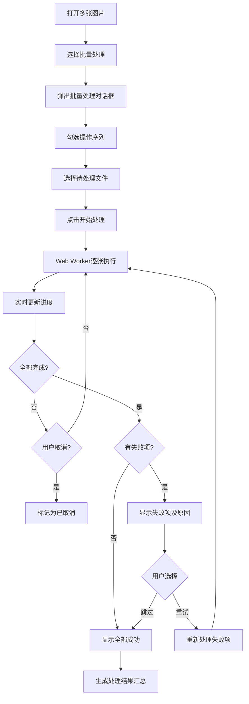
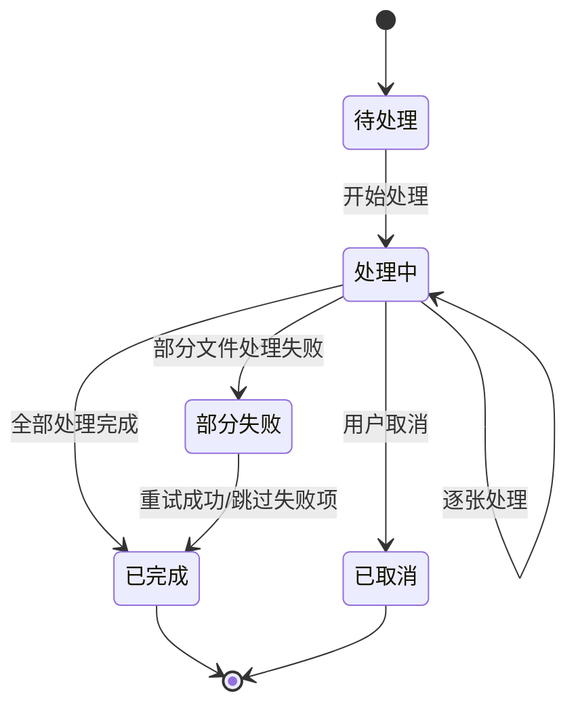
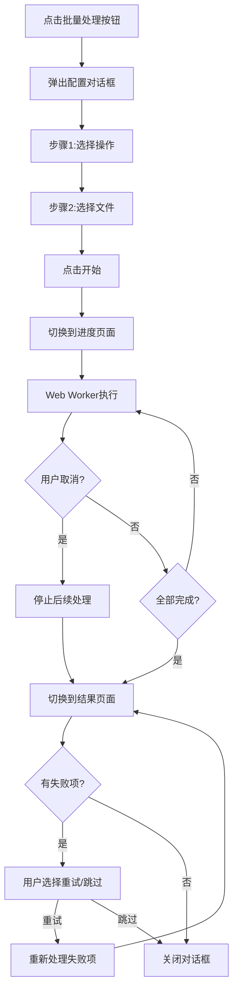

# 档案扫描件处理软件 PRD分册-F008-批量处理模块需求规格说明书

| 文档编号 | PRD-ARCHSCAN-F008-V1.0 | 文档版本 | V1.0 |
| :--- | :--------------------- | :--- | :------- |
| 所属总册 | PRD-ARCHSCAN-V1.0 档案扫描件处理软件产品需求规格说明书 | 编写人 | / |
| 编写日期 | / | 评审人 | 待定 |
| 评审日期 | 待定 | 归档日期 | 待定 |
| 文档状态 | □ 草稿 □ 评审中 □ 已归档 □ 已废弃 | 模块编号 | M011 |

***

## 修订记录

| 版本号 | 修订日期 | 修订人 | 修订内容 | 审核人 |
| :--- | :---- | :---- | :--- | :---- |
| V1.0 | / | / | 首次发布 | 待定 |

***

## 目录

1. [模块概述](#1-模块概述)
2. [业务流程](#2-业务流程)
3. [功能需求与页面设计](#3-功能需求与页面设计)
4. [异常处理](#4-异常处理)
5. [附录](#5-附录)

***

## 1. 模块概述

### 1.1 模块说明

批量处理模块（M011）提供对多张图片批量执行同一操作序列的能力，大幅提升重复性图片处理任务的效率。用户可选择需要执行的操作（裁剪、旋转、调色、去黑孔、纠偏等），选择待处理的文件，一键批量执行。

**核心业务价值**：
- 支持多项操作组合批量执行，减少重复操作90%以上
- Web Worker异步执行，不阻塞UI线程
- 实时进度显示与取消，便于管理
- 处理结果汇总展示，失败项支持重试

### 1.2 用户角色与权限

本产品为纯本地运行工具，无需登录，无角色区分。所有用户拥有全部功能权限。

### 1.3 与其他模块的关系

| 关联模块 | 关联关系说明 | 数据流向 |
| :----- | :----- | :------------- |
| M001 文件管理模块 | 批量处理需先打开多张图片文件 | 输入（接收文件列表） |
| M003~M008 各处理模块 | 批量处理依赖各单图处理模块的能力 | 输入（调用单图处理能力） |

***

## 2. 业务流程

### 2.1 批量处理主流程

### 2.2 批量处理任务状态机

***

## 3. 功能需求与页面设计

### 3.1 功能清单

| 功能编号 | 功能名称 | 功能说明 | 优先级 |
| :--------- | :---- | :---- | :---- |
| F008-01 | 选择处理操作 | 从操作列表中选择要批量执行的操作（可多选组合） | 中 |
| F008-02 | 待处理文件选择 | 从文件列表中选择要处理的文件（勾选/全选） | 中 |
| F008-03 | 处理进度显示 | 显示批量处理的实时进度，支持取消操作 | 中 |
| F008-04 | 批量处理结果汇总 | 汇总展示处理结果（成功/失败/跳过状态及原因） | 中 |

### 3.2 F008-01 选择处理操作

#### 3.2.1 功能详情

| 需求编号 | F008-01 |
| :--- | :---------------------------------------------- |
| 功能概述 | 用户勾选需要批量执行的操作组合 |
| 业务描述 | 在批量处理对话框中，用户从可用的操作列表中勾选需要执行的操作（裁剪、旋转、调色、去黑孔、纠偏等），可多选组合，并对每项操作设置参数 |
| 需求描述 | 1. 操作列表：裁剪、旋转、调色、去黑孔、纠偏（ENUM-040） 2. 支持多项操作组合勾选 3. 选中每项操作后可设置参数（使用该操作当前的工具参数配置） |
| 行为者 | 普通用户 |
| 前置条件 | 文件列表中至少有一张图片 |
| 后置条件 | 操作序列配置完成 |
| 界面描述 | 批量处理对话框-操作选择区：操作项复选框列表，每项可展开配置参数 |
| 业务规则 | 1. 至少选择一项操作才能开始处理 2. 操作参数复用当前工具面板的配置值 3. 操作按选择顺序依次执行 |
| 验收标准 | 1. 给定操作列表有5个可选操作，当用户勾选"纠偏"和"去黑孔"，则操作序列包含这两项 |

### 3.3 F008-02 待处理文件选择

#### 3.3.1 功能详情

| 需求编号 | F008-02 |
| :--- | :---------------------------------------------- |
| 功能概述 | 从文件列表中选择需要批量处理的文件 |
| 业务描述 | 在批量处理对话框中，用户从文件列表中勾选需要处理的文件，支持全选和反选 |
| 需求描述 | 1. 显示文件列表中所有图片 2. 每张图片前有复选框 3. 支持全选/反选操作 4. 显示文件缩略图和文件名 |
| 行为者 | 普通用户 |
| 前置条件 | 文件列表中至少有一张图片 |
| 后置条件 | 待处理文件范围确定 |
| 界面描述 | 批量处理对话框-文件选择区：文件列表带复选框、全选按钮 |
| 业务规则 | 1. 至少选择一个文件才能开始处理 2. 默认全选 3. 所有文件使用同一操作序列 |
| 验收标准 | 1. 给定文件列表有5个文件，当用户取消勾选2个文件后开始处理，则只处理3个文件 |

### 3.4 F008-03 处理进度显示

#### 3.4.1 功能详情

| 需求编号 | F008-03 |
| :--- | :---------------------------------------------- |
| 功能概述 | 实时显示批量处理进度，支持取消 |
| 业务描述 | 批量处理开始后，进度对话框实时显示处理的进度，包括当前处理到第几张、处理状态、耗时等信息，用户可随时取消处理 |
| 需求描述 | 1. 进度条显示整体完成百分比 2. 显示当前处理文件名称和序号（如：3/10） 3. 每张文件处理状态实时更新 4. 取消按钮可终止后续处理 5. 取消后已完成的文件保留结果 |
| 行为者 | 普通用户 |
| 前置条件 | 批量处理已启动 |
| 后置条件 | 处理完成或取消 |
| 界面描述 | 批量处理对话框-进度区：进度条、当前文件信息、文件处理状态列表、取消按钮 |
| 业务规则 | 1. 处理使用Web Worker异步执行 2. 取消操作后正在处理的当前文件继续完成 3. 处理吞吐量>=10张/分钟（常规操作序列） |
| 验收标准 | 1. 给定10张文件执行批量处理，当处理到第5张时，进度条显示50%，状态显示"5/10" |
| 异常流程 | 单张处理失败时不中断整体流程，失败的文件标记状态后继续处理下一张 |

### 3.5 F008-04 批量处理结果汇总

#### 3.5.1 功能详情

| 需求编号 | F008-04 |
| :--- | :---------------------------------------------- |
| 功能概述 | 汇总展示所有文件的处理结果 |
| 业务描述 | 批量处理完成后（或取消后），系统汇总所有文件的处理结果，展示成功/失败/未处理的文件列表，失败项显示原因并支持重试 |
| 需求描述 | 1. 按状态分组展示：成功、失败、未处理 2. 每项显示文件名、处理状态、失败原因 3. 失败项支持"重试"操作 4. 汇总统计：总文件数、成功数、失败数、未处理数 |
| 行为者 | 普通用户 |
| 前置条件 | 批量处理已完成或取消 |
| 后置条件 | 用户确认结果 |
| 界面描述 | 批量处理对话框-结果区：统计信息、状态分组列表、重试按钮、完成按钮 |
| 业务规则 | 1. 重试时只重新处理失败项 2. 原处理结果保留，重试不覆盖成功项 |
| 验收标准 | 1. 给定10张文件处理完成后，汇总显示成功8张/失败2张，当用户点击重试，则只处理2张失败文件 |

#### 3.5.2 页面设计

**页面类型**：模态对话框

如原型图所示：design/02PRD文档/页面原型/001-原型.png

##### 3.5.2.1 交互流程

***

## 4. 异常处理

### 4.1 异常场景清单

| 异常编号 | 异常场景 | 异常描述 | 处理方式 |
| :--- | :----- | :---- | :--------------- |
| E001 | 未选择任何操作 | 用户未勾选操作直接点击开始 | 提示"请至少选择一项操作" |
| E002 | 未选择任何文件 | 用户未勾选文件直接点击开始 | 提示"请至少选择一个文件" |
| E003 | 单张处理失败 | 某张图片处理过程中出错 | 标记失败，记录错误原因，继续处理其他文件 |
| E004 | Web Worker异常 | Worker线程崩溃 | 弹出提示保存已处理结果，建议重新启动应用 |
| E005 | 内存不足 | 同时处理大图时内存不足 | 弹窗提示减少文件数量分批处理 |

### 4.2 边界场景处理

| 场景 | 预期行为 |
| :----- | :-------- |
| 所有文件处理都失败 | 结果汇总显示0成功/全部失败，显示各自失败原因 |
| 用户取消时部分文件已处理完 | 已处理的文件保留结果，未处理的不执行 |
| 处理过程中关闭文件 | 从待处理列表中移除已关闭文件 |
| 重试失败项仍然失败 | 显示重试仍失败，给出解决方案建议 |

***

## 5. 附录

### 5.1 枚举值引用清单

| 本模块使用场景 | 枚举编号 | 枚举名称 | 说明 |
| :------ | :---------- | :----- | :---- |
| 操作类型选择 | ENUM-040 | 批量操作类型 | crop/rotate/adjust/denoise/correction |
| 任务状态管理 | ENUM-041 | 批量任务状态 | pending/processing/completed/failed/cancelled |

### 5.2 名词解释

| 名词 | 说明 |
| :----- | :---- |
| 操作序列 | 用户选择的一组待执行操作的列表，按选定顺序依次执行 |
| Web Worker | 浏览器提供的后台线程机制，用于在不阻塞UI的情况下执行耗时计算 |
| 处理进度 | 批量处理执行过程中各文件的处理状态和整体进度信息 |

### 5.3 相关参考文档

| 文档名称 | 文档路径 | 备注 |
| :----------- | :------ | :------ |
| PRD总册-档案扫描件处理软件 | design/02PRD文档/PRD总册-产品需求规格说明书.md | 所属总册 |
| F001-文件管理模块分册 | design/02PRD文档/F001-文件管理模块分册.md | 依赖的上游模块 |
