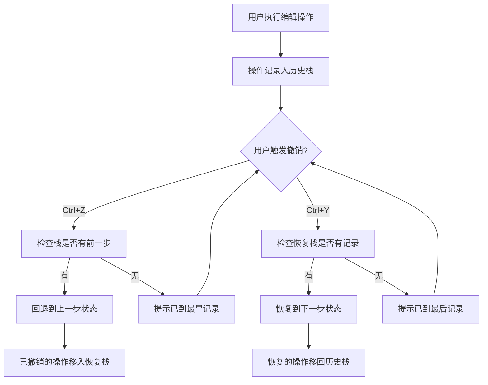
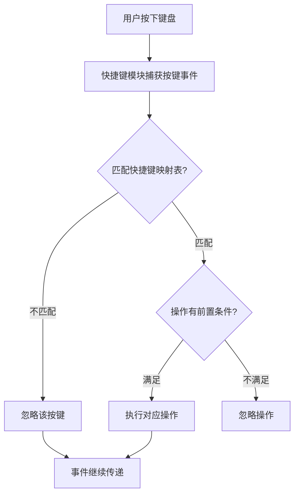
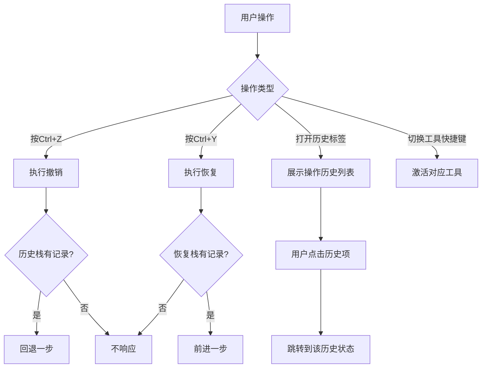

# 档案扫描件处理软件 PRD分册-F009-系统支撑模块需求规格说明书

| 文档编号 | PRD-ARCHSCAN-F009-V1.0 | 文档版本 | V1.0 |
| :--- | :--------------------- | :--- | :------- |
| 所属总册 | PRD-ARCHSCAN-V1.0 档案扫描件处理软件产品需求规格说明书 | 编写人 | / |
| 编写日期 | / | 评审人 | 待定 |
| 评审日期 | 待定 | 归档日期 | 待定 |
| 文档状态 | □ 草稿 □ 评审中 □ 已归档 □ 已废弃 | 模块编号 | M012/M014 |

***

## 修订记录

| 版本号 | 修订日期 | 修订人 | 修订内容 | 审核人 |
| :--- | :---- | :---- | :--- | :---- |
| V1.0 | / | / | 首次发布 | 待定 |

***

## 目录

1. [模块概述](#1-模块概述)
2. [业务流程](#2-业务流程)
3. [功能需求与页面设计](#3-功能需求与页面设计)
4. [异常处理](#4-异常处理)
5. [附录](#5-附录)

***

## 1. 模块概述

### 1.1 模块说明

系统支撑模块包含撤销/恢复（M012）和快捷键（M014）两个子模块。撤销/恢复模块提供操作历史的回退能力，快捷键模块提供键盘快捷操作能力，两者共同提升产品交互体验和操作效率。

**核心业务价值**：
- 撤销/恢复：支持Ctrl+Z/Ctrl+Y快捷撤销恢复，操作历史列表可视化展示
- 快捷键：预设全局快捷键映射，支持快捷键查看帮助

### 1.2 用户角色与权限

本产品为纯本地运行工具，无需登录，无角色区分。所有用户拥有全部功能权限。

### 1.3 与其他模块的关系

| 关联模块 | 关联关系说明 | 数据流向 |
| :----- | :----- | :------------- |
| M003~M011 所有处理模块 | 所有处理操作需记录至操作历史栈以支持撤销/恢复 | 输入（接收各模块提交的操作记录） |

***

## 2. 业务流程

### 2.1 撤销/恢复流程

### 2.2 快捷键触发流程

***

## 3. 功能需求与页面设计

### 3.1 功能清单

| 功能编号 | 功能名称 | 功能说明 | 优先级 |
| :--------- | :---- | :---- | :---- |
| F009-01 | 撤销操作 | 撤销上一步编辑操作（Ctrl+Z） | 高 |
| F009-02 | 恢复操作 | 恢复已撤销的操作（Ctrl+Y） | 高 |
| F009-03 | 操作历史列表 | 在属性面板展示操作历史记录列表 | 高 |
| F009-04 | 全局快捷键映射 | 预设全局快捷键，支持文件/编辑/工具切换等操作 | 低 |
| F009-05 | 快捷键查看帮助 | 弹窗展示完整快捷键列表 | 低 |
| F009-06 | 恢复默认快捷键 | 将快捷键重置为系统默认配置 | 低 |

### 3.2 F009-01 撤销操作

#### 3.2.1 功能详情

| 需求编号 | F009-01 |
| :--- | :---------------------------------------------- |
| 功能概述 | 撤销上一步编辑操作，回到操作前状态 |
| 业务描述 | 用户执行编辑操作后发现效果不理想，可通过Ctrl+Z或点击撤销按钮逐步回退操作，每次回退一步 |
| 需求描述 | 1. 支持快捷键Ctrl+Z触发撤销 2. 支持菜单栏"编辑>撤销"触发 3. 每次撤销回退一步操作 4. 状态栏显示当前历史步数 5. 连续按Ctrl+Z可多次撤销 |
| 行为者 | 普通用户 |
| 前置条件 | 操作历史栈中有至少一条记录 |
| 后置条件 | 画布恢复到上一步操作状态 |
| 界面描述 | 菜单栏-编辑-撤销(Ctrl+Z) |
| 业务规则 | 1. 历史栈上限20步 2. 撤销后画布状态恢复到操作前 3. 无法撤销到初始加载状态之前 |
| 验收标准 | 1. 给定用户执行了裁剪操作，当用户按Ctrl+Z，则画布恢复到裁剪前的状态 2. 给定历史栈为空（无操作），当用户按Ctrl+Z，则不执行任何操作 |

### 3.3 F009-02 恢复操作

#### 3.3.1 功能详情

| 需求编号 | F009-02 |
| :--- | :---------------------------------------------- |
| 功能概述 | 恢复已撤销的操作，回到撤销前的状态 |
| 业务描述 | 用户撤销后反悔，可通过Ctrl+Y或点击恢复按钮重新应用刚才撤销的操作 |
| 需求描述 | 1. 支持快捷键Ctrl+Y触发恢复 2. 支持菜单栏"编辑>恢复"触发 3. 每次恢复前进一步 4. 只有在执行了撤销操作后恢复才可用 |
| 行为者 | 普通用户 |
| 前置条件 | 恢复栈中有记录（执行过撤销操作） |
| 后置条件 | 画布前进到下一步操作状态 |
| 验收标准 | 1. 给定用户撤销了一次裁剪，当用户按Ctrl+Y，则画布恢复到裁剪后的状态 |

### 3.4 F009-03 操作历史列表

#### 3.4.1 功能详情

| 需求编号 | F009-03 |
| :--- | :---------------------------------------------- |
| 功能概述 | 在属性面板显示操作历史记录列表 |
| 业务描述 | 属性面板的操作历史标签页中，按时间倒序展示所有操作记录，用户可点击任意记录直接跳转到该操作状态 |
| 需求描述 | 1. 历史记录显示操作名称和缩略信息 2. 当前所处历史位置高亮标记 3. 支持点击跳转到指定历史位置 4. 撤销后的记录显示为灰色 5. 新操作清除所有"已撤销"状态的历史 |
| 行为者 | 普通用户 |
| 前置条件 | 至少有一条操作历史记录 |
| 后置条件 | 画布跳转到选中的历史状态 |
| 界面描述 | 属性面板-操作历史标签页：列表展示操作记录、当前状态标记、操作时间/序号 |
| 业务规则 | 1. 上限20条记录，超出自动丢弃最早记录 2. 历史记录仅当前会话有效 3. 切换文件时历史记录独立 |
| 验收标准 | 1. 给定用户执行了5步操作，当用户打开操作历史标签页，则显示5条记录 |

### 3.5 F009-04 全局快捷键映射

#### 3.5.1 功能详情

| 需求编号 | F009-04 |
| :--- | :---------------------------------------------- |
| 功能概述 | 预设全局快捷键映射，支持快速操作 |
| 业务描述 | 系统预设一组快捷键映射，涵盖文件操作、编辑操作、工具切换等功能，用户可使用键盘快速完成操作 |
| 需求描述 | 1. 文件操作：Ctrl+O打开、Ctrl+S保存、Ctrl+Shift+S另存为、Ctrl+E导出 2. 编辑操作：Ctrl+Z撤销、Ctrl+Y恢复 3. 工具切换：V选择、H移动、C裁剪、R旋转 4. 视图操作：+放大、-缩小、Ctrl+0适应窗口、Ctrl+1实际大小 5. 快捷键在全局范围内生效 |
| 行为者 | 普通用户 |
| 前置条件 | 应用已启动 |
| 后置条件 | 执行对应的操作 |
| 业务规则 | 1. 快捷键在输入框内不生效（避免与文字输入冲突） 2. 快捷键冲突时以高优先级功能为准 |
| 验收标准 | 1. 给定应用已启动，当用户按C键（不在输入框中），则自动切换为裁剪工具 |

### 3.6 F009-05 快捷键查看帮助

#### 3.6.1 功能详情

| 需求编号 | F009-05 |
| :--- | :---------------------------------------------- |
| 功能概述 | 弹窗展示完整快捷键列表供用户查阅 |
| 业务描述 | 用户可通过菜单栏"帮助>快捷键"或按?键打开快捷键帮助面板，查看所有可用的快捷键映射 |
| 需求描述 | 1. 按功能分组展示快捷键（文件、编辑、工具、视图） 2. 显示快捷键按键和对应功能描述 3. 弹窗可关闭 4. 支持模糊搜索快捷键功能 |
| 行为者 | 普通用户 |
| 前置条件 | 无 |
| 后置条件 | 显示快捷键帮助弹窗 |
| 界面描述 | 模态对话框-快捷键帮助面板：分组列表、按键图标、功能描述 |
| 验收标准 | 1. 给定用户点击"帮助>快捷键"，则弹出快捷键列表对话框 |

### 3.7 F009-06 恢复默认快捷键

#### 3.7.1 功能详情

| 需求编号 | F009-06 |
| :--- | :---------------------------------------------- |
| 功能概述 | 将快捷键配置重置为系统默认设置 |
| 业务描述 | 在快捷键帮助面板中提供"恢复默认"按钮，一键恢复所有快捷键到出厂默认映射 |
| 需求描述 | 1. 恢复默认按钮在快捷键帮助面板底部 2. 点击后弹出确认弹窗 3. 确认后所有快捷键恢复为出厂设置 |
| 验收标准 | 1. 给定用户修改了快捷键，当用户点击恢复默认并确认，则所有快捷键回到初始映射 |

#### 3.7.2 页面设计

**页面类型**：工具面板页/模态对话框

如原型图所示：design/02PRD文档/页面原型/001-原型.png

##### 3.7.2.1 交互流程

***

## 4. 异常处理

### 4.1 异常场景清单

| 异常编号 | 异常场景 | 异常描述 | 处理方式 |
| :--- | :----- | :---- | :--------------- |
| E001 | 无操作可撤销 | 用户按Ctrl+Z但历史栈为空 | 状态栏提示"已到最早记录"，无其他响应 |
| E002 | 无操作可恢复 | 用户按Ctrl+Y但恢复栈为空 | 状态栏提示"已到最后记录" |
| E003 | 历史栈已满 | 操作超过20步上限 | 自动丢弃最早记录，新操作入栈 |
| E004 | 快捷键冲突 | 多工具快捷键冲突 | 以当前激活的工具为准，工具切换后快捷键映射自动跟随 |

### 4.2 边界场景处理

| 场景 | 预期行为 |
| :----- | :-------- |
| 撤销后执行新操作 | 恢复栈清空，新操作入历史栈 |
| 切换文件后历史状态 | 每个文件独立维护历史栈，切换后不影响其他文件 |
| 关闭应用后再次打开 | 历史记录清空，仅会话内有效 |
| 输入框内按快捷键 | 快捷键不触发，正常输入文字 |

***

## 5. 附录

### 5.1 枚举值引用清单

本模块不涉及自定义枚举值，引用总册中全局定义。

### 5.2 名词解释

| 名词 | 说明 |
| :----- | :---- |
| 历史栈 | 存储用户操作记录的数组结构，后进先出 |
| 恢复栈 | 存储已撤销操作记录的数组结构，用于支持Ctrl+Y恢复 |
| 操作记录 | 包含操作类型、操作参数、操作时间戳的数据对象 |
| 会话 | 用户从打开应用到关闭应用的完整使用周期 |

### 5.3 相关参考文档

| 文档名称 | 文档路径 | 备注 |
| :----------- | :------ | :------ |
| PRD总册-档案扫描件处理软件 | design/02PRD文档/PRD总册-产品需求规格说明书.md | 所属总册 |
