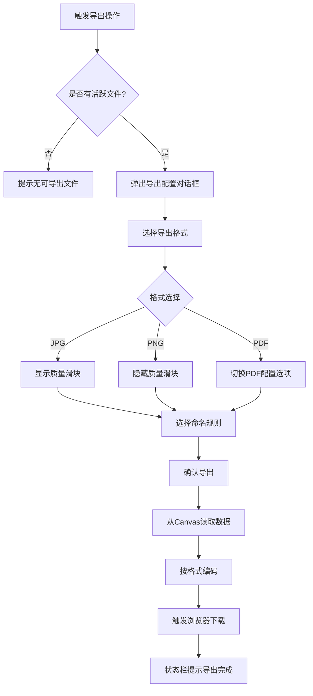
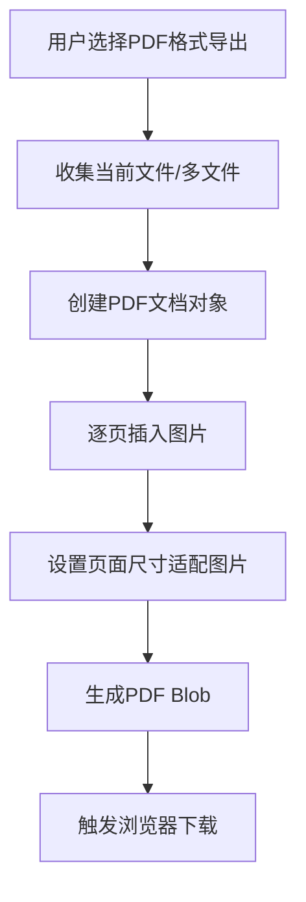

# 档案扫描件处理软件 PRD分册-F010-导出模块需求规格说明书

| 文档编号 | PRD-ARCHSCAN-F010-V1.0 | 文档版本 | V1.0 |
| :--- | :--------------------- | :--- | :------- |
| 所属总册 | PRD-ARCHSCAN-V1.0 档案扫描件处理软件产品需求规格说明书 | 编写人 | / |
| 编写日期 | / | 评审人 | 待定 |
| 评审日期 | 待定 | 归档日期 | 待定 |
| 文档状态 | □ 草稿 □ 评审中 □ 已归档 □ 已废弃 | 模块编号 | M013 |

***

## 修订记录

| 版本号 | 修订日期 | 修订人 | 修订内容 | 审核人 |
| :--- | :---- | :---- | :--- | :---- |
| V1.0 | / | / | 首次发布 | 待定 |

***

## 目录

1. [模块概述](#1-模块概述)
2. [业务流程](#2-业务流程)
3. [功能需求与页面设计](#3-功能需求与页面设计)
4. [异常处理](#4-异常处理)
5. [附录](#5-附录)

***

## 1. 模块概述

### 1.1 模块说明

导出模块（M013）负责将用户编辑完成的图片结果输出为指定格式的文件。支持JPG、PNG、PDF三种格式导出，提供质量控制、命名规则等配置能力。

**核心业务价值**：
- 多格式导出覆盖主流需求（JPG/PNG/PDF）
- JPG格式支持质量控制，平衡文件大小与画质
- 支持多种命名规则，便于文件管理

### 1.2 用户角色与权限

本产品为纯本地运行工具，无需登录，无角色区分。所有用户拥有全部功能权限。

### 1.3 与其他模块的关系

| 关联模块 | 关联关系说明 | 数据流向 |
| :----- | :----- | :------------- |
| M001 文件管理模块 | 导出需先有已加载的图片文件 | 输入（接收当前编辑数据） |
| M009 图像拼接模块 | 拼接结果需通过导出模块保存 | 输入（接收拼接结果数据） |
| M010 图像分割模块 | 分割结果需通过导出模块保存 | 输入（接收分割结果数据） |

***

## 2. 业务流程

### 2.1 导出流程

### 2.2 PDF导出流程

***

## 3. 功能需求与页面设计

### 3.1 功能清单

| 功能编号 | 功能名称 | 功能说明 | 优先级 |
| :--------- | :---- | :---- | :---- |
| F010-01 | 导出格式选择 | 选择导出图片格式（JPG、PNG、PDF） | 高 |
| F010-02 | 质量控制 | 设置JPG格式的导出质量（1%-100%） | 高 |
| F010-03 | 导出路径选择 | 选择文件保存位置 | 高 |
| F010-04 | 文件命名规则 | 选择命名方式：保持原名、自动编号、自定义前缀 | 高 |

### 3.2 F010-01 导出格式选择

#### 3.2.1 功能详情

| 需求编号 | F010-01 |
| :--- | :---------------------------------------------- |
| 功能概述 | 用户选择导出文件的格式 |
| 业务描述 | 用户在导出对话框中选择导出格式，支持JPG、PNG、PDF三种格式（ENUM-002），选择不同格式时下方显示对应的配置选项 |
| 需求描述 | 1. 格式选择下拉框：JPG/PNG/PDF 2. 选择JPG时展开质量滑块 3. 选择PDF时展开PDF配置选项 4. 默认格式与当前文件格式一致 |
| 行为者 | 普通用户 |
| 前置条件 | 有活跃文件 |
| 后置条件 | 导出格式已选定 |
| 界面描述 | 导出对话框-格式下拉选择器 |
| 验收标准 | 1. 给定用户打开导出对话框，当用户选择PNG格式，则质量滑块隐藏 |

### 3.3 F010-02 质量控制

#### 3.3.1 功能详情

| 需求编号 | F010-02 |
| :--- | :---------------------------------------------- |
| 功能概述 | 设置JPG格式的导出质量 |
| 业务描述 | 用户选择JPG格式后，通过滑块设置导出质量（1%-100%），质量越高文件越大画质越好 |
| 需求描述 | 1. 质量滑块范围1-100（默认85） 2. 实时显示当前质量百分比 3. 仅JPG格式时可见 4. 滑块左侧低质量、右侧高质量标注 |
| 验收标准 | 1. 给定质量默认85，当用户拖动到50，则导出的JPG文件质量降低、文件大小减小 |

### 3.4 F010-03 导出路径选择

#### 3.4.1 功能详情

| 需求编号 | F010-03 |
| :--- | :---------------------------------------------- |
| 功能概述 | 选择文件导出的保存位置 |
| 业务描述 | 浏览器默认使用下载目录保存文件，用户可通过浏览器"另存为"方式选择自定义保存路径 |
| 需求描述 | 1. 使用浏览器下载功能保存文件 2. 可自定义下载文件名 |
| 验收标准 | 1. 给定用户点击导出，则浏览器触发文件下载到默认下载目录 |

### 3.5 F010-04 文件命名规则

#### 3.5.1 功能详情

| 需求编号 | F010-04 |
| :--- | :---------------------------------------------- |
| 功能概述 | 选择导出文件的命名方式 |
| 业务描述 | 用户选择命名规则，支持保持原名、自动编号、自定义前缀三种方式（ENUM-003） |
| 需求描述 | 1. 保持原名（original）：使用原文件名导出 2. 自动编号（auto_num）：按文件顺序编号（如 001.jpg、002.jpg） 3. 自定义前缀（custom）：用户输入前缀+编号（如 scan_001.jpg） 4. 多文件导出时自动编号和自定义前缀附加序号 |
| 验收标准 | 1. 给定用户选择自动编号导出3张图片，则文件名依次为001.jpg、002.jpg、003.jpg |

#### 3.5.2 页面设计

**页面类型**：模态对话框

如原型图所示：design/02PRD文档/页面原型/001-原型.png

##### 3.5.2.1 交互流程

`mermaid
flowchart TD
    A[用户触发导出] --> B[弹出导出对话框]
    B --> C[选择导出格式]
    C --> D{格式}
    D -->|JPG| E[显示质量滑块]
    D -->|PNG| F[隐藏质量滑块]
    D -->|PDF| G[显示PDF选项]
    E --> H[选择命名规则]
    F --> H
    G --> H
    H --> I{命名规则}
    I -->|保持原名| J[文件名锁定为原文件名]
    I -->|自动编号| K[显示编号预览]
    I -->|自定义前缀| L[显示前缀输入框]
    J --> M[确认导出]
    K --> M
    L --> M
    M --> N[从Canvas读取图片数据]
    N --> O[按格式编码]
    O --> P[触发浏览器下载]
`

***

## 4. 异常处理

### 4.1 异常场景清单

| 异常编号 | 异常场景 | 异常描述 | 处理方式 |
| :--- | :----- | :---- | :--------------- |
| E001 | 无可导出文件 | 用户触发导出时无活跃文件 | 提示"当前没有可导出的文件" |
| E002 | Canvas导出失败 | Canvas.toBlob/toDataURL抛出异常 | 提示"导出失败，请重试" |
| E003 | PDF生成失败 | PDF文档创建过程中出错 | 提示"PDF生成失败，请检查图片尺寸是否过大" |
| E004 | 浏览器不支持PDF | 浏览器不支持PDF生成 | 提示"当前浏览器不支持PDF导出，请使用Chrome或Edge" |

### 4.2 边界场景处理

| 场景 | 预期行为 |
| :----- | :-------- |
| 导出超大图片 | 提示图片尺寸过大可能导出失败 |
| 导出透明背景为JPG | JPG不支持透明通道，自动填充白色背景 |
| 多文件批量导出 | 按命名规则依次导出，支持打包为ZIP或逐个下载 |

***

## 5. 附录

### 5.1 枚举值引用清单

| 本模块使用场景 | 枚举编号 | 枚举名称 | 说明 |
| :------ | :---------- | :----- | :---- |
| 格式选择 | ENUM-002 | 导出文件格式 | jpg/png/pdf |
| 命名规则 | ENUM-003 | 导出命名规则 | original/auto_num/custom |

### 5.2 名词解释

| 名词 | 说明 |
| :----- | :---- |
| Canvas.toBlob | HTML5 Canvas API，用于将Canvas内容编码为指定格式的二进制数据 |
| Canvas.toDataURL | HTML5 Canvas API，用于将Canvas内容编码为Base64格式的图片数据 |
| PDF | 便携式文档格式，适合多张图片或文档的归档保存 |

### 5.3 相关参考文档

| 文档名称 | 文档路径 | 备注 |
| :----------- | :------ | :------ |
| PRD总册-档案扫描件处理软件 | design/02PRD文档/PRD总册-产品需求规格说明书.md | 所属总册 |
| F001-文件管理模块分册 | design/02PRD文档/F001-文件管理模块分册.md | 关联的文件管理模块 |
| F007-图像组合模块分册 | design/02PRD文档/F007-图像组合模块分册.md | 依赖本模块导出的上游模块 |
