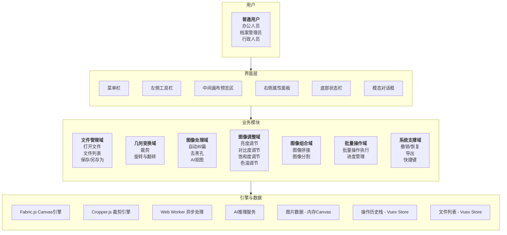
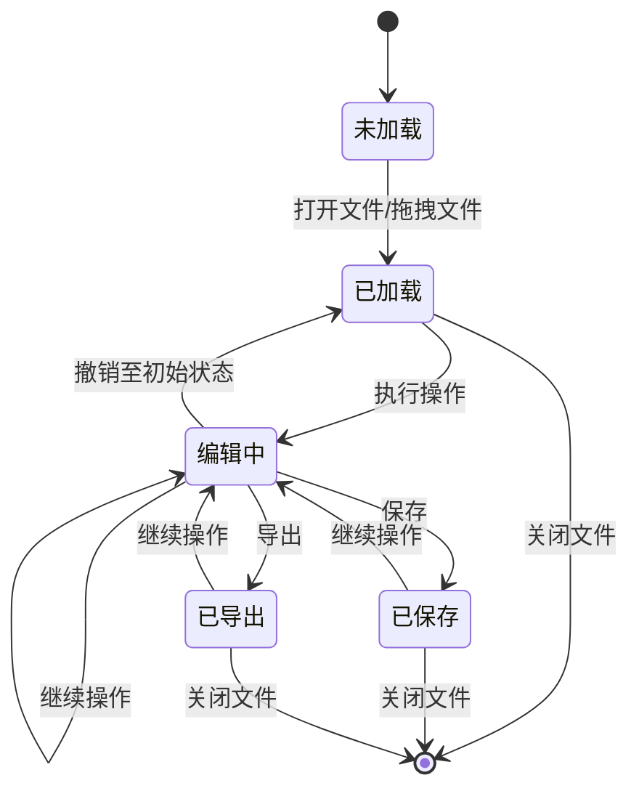
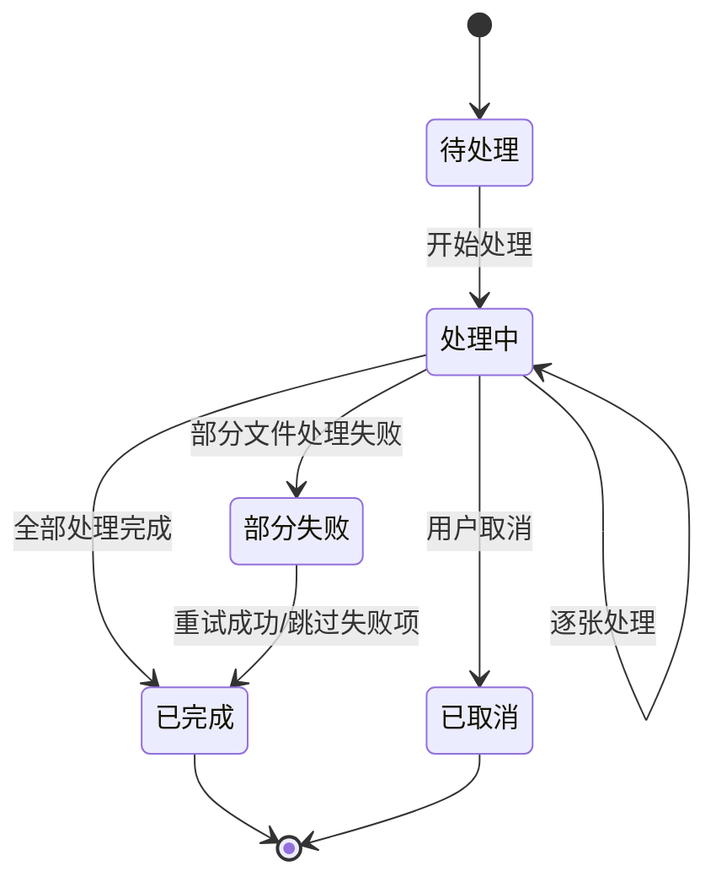
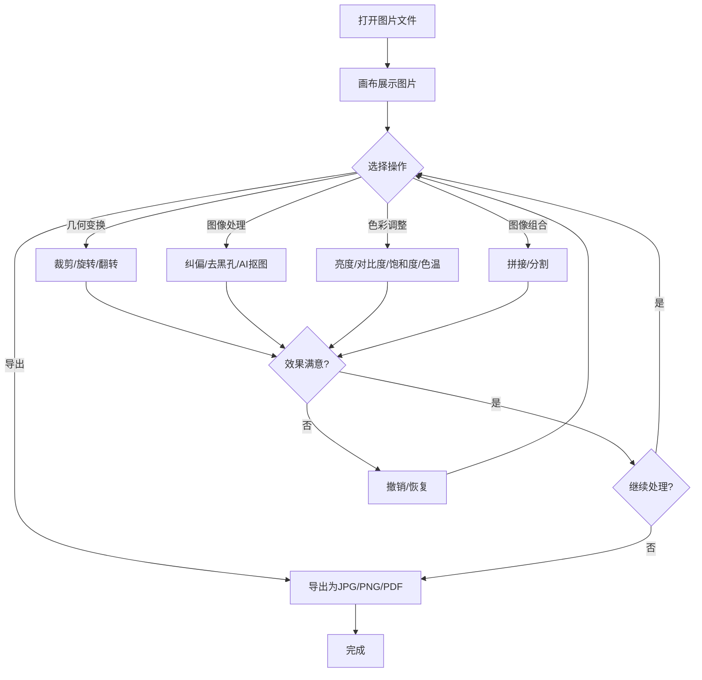
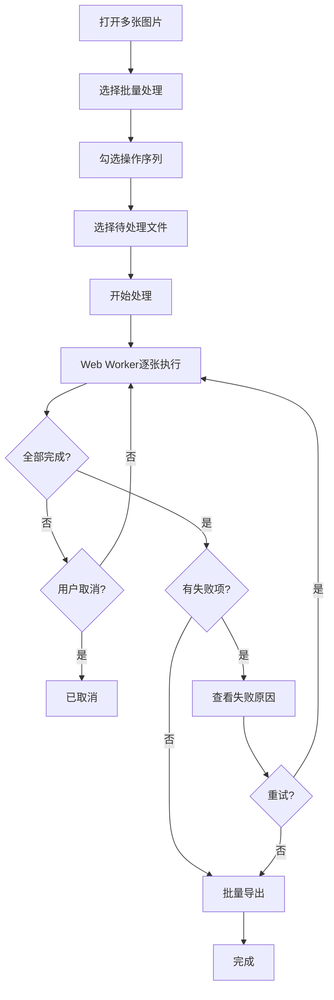

# PRD总册 - 产品需求规格说明书

| 文档编号 | PRD-ARCHSCAN-V1.0                  | 文档版本 | V1.0                         |
| :------- | :--------------------------------- | :------- | :--------------------------- |
| 项目名称 | 档案扫描件处理软件                  | 编写人   |                              |
| 编写日期 |                                    | 评审人   | 待定                         |
| 评审日期 | 待定                               | 归档日期 | 待定                         |
| 文档状态 | □ 草稿 □ 评审中 □ 已归档 □ 已废弃 | 业务领域 | 图像处理 / 档案管理          |

------

## 修订记录

| 版本号 | 修订日期 | 修订人 | 修订内容 | 审核人 |
| :----- | :------- | :----- | :------- | :----- |
| V1.0   |          |        | 首次发布 | 待定   |
| V1.1   | 2026-06-16 |        | §7.3 工具栏由单列56px改为双列112px，消除垂直滚动 | 待定   |

------

## 目录

1. 文档概述
2. 产品定位
3. 用户与角色
4. 业务架构与模块划分
5. 全局业务规则
6. 全局枚举值字典
7. 功能模块概览
8. 非功能需求
9. 附录

------

## 1. 文档概述

### 1.1 编写目的

本文档为档案扫描件处理软件的完整产品需求规格说明书（总册），旨在明确产品的功能范围、业务规则、用户体验要求等设计依据，供产品团队、开发团队、测试团队、UI设计团队共同使用。各功能模块的详细需求规格见对应分册文档。

### 1.2 术语定义

| 术语     | 说明                                                                   |
| :------- | :--------------------------------------------------------------------- |
| 纠偏     | 自动检测扫描件图片的倾斜角度并将其旋转校正为水平方向                     |
| 去黑孔   | 去除扫描件图片边缘的黑色边框（黑边）及装订孔洞，并填充为指定颜色         |
| AI抠图   | 基于AI推理模型，自动分离图片前景与背景，实现智能抠图                     |
| 图像拼接 | 将多张图片按水平或垂直方向拼接为一张完整图片                             |
| 图像分割 | 将一张图片沿水平或垂直方向切割为多张子图                                 |
| 画布     | 应用中央用于显示和操作图片的区域，基于HTML5 Canvas实现                   |
| 操作历史 | 用户对图片执行的每一步处理操作的记录栈，支持撤销与恢复                   |
| 会话     | 用户从打开应用到关闭应用的完整使用周期，操作历史仅在会话内有效           |

### 1.3 参考文档

| 文档名称                       | 文档编号 | 备注               |
| :----------------------------- | :------- | :----------------- |
| 业务需求与业务架构文档          | BRD-001  | 业务需求与架构设计  |
| 页面原型 001-原型.png           | PT-001   | UI原型参考          |

------

## 2. 产品定位

### 2.1 产品背景

日常办公及档案管理场景中，大量扫描件、文档图片需要二次处理（纠偏、去黑边、裁剪、拼接等）。现有方案存在以下问题：
- 专业PS软件：学习成本高、安装部署重，简单操作流程繁琐
- 在线图片处理工具：需上传下载，存在隐私泄露风险，大文件处理效率低
- 系统自带工具：功能单一，无法满足纠偏、去黑孔、AI抠图等专业需求

本产品旨在提供一款轻量、本地化、功能专业的图片处理工具，所有图片数据在本地处理不离开本机，兼顾易用性与专业性。

### 2.2 产品目标

| 目标类型 | 目标描述                                               | 量化指标                      |
| :------- | :----------------------------------------------------- | :---------------------------- |
| 效率目标 | 常规图片处理操作时效提升                                | 较使用PS工具效率提升80%以上   |
| 效率目标 | 批量处理场景减少人工重复操作                            | 重复操作减少90%以上           |
| 安全目标 | 图片数据本地处理，不上传云端                            | 数据外泄风险降低100%          |
| 体验目标 | 工具轻量即开即用，无需安装配置                          | 首次使用零学习成本            |
| 覆盖目标 | 覆盖日常图片处理主流需求                                | 覆盖90%以上常见图片处理场景   |

### 2.3 产品边界

| 对接类型   | 对接对象        | 对接形式及内容                                         |
| :--------- | :-------------- | :----------------------------------------------------- |
| 本地后端   | AI推理服务       | HTTP API调用，提供AI抠图推理能力，模型本地部署          |
| 本地文件   | 用户磁盘文件系统 | 浏览器File API / 后端代理，实现文件打开与保存            |
| 前端依赖   | Fabric.js        | 前端Canvas渲染与交互引擎，用于图片展示与几何变换操作      |
| 前端依赖   | Cropper.js       | 前端裁剪交互组件，用于裁剪区域的框选与预览                |

**功能边界声明：**
- 本产品为图片处理工具，不涉及图片拍摄、扫描硬件控制等功能
- 不涉及用户账号体系、权限管理、云存储、在线协作等功能
- AI能力仅限于抠图推理，不涉及图像生成、风格迁移等AIGC功能
- 不涉及视频、音频等多媒体处理

------

## 3. 用户与角色

### 3.1 用户角色清单

| 角色名称 | 角色描述                                       | 所属侧 |
| :------- | :--------------------------------------------- | :----- |
| 普通用户 | 需要处理扫描件/文档图片的办公人员，无角色区分   | 用户端 |

> 说明：本产品为本地工具型应用，无需登录，无角色区分。所有用户拥有全部功能权限。

### 3.2 RBAC权限矩阵

| 功能模块     | 普通用户 |
| :----------- | :------- |
| 文件管理     | 完全使用 |
| 选择与导航   | 完全使用 |
| 裁剪         | 完全使用 |
| 旋转与翻转   | 完全使用 |
| 纠偏         | 完全使用 |
| 去黑孔       | 完全使用 |
| AI抠图       | 完全使用 |
| 色彩调整     | 完全使用 |
| 图像拼接     | 完全使用 |
| 图像分割     | 完全使用 |
| 批量处理     | 完全使用 |
| 撤销/恢复    | 完全使用 |
| 导出         | 完全使用 |
| 快捷键       | 完全使用 |

------

## 4. 业务架构与模块划分

### 4.1 业务架构图



### 4.2 模块划分说明

| 模块编号 | 模块名称       | 模块说明                                                     | 优先级 | 负责分册 |
| :------- | :------------- | :----------------------------------------------------------- | :----- | :------- |
| M001     | 文件管理模块   | 图片文件的打开、保存、导出、文件列表管理                     | 高     | F001     |
| M002     | 选择与导航模块 | 选择工具、移动画布、缩放查看                                 | 高     | F002     |
| M003     | 裁剪模块       | 自由裁剪、固定比例裁剪、固定尺寸裁剪                         | 高     | F003     |
| M004     | 旋转与翻转模块 | 左旋/右旋90°、任意角度旋转、水平/垂直翻转                    | 高     | F003     |
| M005     | 纠偏模块       | 自动检测倾斜角度并纠偏、灵敏度调节、手动微调                 | 高     | F004     |
| M006     | 去黑孔模块     | 自动去黑边、自动去装订孔、灵敏度调节、手动框选               | 高     | F004     |
| M007     | AI抠图模块     | 智能前景/背景分离、边缘羽化、边缘平滑、背景替换              | 中     | F005     |
| M008     | 色彩调整模块   | 亮度、对比度、饱和度、色温调节                               | 高     | F006     |
| M009     | 图像拼接模块   | 水平/垂直拼接、间距设置、对齐方式                             | 中     | F007     |
| M010     | 图像分割模块   | 水平/垂直分割、等分/自定义比例                                | 中     | F007     |
| M011     | 批量处理模块   | 多文件批量执行同一操作序列、进度管理                          | 中     | F008     |
| M012     | 撤销/恢复模块  | 操作历史的撤销与恢复，会话内有效                              | 高     | F009     |
| M013     | 导出模块       | 多格式导出（JPG/PNG/PDF）、质量控制、命名规则                | 高     | F010     |
| M014     | 快捷键模块     | 全局快捷键管理、自定义快捷键                                  | 低     | F009     |

------

## 5. 全局业务规则

### 5.1 核心状态机

#### 5.1.1 图片编辑状态机



#### 5.1.2 批量处理任务状态机



### 5.2 核心业务流程

#### 5.2.1 单图处理流程



#### 5.2.2 批量处理流程



### 5.3 其他全局规则

| 规则类型     | 规则描述                                                                                     |
| :----------- | :------------------------------------------------------------------------------------------- |
| 数据安全     | 图片数据仅存在于浏览器内存（Canvas），不写入本地磁盘临时文件；处理完成后关闭文件即释放内存     |
| 历史记录     | 操作历史栈上限20步，超出后自动丢弃最早记录；历史记录仅当前会话有效，关闭应用即清空             |
| 文件大小     | 单张图片文件最大50MB，超出时弹出提示拒绝加载                                                  |
| 文件格式     | 输入支持JPG、JPEG、PNG；导出支持JPG、PNG、PDF                                                |
| 批量处理     | 批量处理使用Web Worker异步执行，不阻塞UI线程；支持进度显示与取消                               |
| AI抠图依赖   | AI抠图功能依赖本地后端推理服务，后端未启动时该功能不可用，界面给出友好提示                     |
| 缩放限制     | 画布缩放范围10%~500%                                                                         |
| 自动保存     | 不支持自动保存，用户需主动执行保存或导出操作                                                   |

------

## 6. 全局枚举值字典

> 本章定义产品中所有枚举类型的可选值规范，供各分册引用。分册中使用枚举值时，仅需标注引用编号即可，无需重复定义。

### 6.1 文件管理相关枚举

| 枚举编号    | 枚举名称     | 枚举值    | 值含义         | 使用场景           |
| :---------- | :----------- | :-------- | :------------- | :----------------- |
| ENUM-001    | 输入文件格式 | jpg       | JPEG格式       | 打开文件           |
| ENUM-001    | 输入文件格式 | jpeg      | JPEG格式       | 打开文件           |
| ENUM-001    | 输入文件格式 | png       | PNG格式        | 打开文件           |
| ENUM-002    | 导出文件格式 | jpg       | JPEG格式       | 导出文件           |
| ENUM-002    | 导出文件格式 | png       | PNG格式        | 导出文件           |
| ENUM-002    | 导出文件格式 | pdf       | PDF格式        | 导出文件           |
| ENUM-003    | 导出命名规则 | original  | 保持原名       | 导出文件命名       |
| ENUM-003    | 导出命名规则 | auto_num  | 自动编号       | 导出文件命名       |
| ENUM-003    | 导出命名规则 | custom    | 自定义前缀     | 导出文件命名       |

### 6.2 几何变换相关枚举

| 枚举编号    | 枚举名称     | 枚举值    | 值含义         | 使用场景           |
| :---------- | :----------- | :-------- | :------------- | :----------------- |
| ENUM-010    | 裁剪模式     | free      | 自由裁剪       | 裁剪工具           |
| ENUM-010    | 裁剪模式     | ratio     | 固定比例裁剪   | 裁剪工具           |
| ENUM-010    | 裁剪模式     | size      | 固定尺寸裁剪   | 裁剪工具           |
| ENUM-011    | 裁剪比例     | 1:1       | 1:1正方形      | 裁剪工具-固定比例  |
| ENUM-011    | 裁剪比例     | 4:3       | 4:3标准        | 裁剪工具-固定比例  |
| ENUM-011    | 裁剪比例     | 16:9      | 16:9宽屏       | 裁剪工具-固定比例  |
| ENUM-011    | 裁剪比例     | 3:2       | 3:2照片        | 裁剪工具-固定比例  |
| ENUM-011    | 裁剪比例     | 2:3       | 2:3竖版照片    | 裁剪工具-固定比例  |
| ENUM-012    | 翻转方向     | horizontal| 水平翻转       | 旋转与翻转工具     |
| ENUM-012    | 翻转方向     | vertical  | 垂直翻转       | 旋转与翻转工具     |

### 6.3 图像处理相关枚举

| 枚举编号    | 枚举名称       | 枚举值      | 值含义           | 使用场景         |
| :---------- | :------------- | :---------- | :--------------- | :--------------- |
| ENUM-020    | 去黑孔选项     | black_edge  | 自动去黑边       | 去黑孔工具       |
| ENUM-020    | 去黑孔选项     | hole        | 自动去装订孔     | 去黑孔工具       |
| ENUM-021    | 抠图模式       | auto        | 自动识别         | AI抠图工具       |
| ENUM-021    | 抠图模式       | manual      | 手动框选         | AI抠图工具       |
| ENUM-022    | 抠图背景       | color       | 纯色背景         | AI抠图工具       |
| ENUM-022    | 抠图背景       | transparent | 透明背景         | AI抠图工具       |

### 6.4 图像组合相关枚举

| 枚举编号    | 枚举名称       | 枚举值       | 值含义           | 使用场景         |
| :---------- | :------------- | :----------- | :--------------- | :--------------- |
| ENUM-030    | 拼接方向       | horizontal   | 水平拼接         | 图像拼接工具     |
| ENUM-030    | 拼接方向       | vertical     | 垂直拼接         | 图像拼接工具     |
| ENUM-031    | 拼接对齐方式   | top          | 顶部对齐         | 图像拼接-水平拼接|
| ENUM-031    | 拼接对齐方式   | center       | 居中对齐         | 图像拼接         |
| ENUM-031    | 拼接对齐方式   | bottom       | 底部对齐         | 图像拼接-水平拼接|
| ENUM-031    | 拼接对齐方式   | left         | 左侧对齐         | 图像拼接-垂直拼接|
| ENUM-031    | 拼接对齐方式   | right        | 右侧对齐         | 图像拼接-垂直拼接|
| ENUM-032    | 分割方向       | horizontal   | 水平分割         | 图像分割工具     |
| ENUM-032    | 分割方向       | vertical     | 垂直分割         | 图像分割工具     |
| ENUM-033    | 分割模式       | equal        | 等分             | 图像分割工具     |
| ENUM-033    | 分割模式       | custom       | 自定义比例       | 图像分割工具     |

### 6.5 批量处理相关枚举

| 枚举编号    | 枚举名称       | 枚举值      | 值含义           | 使用场景         |
| :---------- | :------------- | :---------- | :--------------- | :--------------- |
| ENUM-040    | 批量操作类型   | crop        | 批量裁剪         | 批量处理         |
| ENUM-040    | 批量操作类型   | rotate      | 批量旋转         | 批量处理         |
| ENUM-040    | 批量操作类型   | adjust      | 批量调色         | 批量处理         |
| ENUM-040    | 批量操作类型   | denoise     | 批量去黑孔       | 批量处理         |
| ENUM-040    | 批量操作类型   | correction  | 批量纠偏         | 批量处理         |
| ENUM-041    | 批量任务状态   | pending     | 待处理           | 批量处理进度     |
| ENUM-041    | 批量任务状态   | processing  | 处理中           | 批量处理进度     |
| ENUM-041    | 批量任务状态   | completed   | 已完成           | 批量处理进度     |
| ENUM-041    | 批量任务状态   | failed      | 失败             | 批量处理进度     |
| ENUM-041    | 批量任务状态   | cancelled   | 已取消           | 批量处理进度     |

### 6.6 色彩调整相关枚举

| 枚举编号    | 枚举名称       | 枚举值      | 值含义           | 使用场景         |
| :---------- | :------------- | :---------- | :--------------- | :--------------- |
| ENUM-050    | 调节参数       | brightness  | 亮度             | 色彩调整工具     |
| ENUM-050    | 调节参数       | contrast    | 对比度           | 色彩调整工具     |
| ENUM-050    | 调节参数       | saturation  | 饱和度           | 色彩调整工具     |
| ENUM-050    | 调节参数       | temperature | 色温             | 色彩调整工具     |

------

## 7. 功能模块概览

### 7.1 模块清单

| 模块编号 | 模块名称       | 核心功能（列举）                                         | 优先级 | 分册文档 |
| :------- | :------------- | :------------------------------------------------------- | :----- | :------- |
| M001     | 文件管理模块   | 拖拽/点击打开文件、文件列表管理、保存、另存为             | 高     | F001     |
| M002     | 选择与导航模块 | 选择工具、移动画布、放大、缩小、适应窗口、实际大小         | 高     | F002     |
| M003     | 裁剪模块       | 自由裁剪、固定比例裁剪、固定尺寸裁剪、参数精确输入         | 高     | F003     |
| M004     | 旋转与翻转模块 | 左旋90°、右旋90°、任意角度旋转、水平翻转、垂直翻转         | 高     | F003     |
| M005     | 纠偏模块       | 自动检测倾斜、灵敏度调节、手动微调、应用纠偏               | 高     | F004     |
| M006     | 去黑孔模块     | 自动去黑边、自动去装订孔、灵敏度调节、填充颜色、手动框选   | 高     | F004     |
| M007     | AI抠图模块     | 自动识别、手动框选、边缘羽化、边缘平滑、背景替换/透明      | 中     | F005     |
| M008     | 色彩调整模块   | 亮度调节、对比度调节、饱和度调节、色温调节、重置           | 高     | F006     |
| M009     | 图像拼接模块   | 水平/垂直拼接、间距设置、对齐方式、图片排序                 | 中     | F007     |
| M010     | 图像分割模块   | 水平/垂直分割、分割数量、等分/自定义比例、预览             | 中     | F007     |
| M011     | 批量处理模块   | 操作序列选择、文件范围选择、进度管理、结果汇总             | 中     | F008     |
| M012     | 撤销/恢复模块  | 撤销(Ctrl+Z)、恢复(Ctrl+Y)、操作历史列表                   | 高     | F009     |
| M013     | 导出模块       | 格式选择(JPG/PNG/PDF)、质量控制、路径选择、命名规则        | 高     | F010     |
| M014     | 快捷键模块     | 全局快捷键映射、快捷键查看、恢复默认                       | 低     | F009     |

### 7.2 模块依赖关系

| 上游模块           | 下游模块           | 依赖说明                                                       |
| :----------------- | :----------------- | :------------------------------------------------------------- |
| M001 文件管理模块  | M002 选择与导航模块| 选择与导航需先加载图片文件                                     |
| M001 文件管理模块  | M011 批量处理模块  | 批量处理需先打开多张图片文件                                   |
| M001 文件管理模块  | M013 导出模块      | 导出需先有已加载的图片文件                                     |
| M002 选择与导航模块| M003 裁剪模块      | 裁剪区域框选依赖画布交互                                       |
| M002 选择与导航模块| M004 旋转与翻转模块| 旋转操作依赖画布渲染                                           |
| M012 撤销/恢复模块 | M003~M011 所有处理模块 | 所有处理操作需记录至操作历史栈以支持撤销/恢复              |
| M013 导出模块      | M009 图像拼接模块  | 拼接结果需通过导出模块保存                                     |
| M013 导出模块      | M010 图像分割模块  | 分割结果需通过导出模块保存                                     |
| M011 批量处理模块  | M003~M008 各处理模块 | 批量处理依赖各单图处理模块的能力                              |
| 后端AI推理服务     | M007 AI抠图模块    | AI抠图依赖本地后端推理服务                                     |

### 7.3 界面布局规则

基于原型设计，产品界面采用经典三栏布局：

```
┌───────────────────────────────────────────────────────────┐
│ 菜单栏：文件(F) 编辑(E) 视图(V) 工具(T) 帮助(H)           │
├──────┬──────────────────────────────────┬─────────────────┤
│      │                                  │ 属性面板         │
│ 工   │                                  │ ┌───────────┐  │
│ 具   │        画布预览区                 │ │图像│工具│历史│  │
│ 栏   │                                  │ ├───────────┤  │
│      │                                  │ │属性内容    │  │
│112px │                                  │ │            │  │
│ 双   │                                  │ │  280px     │  │
│ 列   │                                  │ │            │  │
├──────┴──────────────────────────────────┴─────────────────┤
│ 状态栏：就绪 │ 缩放:100% │ 鼠标:(x,y) │ 文件:n/m │ 内存   │
└───────────────────────────────────────────────────────────┘
```

- **菜单栏**（顶部，36px）：文件、编辑、视图、工具、帮助菜单入口
- **工具栏**（左侧，112px，双列）：按功能域分组排列的工具按钮，每列56px，含文件、选择、裁剪、旋转、缩放、处理、调整、批量、辅助共9组，双列布局避免垂直滚动
- **画布预览区**（中央，弹性宽度）：图片展示与操作区域，支持拖拽打开文件
- **属性面板**（右侧，280px）：三个标签页——图像信息/工具属性/操作历史，随选中工具动态切换内容
- **状态栏**（底部，28px）：显示当前状态、缩放比例、鼠标坐标、文件计数、内存占用、历史步数

------

## 8. 非功能需求

### 8.1 性能需求

| 指标项                       | 要求                           |
| :--------------------------- | :----------------------------- |
| 应用首屏加载时间             | ≤2秒                           |
| 图片加载到画布展示时间       | ≤1秒（10MB以内图片）           |
| 常规操作响应时间（裁剪/旋转）| ≤0.5秒                         |
| AI抠图推理响应时间           | ≤5秒（1080p图片）              |
| 批量处理吞吐量               | ≥10张/分钟（常规操作序列）     |
| 单张图片最大支持             | 50MB                           |
| 最大同时打开文件数           | ≥20张                          |
| 操作历史栈深度               | 20步                           |

### 8.2 安全需求

| 安全项       | 要求                                                                               |
| :----------- | :--------------------------------------------------------------------------------- |
| 数据安全     | 图片数据仅存于浏览器内存Canvas，不写入磁盘临时文件；关闭文件/应用即释放              |
| 本地处理     | 所有图片处理在前端Canvas/Web Worker完成（AI抠图除外），图片不离开本机                |
| 后端通信     | AI抠图与本地后端通信仅限localhost，不涉及外网传输                                    |
| 文件校验     | 打开文件时校验文件类型与大小，拒绝非图片格式及超限文件                               |
| XSS防护      | 文件名、元信息展示时进行转义处理，防止XSS注入                                       |

### 8.3 兼容性需求

| 兼容项       | 要求                                            |
| :----------- | :---------------------------------------------- |
| 浏览器       | Chrome 90+、Edge 90+、Firefox 90+              |
| 操作系统     | Windows 10/11                                   |
| 屏幕分辨率   | 最低1366×768，推荐1920×1080                     |
| 缩放比例     | 支持100%/125%/150%系统DPI缩放                   |

### 8.4 可用性需求

| 可用性项         | 要求                                                                   |
| :--------------- | :--------------------------------------------------------------------- |
| 离线使用         | 除AI抠图外的所有功能均可离线使用                                        |
| 后端状态检测     | 前端启动时检测AI后端可用性，不可用时AI抠图按钮置灰并提示                |
| 异常保护         | 图片处理异常时保留原始数据，不破坏原图；弹出错误提示                    |
| 操作可逆         | 所有处理操作支持撤销，确保用户不会因误操作导致不可逆的数据损失            |
| 内存管理         | 切换文件或关闭文件时及时释放Canvas内存，防止内存泄漏                     |

------

## 9. 附录

### 9.1 分册文档索引

| 分册编号 | 分册名称               | 文档路径                                     | 责任人 |
| :------- | :--------------------- | :------------------------------------------- | :----- |
| F001     | 文件管理模块分册       | design/02PRD文档/F001-文件管理模块分册.md     |        |
| F002     | 选择与导航模块分册     | design/02PRD文档/F002-选择与导航模块分册.md   |        |
| F003     | 几何变换模块分册       | design/02PRD文档/F003-几何变换模块分册.md     |        |
| F004     | 图像处理模块分册       | design/02PRD文档/F004-图像处理模块分册.md     |        |
| F005     | AI抠图模块分册         | design/02PRD文档/F005-AI抠图模块分册.md       |        |
| F006     | 色彩调整模块分册       | design/02PRD文档/F006-色彩调整模块分册.md     |        |
| F007     | 图像组合模块分册       | design/02PRD文档/F007-图像组合模块分册.md     |        |
| F008     | 批量处理模块分册       | design/02PRD文档/F008-批量处理模块分册.md     |        |
| F009     | 系统支撑模块分册       | design/02PRD文档/F009-系统支撑模块分册.md     |        |
| F010     | 导出模块分册           | design/02PRD文档/F010-导出模块分册.md         |        |

### 9.2 相关参考文档

| 文档名称                       | 文档路径                                         | 备注               |
| :----------------------------- | :----------------------------------------------- | :----------------- |
| 业务需求与业务架构文档          | design/01业务设计/1-业务需求与业务架构文档.md     | 业务需求与架构设计  |
| 页面原型                       | design/02PRD文档/页面原型/001-原型.png            | UI原型参考          |
| Fabric.js 官方文档             | http://fabricjs.com/                              | 前端Canvas引擎     |
| Cropper.js 官方文档            | https://fengyuanchen.github.io/cropperjs/         | 裁剪组件           |

### 9.3 评审意见与修改记录

| 评审轮次 | 评审问题 | 修改方案 | 修改人 | 修改日期 |
| :------- | :------- | :------- | :----- | :------- |
|          |          |          |        |          |
