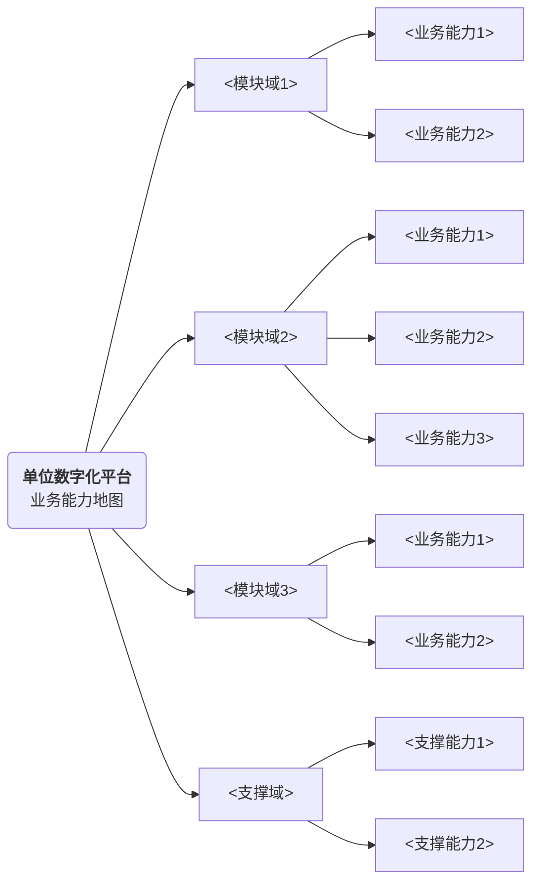
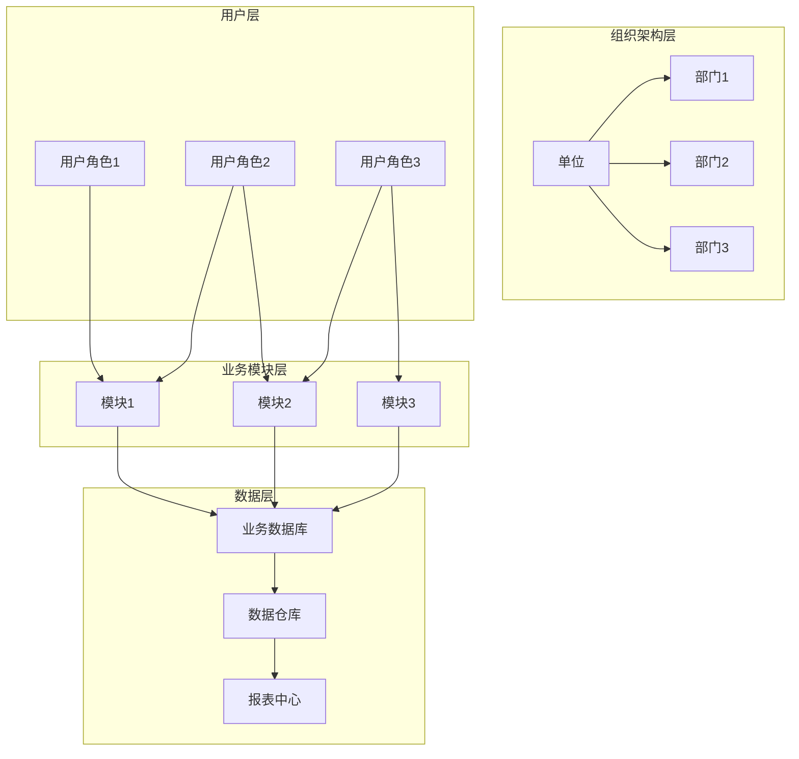

# 业务需求与业务架构文档规范（单位数字化平台）

## 文档说明

本文档为企业单位数字化平台的业务需求与业务架构设计规范，适用于**单位数字化平台**类型项目。单位数字化平台不分侧，聚焦单个单位内部数字化转型，以组织架构为核心，实现内部业务协同、数据打通与效率提升。

---

### 一、文档基础信息

| 项目名称 | <填写具体项目名称> | 文档版本 | V1.0 |
| -------- | ------------------ | -------- | ---- |
| 编写人 | <br /> | 编写日期 | <br /> |
| 评审人 | <br /> | 评审日期 | <br /> |
| 归档日期 | <br /> | 归档编号 | <br /> |
| 业务领域 | <填写具体业务领域，如：政务、制造业、医疗、教育等> | 文档状态 | □ 草稿 □ 评审中 □ 已归档 □ 已废弃 |
| 平台类型 | □ 业务服务平台 □ 单位数字化平台（不分侧，聚焦单个单位内部数字化） | | |

---

### 二、业务背景与价值

#### 2.1 需求来源

☑ 政策驱动（详细说明：<填写政策背景及数字化转型要求，如：国家数字化战略、主管部门要求等>）

☑ 内部痛点（详细说明：<填写单位内部现有业务痛点，如：流程繁琐、数据孤岛、协同效率低等>）

☑ 外部驱动（详细说明：<填写外部环境变化，如：行业发展趋势、竞争压力、客户期望提升等>）

□ 战略落地（详细说明：<填写公司/单位战略相关需求>）

□ 其他（详细说明：<填写其他需求来源>）

#### 2.2 行业/单位现状与痛点分析

1. 现状分析：<填写单位所处行业/领域当前发展现状，包括业务规模、技术基础、人员素质等>

2. 现有痛点：
   - 流程痛点：<填写现有业务流程中的效率问题，如：审批环节多、流转时间长等>
   - 数据痛点：<填写数据方面的问题，如：数据分散、标准不统一、难以共享等>
   - 协同痛点：<填写跨部门/跨系统协同问题，如：信息传递不畅、配合效率低等>
   - 管理痛点：<填写管理层面问题，如：决策缺乏数据支撑、监管难度大等>

#### 2.3 核心业务价值（量化）

1. 效率价值：<填写效率提升相关量化指标，如：审批时效提升XX%、减少人工操作XX%、缩短平均处理时长XX%等>

2. 管理价值：<填写管理优化相关量化指标，如：数据准确率提升XX%、决策效率提升XX%、监管覆盖率XX%等>

3. 协同价值：<填写协同改善相关量化指标，如：跨部门协同耗时降低XX%、信息共享率提升XX%等>

---

### 三、产品定义

明确产品研发背景、服务对象、核心业务及目标，定位清晰：

1. 研发背景：<填写产品研发的核心背景，结合政策要求、内部痛点及现状分析，明确数字化转型的必要性>

2. 服务对象：<填写产品的核心服务对象，包括内部用户（各部门、人员）及外部用户（如有），明确各服务对象的范围及核心需求>

3. 核心业务：<填写产品的核心业务内容，聚焦单位内部核心业务流程优化与数字化，实现业务全流程闭环管理>

4. 核心目标：<填写产品的核心研发目标，涵盖以下维度：
   - 业务目标：<如：实现XX业务的线上化、自动化>
   - 管理目标：<如：提升XX管理精细度、实现XX数据可视化>
   - 协同目标：<如：打通XX系统数据、实现XX协同线上化>
   - 技术目标：<如：建立统一数据标准、形成可复用的技术组件>

---

### 四、产品边界

明确产品与内部其他系统、外部第三方的对接范围及方式，界定功能边界：

| 对接类型 | 对接对象 | 对接形式及内容 |
| -------- | -------- | -------------- |
| 内部系统 | <填写对接的内部系统名称，如：财务系统、HR系统等> | <填写对接形式及具体内容，如：数据同步、接口调用、单点登录等> |
| 外部第三方 | <填写对接的外部第三方名称，如：政务平台、第三方支付等> | <填写对接形式及具体内容，明确对接功能及核心目的> |

---

### 五、单位数字化平台核心模块划分

说明：单位数字化平台以组织架构为核心，聚焦内部业务协同，按功能域划分模块。

#### 5.1 模块划分总览

| 模块域 | 模块名称 | 核心功能概述 | 优先级 |
| ------ | -------- | ------------ | ------ |
| <模块域1> | <模块名称> | <功能概述> | <优先级> |
| <模块域2> | <模块名称> | <功能概述> | <优先级> |

#### 5.2 模块详细说明

**模块1：<模块名称>**

- 模块定位：<填写该模块在整体平台中的定位，与其他模块的关系>
- 核心功能：
  - 功能1：<功能描述>
  - 功能2：<功能描述>
- 使用角色：<填写使用该模块的主要角色>
- 数据产出：<填写该模块产生的主要数据>

---

### 六、用户角色清单

| 用户角色 | 角色描述 | 所属部门 | 核心工作职责 | 权限范围 |
| -------- | -------- | -------- | ------------ | -------- |
| <角色1> | <角色定位> | <部门> | <核心职责> | <权限范围> |
| <角色2> | <角色定位> | <部门> | <核心职责> | <权限范围> |

---

### 七、业务场景分析

梳理平台支撑的业务场景及核心业务能力：



#### 7.1 核心业务场景清单

场景1：<业务场景名称>（角色：<涉及角色>，核心动作：<核心业务动作>，预期结果：<预期成果>）

场景2：<业务场景名称>（角色：<涉及角色>，核心动作：<核心业务动作>，预期结果：<预期成果>）

#### 7.2 核心业务流程清单

流程1：<业务流程名称>

```
节点1：<流程步骤描述>
节点2：<流程步骤描述>
节点3：<流程步骤描述>
节点4：<流程步骤描述>
```

流程2：<业务流程名称>

---

### 八、数据业务化需求

单位数字化平台数据业务化核心目标：实现内部业务数据的采集、整合与分析，支撑单位内部管理决策与业务优化，沉淀可复用数据资产，确保数据合规使用。

| 角色 | 具体数据业务化需求 |
| ---- | ------------------ |
| <角色1> | 1. <数据需求>；2. <数据需求>；3. <数据需求> |
| <角色2> | 1. <数据需求>；2. <数据需求>；3. <数据需求> |
| 管理层 | 1. <数据需求>；2. <数据需求>；3. <数据需求> |

---

### 九、业务架构图

绘制包含各模块、用户角色、业务流程、数据流转的架构图：



---

### 十、约束与依赖

#### 10.1 平台专属约束

1. 单位数字化平台约束：聚焦单个单位内部数字化，不涉及多租户/多企业场景；需与单位现有IT架构兼容，确保平滑迁移；数据安全要求高，需符合单位内部安全合规要求。

#### 10.2 核心约束与依赖

1. 合规约束：符合《数据安全法》《个人信息保护法》等相关法规，确保数据采集、存储、使用合规；业务内容需符合行业规范及相关管理制度。

2. 系统依赖：依赖单位现有<系统名称>实现<功能>；依赖<第三方平台/服务>实现<功能>；依赖<基础设施>提供技术支撑。

3. 团队依赖：依赖<内部团队>完成<工作>；依赖<外部供应商>提供<服务>；明确各团队职责，确保项目顺利推进。

---

### 十一、风险与初步应对

| 风险类型 | 风险描述 | 初步应对思路 | 风险责任人 | 资产继承备注 |
| -------- | -------- | ------------ | ---------- | ------------ |
| 业务风险 | <业务层面风险> | <应对思路> | <责任人> | 无相关复用资产 |
| 技术风险 | <技术层面风险> | <应对思路> | <责任人> | 无相关复用资产 |
| 实施风险 | <实施层面风险> | <应对思路> | <责任人> | 无相关复用资产 |
| 安全风险 | <安全层面风险> | <应对思路> | <责任人> | 无相关复用资产 |

---

### 十二、相关参考文档

1. 过往同类项目文档：<参考文档列表>

2. 政策法规/行业规范：<相关政策法规及行业标准>

3. 单位内部文档：<单位内部相关制度、标准等>

4. 技术参考文档：<技术方案、接口文档等>

---

### 十三、评审意见与修改记录

| 评审轮次 | 评审问题 | 修改方案 | 修改人 | 修改日期 | 资产继承相关修改说明 |
| -------- | -------- | -------- | ------ | -------- | -------------------- |
| 1 | <评审问题> | <修改方案> | <修改人> | <修改日期> | <修改说明> |
