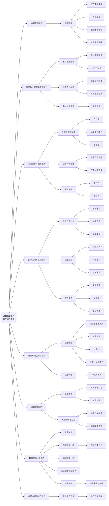
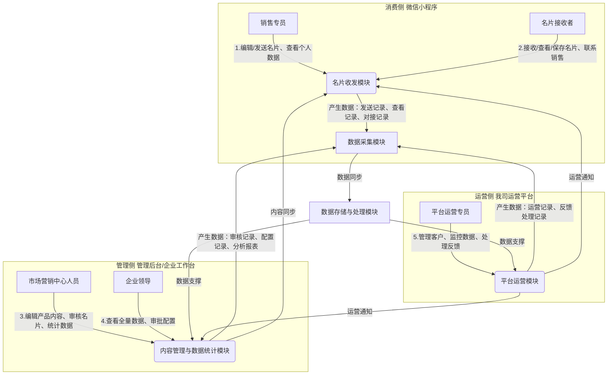

# 业务需求与业务架构文档规范（业务服务平台）

## 文档说明

本文档为企业数字名片业务服务平台的业务需求与业务架构设计规范，适用于**业务服务平台**类型项目。业务服务平台需包含至少2个侧（消费侧、管理侧、运营侧等），通过权限区分功能，逻辑上分侧，实现数据互通与业务协同。

---

### 一、文档基础信息

| 项目名称 | 企业数字名片业务服务平台 | 文档版本 | V1.0 |
| -------- | ---------------------- | -------- | ---- |
| 编写人 |   | 编写日期 |   |
| 评审人 |   | 评审日期 |   |
| 归档日期 |   | 归档编号 |   |
| 业务领域 | 企业服务、数字营销、客户触达 | 文档状态 | □ 草稿 □ 评审中 □ 已归档 □ 已废弃 |
| 平台类型 | ☑ 业务服务平台（至少包含2个侧，可通过权限区分功能，逻辑上分侧） | | |

---

### 二、业务背景与价值

#### 2.1 需求来源

☑ 市场需求（详细说明：当前B端企业数字化转型提速，传统纸质名片传递不便、无法追踪触达效果，数字名片成为企业客户触达的核心工具，市场需求旺盛）

☑ 客户反馈（详细说明：多数B端企业反馈，现有数字名片产品功能单一，缺乏统一管理、营销数据统计能力，无法满足企业销售人员客户跟进、管理者统筹管控的需求）

☑ 内部业务优化（详细说明：丰富公司企业服务产品线，补充数字营销类工具，提升B端客户粘性与产品竞争力，拓展营收渠道）

□ 公司战略落地（详细说明：\_\_\_\_\_\_\_\_\_\_）

□ 其他（详细说明：\_\_\_\_\_\_\_\_\_\_）

#### 2.2 行业现状与现有业务痛点

1. 行业现状：数字名片行业快速发展，B端企业对数字化客户触达工具的需求持续上升，但现有产品多聚焦单一收发功能，缺乏"收发-管理-营销-运营"全流程闭环，且各侧协同性差，无法满足企业规模化、精细化管理需求。

2. 现有业务痛点：企业数字名片内容无法统一管控，易出现信息混乱；销售人员无法追踪名片发送效果，客户触达缺乏精准性；管理者无法统筹查看营销数据，决策缺乏依据；运营端无法对产品及企业客户进行有效管控，用户留存率偏低。

#### 2.3 核心业务价值（量化）

1. 效率价值：帮助企业客户触达效率提升50%，销售人员跟进客户效率提升40%，名片管理成本降低60%，营销数据统计耗时缩短70%。

2. 业务价值：支撑日均1000家企业使用，累计服务10万+销售人员，帮助企业新增客户触达量30%，提升我司B端产品市场占有率2%，年新增营收500万元。

---

### 三、产品定义

明确产品研发背景、服务对象、核心业务及目标，定位清晰：

1. 研发背景：针对B端企业传统纸质名片痛点及现有数字名片产品短板，结合数字化营销趋势，搭建企业数字名片业务服务平台，实现名片数字化、管理规范化、营销精准化、运营精细化。

2. 服务对象：各类有客户触达、品牌展示及营销管理需求的B端企业，涵盖中小企业及大型企业的销售部门、市场营销部门、企业管理者，同时覆盖企业的潜在客户、合作客户（消费侧）及我司运营人员（运营侧）。

3. 核心业务：为B端企业提供数字名片生成、收发、内容编辑、权限管控、营销数据统计等服务，打通消费侧、管理侧、运营侧，实现"客户触达-内部管理-平台运营"全流程数字化闭环，支撑企业精准营销与高效管理。

4. 核心目标：打造一站式企业数字名片服务平台，满足B端企业数字化名片管理与精准营销需求，提升企业客户触达效率与营销效果，同时丰富公司企业服务产品线，提升市场竞争力与营收水平。

---

### 四、产品边界

明确产品与内部产品、外部第三方的对接范围及方式，界定功能边界：

| 对接类型 | 对接对象 | 对接形式及内容 |
| -------- | -------- | -------------- |
| 内部产品 | 公司用户管理系统 | 接口调用，实现用户信息同步、权限校验与统一登录，保障各侧用户身份合规性 |
| 外部第三方 | 企业微信/钉钉开放平台、腾讯云OSS | 接口对接，支持数字名片分享至企业微信/钉钉，实现管理侧与企业工作台集成；腾讯云OSS用于存储名片图片、企业产品素材等资源 |

---

### 五、业务服务平台各侧划分说明

**1.消费侧**（定位：面向销售专员、企业潜在客户及合作客户，核心承载数字名片收发、信息查看功能，是企业客户触达的核心入口，入口为微信小程序，功能边界：提供名片发送、接收、查看、保存、联系对接人功能，不涉及平台管理、运营相关操作，权限区分：销售专员可编辑个人名片、发送名片、查看个人发送数据；名片接收者仅拥有名片查看、保存及联系销售专员权限，无任何管理、配置权限）

**2.管理侧**（定位：面向企业领导、市场营销中心人员，核心承载名片内容管控、数据统计分析功能，支撑企业获客转化与管理决策，入口为管理后台或企业工作台，功能边界：负责管理销售专员对外发送名片中的产品介绍内容、审核名片内容、查看全量发送数据、分析获客转化情况，不涉及平台产品运营相关操作，权限区分：企业领导可查看全量数据、审批配置；市场营销中心人员可编辑产品介绍内容、审核名片、查看统计数据，无平台运营权限）

**3.运营侧**（定位：面向我司运营人员，核心承载平台产品运营与客户运营功能，保障平台稳定运行与用户留存，功能边界：负责企业客户管理、产品功能运营、营销活动支持、数据监控与优化，不涉及企业内部名片管理，权限区分：拥有平台运营全权限，可查看所有企业使用数据、配置运营策略、处理企业反馈）

**4.各侧协同逻辑**：消费侧中销售专员发送名片、名片接收者查看名片的相关数据同步至管理侧，支撑企业领导、市场营销中心分析获客转化情况；管理侧配置的产品介绍内容、名片审核结果同步至消费侧，确保销售专员发送的名片内容规范统一；管理侧的企业使用数据、需求反馈同步至运营侧，支撑运营策略优化；运营侧的产品更新、活动通知同步至管理侧与消费侧，提升用户体验。

---

### 六、业务服务平台各侧用户角色清单

| 所属侧 | 用户角色 | 角色定位 | 核心业务动作 |
| ------ | -------- | -------- | ------------ |
| 访客侧 | B端/G端客户 | 企业级潜在客户、合作方、渠道伙伴 | 多渠道获取名片、了解企业/产品/案例、线上互动（交换/转发名片）、提交需求/咨询沟通 |
| 访客侧 | 个人用户 | C端潜在客户、个人人脉、活动参与者 | 名片浏览、品牌内容查看、收藏/转发内容、在线咨询、交换个人名片 |
| 企业侧 | 销售人员 | 一线业务执行者，直接负责客户转化 | 名片配置与分发、多渠道触达客户、跟进线索与商机、销售回款管理、客户关系维护 |
| 企业侧 | 市场营销人员 | 品牌与获客运营者，负责内容与获客策略 | 内容发布与素材管理、活动推广、全员推广任务配置、营销效果数据分析 |
| 企业侧 | 企业管理者 | 企业决策与管理者，负责整体业务管控 | 组织架构与员工管理、全团队数据看板查看、销售业绩分析、业务策略调整 |
| 运营侧 | 平台运营人员 | 平台功能与客户服务的维护者 | 产品运营、客户运营、用户反馈处理、平台规则维护 |

---

### 七、业务场景分析

梳理产品支撑的业务场景及核心业务能力，以脑图形式呈现：

#### 7.1 核心业务场景清单

场景1：数字名片收发（角色：销售专员、名片接收者，核心动作：销售专员通过微信小程序编辑、发送名片，接收者通过微信小程序接收、查看、保存名片，预期结果：实现名片快速传递与信息同步）

场景2：名片内容管理（角色：市场营销中心人员、销售专员，核心动作：市场营销中心人员编辑、更新名片中的产品介绍内容，审核销售专员提交的名片，销售专员基于规范内容编辑个人名片，预期结果：实现名片内容统一管控与规范展示）

场景3：营销数据管理（角色：企业领导、市场营销中心人员、销售专员，核心动作：销售专员查看个人发送数据，市场营销中心人员统计分析全量数据，企业领导查看获客转化数据，生成数据报表，预期结果：为客户跟进与管理决策提供数据支撑）

场景4：客户跟进管理（角色：销售专员，核心动作：记录客户跟进情况，设置跟进提醒，预期结果：提升客户跟进效率与转化率）

场景5：平台运营管理（角色：平台运营专员，核心动作：管理企业客户、监控平台数据、处理反馈，预期结果：保障平台稳定运行，提升企业用户留存率）

#### 7.2 核心业务流程清单

##### 7.2.1 名片基础管理流程

流程1：**数字名片配置流程**（节点1：系统管理员配置企业名片模板与自定义权限→节点2：为销售成员分配名片使用权限→节点3：销售专员套用模板完成个人数字名片配置）

流程2：**内容管理流程**（节点1：市场营销中心人员编辑企业名片产品介绍、案例素材等内容→节点2：销售专员基于企业规范内容编辑个人名片模块→节点3：市场营销中心人员审核通过后，销售专员可对外发送名片）

流程3：**数字名片发送流程**（节点1：销售专员通过微信小程序编辑名片内容→节点2：预览确认后发送给客户→节点3：客户通过微信小程序接收并查看名片）

##### 7.2.2 用户触点与获客流程

流程4：**多渠道用户获取流程**（节点1：企业配置名片码、流量平台入口等触达触点→节点2：用户通过收名片/扫名片码/流量平台跳入触达企业→节点3：用户进入企业名片触点，完成首次触达）

流程5：**企业/产品认知流程**（节点1：用户进入名片后查看企业介绍模块内容→节点2：用户浏览名片内产品信息与服务介绍→节点3：用户查看成功案例资料，完成对企业与产品的初步认知）

流程6：**线上互动传播流程**（节点1：用户发起名片交换或收藏内容请求→节点2：用户转发名片至社交渠道进行传播→节点3：系统记录用户互动行为，完成数据采集）

流程7：**意向用户深入沟通流程**（节点1：用户通过名片发起电话咨询或AI客服对话→节点2：用户提交需求表单，表达合作意向→节点3：企业侧接收用户意向需求，建立沟通对接通道）

##### 7.2.3 线索转化流程

流程8：**客户线索初步转化流程**（节点1：系统采集用户访问名片的访客记录与行为轨迹数据→节点2：数据流入线索池，管理员完成线索分配与销售跟进→节点3：销售专员跟进线索，符合条件的用户转化为商机）

---

### 八、数据业务化需求

平台数据业务化核心目标：实现各侧业务数据的采集、整合与分析，支撑企业营销决策与平台运营优化，沉淀可复用数据资产，确保数据合规使用。各相关角色的数据业务化需求具体如下：

| 所属侧 | 角色 | 具体数据业务化需求 |
| ------ | ---- | ------------------ |
| 消费侧 | 销售专员 | 1. 采集个人名片发送量、客户查看率、客户联系率等数据；2. 可查看个人数据统计报表，支撑客户跟进优先级判断；3. 可导出个人跟进数据，便于后续复盘与总结。 |
| 管理侧 | 企业领导 | 1. 查看全量数据汇总报表，包括名片总发送量、获客转化数据、各销售专员数据对比等；2. 支持多维度数据筛选分析，为企业获客策略制定提供数据支撑；3. 可查看数据趋势变化，监控业务目标达成情况。 |
| 管理侧 | 市场营销中心人员 | 1. 采集分析名片内容曝光数据、产品介绍查看数据，优化产品内容呈现形式；2. 统计各销售专员名片发送及转化数据，为销售培训、考核提供依据；3. 整合客户反馈数据，支撑名片内容与营销策略优化。 |
| 运营侧 | 平台运营专员 | 1. 采集平台运行数据、企业用户活跃数据、功能使用数据，监控平台运行状态；2. 分析企业用户留存数据、需求反馈数据，优化平台运营策略；3. 沉淀企业客户数据、名片模板数据等可复用资产，支撑后续产品迭代。 |

---

### 九、业务架构图

绘制包含各侧用户、入口、业务场景、业务能力、产生数据的架构图：

---

### 十、约束与依赖

#### 10.1 平台专属约束

1. 业务服务平台约束：必须包含消费侧、管理侧、运营侧三个侧，各侧逻辑独立、权限区分清晰，实现数据互通与业务协同；需支撑多企业同时使用，保障数据隔离与安全；适配企业微信、钉钉等第三方平台集成需求。

#### 10.2 核心约束与依赖

1. 合规约束：符合《数据安全法》《个人信息保护法》，确保企业及客户数据采集、存储、使用合规，不泄露敏感信息；名片内容需符合广告法相关规定，禁止违规内容发布。

2. 系统依赖：依赖公司用户管理系统实现用户统一登录与权限管控；依赖企业微信/钉钉开放平台实现功能集成；依赖腾讯云OSS实现资源存储；依赖内部数据中台实现数据业务化处理。

3. 团队依赖：依赖技术部完成接口开发、平台搭建与稳定性维护；依赖业务部提供企业需求确认与场景验证；依赖运营部提供运营策略与客户反馈收集。

---

### 十一、风险与初步应对

| 风险类型 | 风险描述 | 初步应对思路 | 风险责任人 | 资产继承备注 |
| -------- | -------- | ------------ | ---------- | ------------ |
| 业务风险 | B端企业用户接受度低，平台使用率未达预期；企业客户反馈功能不符合实际需求。 | 上线前选取10家不同行业企业进行小范围测试，收集反馈并优化功能；提供一对一操作培训，降低使用门槛；建立客户反馈机制，及时响应需求调整。 | 产品部-李四 | 无相关复用资产 |
| 技术风险 | 第三方接口（企业微信/钉钉）适配难度大，影响功能落地；多企业同时使用时平台卡顿、数据泄露。 | 提前与第三方对接测试，组建专项技术团队解决适配问题；优化平台架构，提升并发处理能力；采用加密技术保障数据安全，定期进行安全检测。 | 技术部-王五 | 无相关复用资产 |
| 其他风险 | 数据业务化落地不及预期，数据统计不准确，无法支撑决策；运营策略不当，导致企业用户留存率低。 | 提前梳理核心数据指标，优化数据采集与分析流程；组建专业运营团队，制定针对性运营策略，定期优化调整；建立数据校验机制，确保数据准确性。 | 运营部-赵六 | 无相关复用资产 |

---

### 十二、相关参考文档

1. 过往同类项目文档：企业服务类业务服务平台需求概要说明书（归档编号：QY-SDD-20251105-003）

2. 公司战略文档：公司B端产品发展规划（2026-2028）

3. 行业规范/合规文档：《数据安全法》《个人信息保护法》《广告法》相关规范

4. 数据业务化相关文档：公司数据业务化实施规范（归档编号：SJ-SDD-20250908-002）

5. 其他参考文档：企业微信/钉钉开放平台对接文档、腾讯云OSS使用规范

---

### 十三、评审意见与修改记录

| 评审轮次 | 评审问题 | 修改方案 | 修改人 | 修改日期 | 资产继承相关修改说明 |
| -------- | -------- | -------- | ------ | -------- | -------------------- |
| 1 | 各侧协同逻辑描述不够清晰，未明确数据流转细节 | 补充各侧数据流转具体说明，明确消费侧、管理侧、运营侧的数据同步方向与内容，增强协同逻辑的可落地性 | 张三 | 2026年5月9日 | 无相关复用资产，结合本次平台业务实际需求调整 |
| 2 | 数据业务化需求描述过于笼统，未明确核心数据指标 | 补充数据业务化核心数据指标（名片收发数据、查看数据等），明确数据采集与应用方向，贴合平台业务场景 | 张三 | 2026年5月9日 | 无相关复用资产，结合本次平台数据业务化需求调整 |
