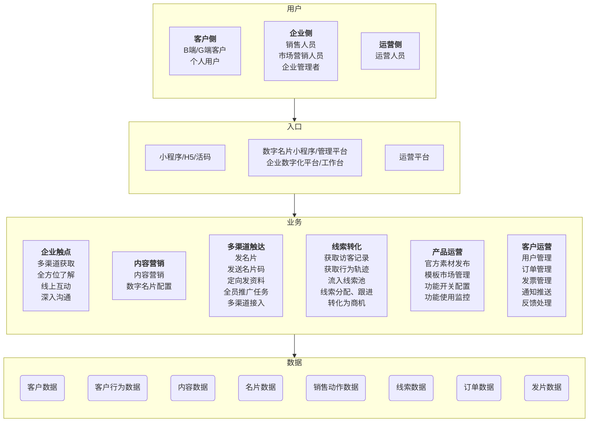
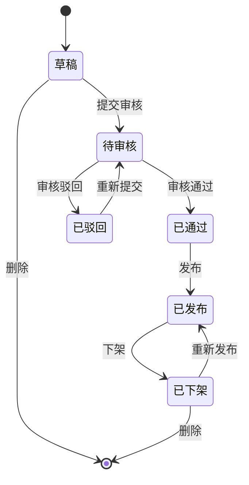
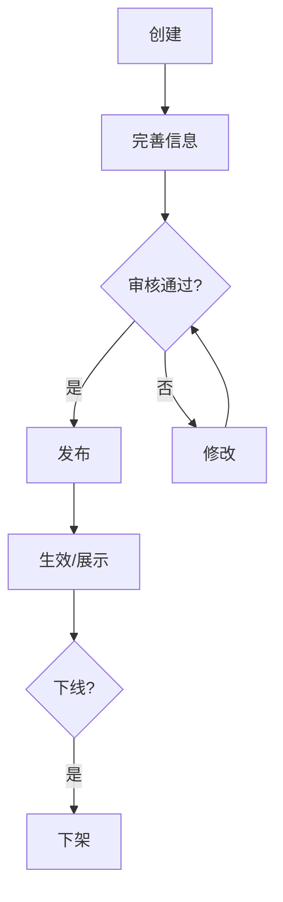

# PRD总册 - 产品需求规格说明书

| 文档编号 | [PRD-XXX-V1.0]                    | 文档版本 | [V1.0]                       |
| :------- | :-------------------------------- | :------- | :--------------------------- |
| 项目名称 | [项目名称]                        | 编写人   | [姓名/部门]                  |
| 编写日期 | [YYYY-MM-DD]                      | 评审人   | [待定]                       |
| 评审日期 | [待定]                            | 归档日期 | [待定]                       |
| 文档状态 | □ 草稿 □ 评审中 □ 已归档 □ 已废弃 | 业务领域 | [如：企业服务、金融、电商等] |

------

## 修订记录

| 版本号 | 修订日期 | 修订人 | 修订内容 | 审核人 |
| :----- | :------- | :----- | :------- | :----- |
| V1.0   | [日期]   | [姓名] | 首次发布 | [待定] |
|        |          |        |          |        |

------

## 目录

1. 文档概述
2. 产品定位
3. 用户与角色
4. 业务架构与模块划分
5. 全局业务规则
6. 全局枚举值字典
7. 功能模块概览
8. 非功能需求
9. 附录

------

## 1. 文档概述

### 1.1 编写目的

本文档为【项目名称】的完整产品需求规格说明书（总册），旨在明确产品的功能范围、业务规则、用户体验要求等设计依据，供产品团队、开发团队、测试团队、UI设计团队共同使用。

### 1.2 术语定义

| 术语    | 说明   |
| :------ | :----- |
| [术语1] | [定义] |
| [术语2] | [定义] |

### 1.3 参考文档

| 文档名称 | 文档编号 | 备注   |
| :------- | :------- | :----- |
| [文档名] | [编号]   | [备注] |

------

## 2. 产品定位

### 2.1 产品背景

[描述当前市场/业务痛点，以及本产品产生的背景原因]

### 2.2 产品目标

| 目标类型           | 目标描述 | 量化指标      |
| :----------------- | :------- | :------------ |
| [效率/业务/体验等] | [描述]   | [如：提升50%] |
| ...                | ...      | ...           |

### 2.3 产品边界

| 对接类型   | 对接对象   | 对接形式及内容      |
| :--------- | :--------- | :------------------ |
| 内部产品   | [系统名称] | [接口/数据同步方式] |
| 外部第三方 | [平台名称] | [API/文件导入等]    |

------

## 3. 用户与角色

### 3.1 用户角色清单

| 角色名称 | 角色描述 | 所属侧（如：管理端/用户端） |
| :------- | :------- | :-------------------------- |
| [角色A]  | [描述]   | [侧]                        |
| [角色B]  | [描述]   | [侧]                        |

### 3.2 RBAC权限矩阵

| 功能模块 | [角色1]         | [角色2] | [角色3] | ...  |
| :------- | :-------------- | :------ | :------ | :--- |
| [模块A]  | [读/写/删/审等] | ...     | ...     | ...  |

> 权限类型示例：读（查看）、写（新增/编辑）、删（删除）、审（审核/审批）、分配（资源分配）、执行（任务执行）

------

## 4. 业务架构与模块划分

### 4.1 业务架构图（示例）

### 4.2 模块划分说明

| 模块编号 | 模块名称 | 模块说明 | 优先级   | 负责分册   |
| :------- | :------- | :------- | :------- | :--------- |
| M001     | [模块名] | [简述]   | 高/中/低 | [分册编号] |
|          |          |          |          |            |
|          |          |          |          |            |

------

## 5. 全局业务规则

### 5.1 核心状态机

> 注：可根据业务替换状态名称及流转条件。

### 5.2 核心业务流程（示例：内容生命周期）

### 5.3 其他全局规则

| 规则类型 | 规则描述               |
| :------- | :--------------------- |
| 数据隔离 | [如：按企业/租户隔离]  |
| 同步规则 | [数据变更后的同步机制] |
| 展示规则 | [数据可见性条件]       |

------

## 6. 全局枚举值字典

> 本章定义产品中所有枚举类型的可选值规范，供各分册引用。分册中使用枚举值时，仅需标注引用编号即可，无需重复定义。

### 6.1 [业务域1]相关枚举

| 枚举编号 | 枚举名称 | 枚举值 | 值含义 | 使用场景 |
| :------- | :------- | :----- | :----- | :------- |
| ENUM-001 | [名称]   | VALUE1 | 含义1  | [场景]   |
| ENUM-001 | [名称]   | VALUE2 | 含义2  | [场景]   |

### 6.2 [业务域2]相关枚举

...（按需增加）

------

## 7. 功能模块概览

### 7.1 模块清单

| 模块编号 | 模块名称 | 核心功能（列举） | 优先级 | 分册文档 |
| :------- | :------- | :--------------- | :----- | :------- |
| M001     | [模块名] | [功能1,功能2]    | 高     | [分册名] |

### 7.2 模块依赖关系

| 上游模块 | 下游模块 | 依赖说明               |
| :------- | :------- | :--------------------- |
| [模块A]  | [模块B]  | [如：B依赖A的基础数据] |

------

## 8. 非功能需求

### 8.1 性能需求

| 指标项           | 要求    |
| :--------------- | :------ |
| 页面首屏加载时间 | ≤[2]秒  |
| 列表响应时间     | ≤[1]秒  |
| 并发用户数       | ≥[1000] |

### 8.2 安全需求

| 安全项   | 要求                 |
| :------- | :------------------- |
| 数据隔离 | [描述]               |
| 权限管控 | [描述]               |
| 日志审计 | [留存时长、追溯要求] |
| 文件安全 | [查杀病毒、格式限制] |

### 8.3 兼容性需求

| 兼容项    | 要求                       |
| :-------- | :------------------------- |
| 浏览器    | [Chrome/Firefox/Edge 版本] |
| 操作系统  | [Windows/macOS 版本]       |
| 屏幕/缩放 | [支持范围]                 |

### 8.4 可用性需求

| 可用性项      | 要求                   |
| :------------ | :--------------------- |
| 系统可用性    | ≥[99.9]%               |
| 数据备份      | [备份频率、保留周期]   |
| 断线/异常保护 | [如：自动保存草稿间隔] |

------

## 9. 附录

### 9.1 分册文档索引

| 分册编号 | 分册名称 | 文档路径 | 责任人 |
| :------- | :------- | :------- | :----- |
| F001     | [分册名] | [路径]   | [姓名] |

### 9.2 相关参考文档

| 文档名称 | 文档路径 | 备注   |
| :------- | :------- | :----- |
| [文档名] | [路径]   | [备注] |

### 9.3 评审意见与修改记录

| 评审轮次 | 评审问题 | 修改方案 | 修改人 | 修改日期 |
| :------- | :------- | :------- | :----- | :------- |
| [1]      | [问题]   | [方案]   | [姓名] | [日期]   |