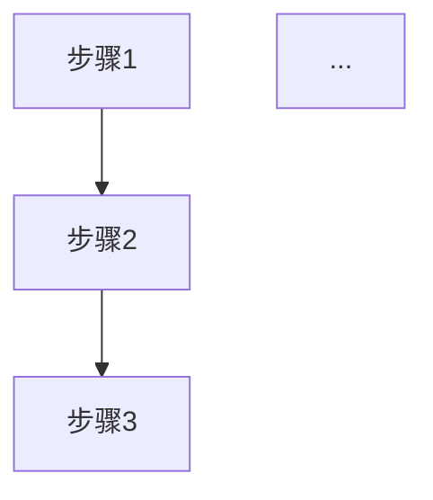
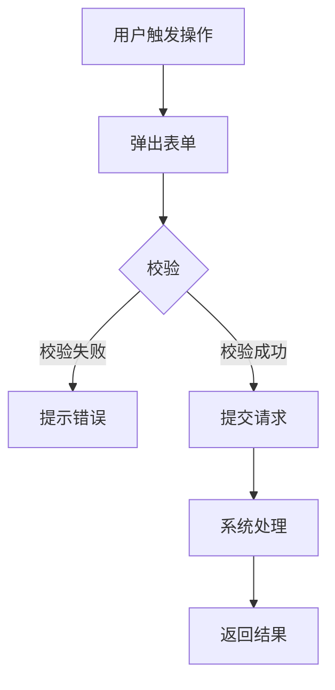
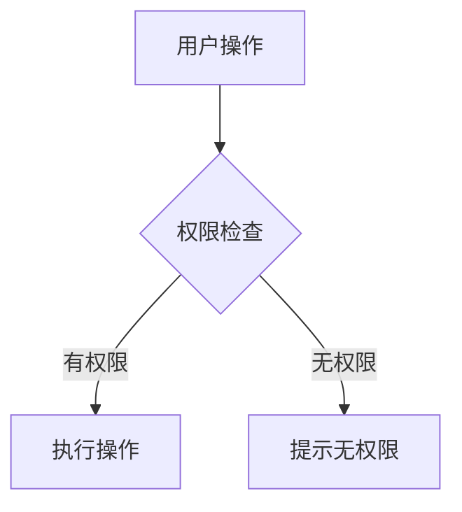
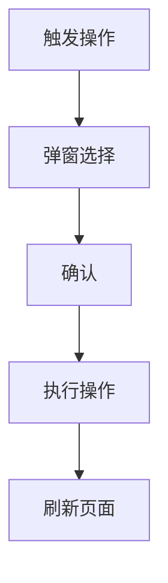
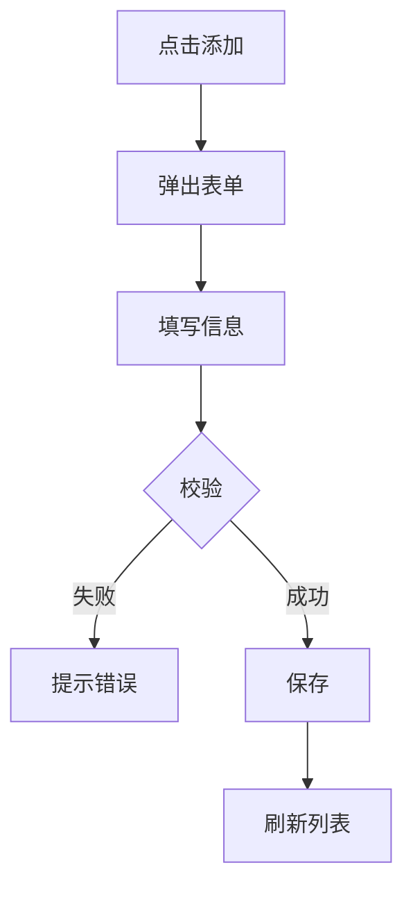

# \[产品名称] PRD分册-\[分册编号]-\[模块名称]需求规格说明书

| 文档编号 | \[PRD-XXX-FXXX-V1.0]   | 文档版本 | \[V1.0]  |
| :--- | :--------------------- | :--- | :------- |
| 所属总册 | \[总册文档编号及名称]           | 编写人  | \[姓名/部门] |
| 编写日期 | \[YYYY-MM-DD]          | 评审人  | \[待定]    |
| 评审日期 | \[待定]                  | 归档日期 | \[待定]    |
| 文档状态 | □ 草稿 □ 评审中 □ 已归档 □ 已废弃 | 模块编号 | \[MXXX]  |

***

## 修订记录

| 版本号  | 修订日期  | 修订人   | 修订内容 | 审核人   |
| :--- | :---- | :---- | :--- | :---- |
| V1.0 | \[日期] | \[姓名] | 首次发布 | \[待定] |

***

## 目录

1. [模块概述](#1-模块概述)
2. [业务流程](#2-业务流程)
3. [功能需求与页面设计](#3-功能需求与页面设计)
4. [异常处理](#4-异常处理)
5. [附录](#5-附录)

***

## 1. 模块概述

### 1.1 模块说明

\[一段话描述本模块的核心定位、解决的业务痛点、主要价值。建议分点列出核心业务价值]

**核心业务价值**：

- \[价值1]
- \[价值2]
- \[价值3]

### 1.2 用户角色与权限

#### 1.2.1 权限矩阵

| 操作     | \[角色A] | \[角色B] | \[角色C] | \[角色D] |
| :----- | :----: | :----: | :----: | :----: |
| \[操作1] |    ✓   |    ✓   |    ✓   |    ✓   |
| \[操作2] |    ✓   |    ✓   |    ✓   |    ✗   |
| \[操作3] |    ✓   |    ✓   |    ✗   |    ✗   |

> 注：角色定义及全局权限请参考总册 RBAC 矩阵。

#### 1.2.2 角色体系

**管理角色（管理权限）：**

| 角色     | 说明      | 来源      |
| :----- | :------ | :------ |
| \[角色A] | \[权限说明] | \[来源说明] |
| \[角色B] | \[权限说明] | \[来源说明] |

**业务角色（协作身份）：**

| 角色     | 职责说明    |
| :----- | :------ |
| \[角色C] | \[职责描述] |
| \[角色D] | \[职责描述] |

#### 1.2.3 权限说明

- \[权限规则1]
- \[权限规则2]
- \[权限规则3]

### 1.3 与其他模块的关系

| 关联模块   | 关联关系说明 | 数据流向（输入/输出/双向） |
| :----- | :----- | :------------- |
| \[模块1] | \[描述]  | 输入             |
| \[模块2] | \[描述]  | 输出             |

***

## 2. 业务流程

### 2.1 \[主要业务流程名称，如：页面加载流程]



### 2.2 \[其他关键流程，如：创建流程]



### 2.3 \[权限校验流程]



***

## 3. 功能需求与页面设计

### 3.1 功能清单

| 功能编号       | 功能名称  | 功能说明  | 优先级   |
| :--------- | :---- | :---- | :---- |
| \[FXXX-01] | \[名称] | \[简述] | 高/中/低 |
| \[FXXX-02] | \[名称] | \[简述] | 高/中/低 |
| \[FXXX-03] | \[名称] | \[简述] | 高/中/低 |

### 3.2 \[FXXX-01] \[功能名称]

#### 3.2.1 功能详情

| 需求编号 | \[FXXX-01]                                      |
| :--- | :---------------------------------------------- |
| 功能概述 | \[一句话概述功能核心价值]                                  |
| 业务描述 | \[详细描述业务场景、解决的问题、用户价值]                          |
| 需求描述 | 1. \[需求点1]2. \[需求点2]3. \[需求点3]                  |
| 行为者  | \[角色A、角色B、角色C]                                  |
| 前置条件 | \[如：用户已登录、数据已存在等]                               |
| 后置条件 | \[操作完成后的系统状态变化]                                 |
| 界面描述 | \[页面位置、布局说明、关键元素]                               |
| 业务规则 | 1. \[规则1]2. \[规则2]3. \[规则3]                     |
| 异常流程 | 1. \[异常场景1及处理]2. \[异常场景2及处理]                    |
| 验收标准 | **（可测试的检查点）**1. 给定\[条件]，当\[操作]，则\[预期结果]2. 给定... |

#### 3.2.2 页面设计

如原型图所示：

- **原型图链接**：\[插入原型图的链接]
  > 原型图统一放置在".../02PRD文档/页面原型"文件夹下

**页面类型**：\[列表页/表单页/详情页/卡片页/Dashboard页/其他]

##### 3.2.2.1 交互流程

> 描述页面的核心交互逻辑，适用于所有页面类型

```mermaid
flowchart TD
    A[进入页面] --> B[加载数据]
    B --> C[渲染页面]
    C --> D{用户操作}
    D -->|[操作1]| E[处理操作1]
    D -->|[操作2]| F[处理操作2]
    D -->|[操作3]| G[处理操作3]
```

**交互说明**：

| 操作     | 触发方式           | 预期行为                       | 备注      |
| :----- | :------------- | :------------------------- | :------ |
| \[操作1] | \[点击/悬停/输入/滚动] | \[描述具体行为，如：跳转页面、展示弹窗、更新状态] | \[特殊说明] |
| \[操作2] | \[点击/悬停/输入/滚动] | \[描述具体行为]                  | \[特殊说明] |

##### 3.2.2.2 列表页规则

> 当页面类型为列表页时，需填写此部分

**搜索配置**：

| 搜索字段   | 搜索类型                 | 搜索规则              |
| :----- | :------------------- | :---------------- |
| \[字段名] | \[文本输入框/下拉框单选/下拉框多选] | \[模糊匹配/精确匹配/正则匹配] |

**排序配置**：

| 排序字段   | 默认排序方向   | 说明              |
| :----- | :------- | :-------------- |
| \[字段名] | \[升序/降序] | \[如：点击表头可切换升降序] |

**展示字段**：

| 字段名称   | 控件类型                 | 对齐方式  | 异常提示           | 备注            |
| :----- | :------------------- | :---- | :------------- | :------------ |
| \[字段名] | \[表格列/图片缩略图/开关/文字按钮] | 左/右/中 | \[如：缺失显示默认占位图] | \[特殊说明，如支持格式] |

**列表页通用规则**：

- **分页规则**：默认每页显示 \[X] 条，支持 \[10/20/50/100] 条切换
- **默认排序**：按 \[字段名] \[升序/降序]
- **默认展开**：第 \[X] 页
- **行高**：\[XX]px

##### 3.2.2.3 表单页规则

> 当页面类型为表单页时，需填写此部分

**输入字段**：

| 字段名称   | 输入类型                                                | 默认值    | 必填      | 对齐方式  | 备注            |
| :----- | :-------------------------------------------------- | :----- | :------ | :---- | :------------ |
| \[字段名] | \[单行文本框/多行文本框/富文本编辑器/下拉框单选/下拉框多选/开关按钮/图片上传控件/日期选择器] | \[默认值] | ☑ 是 □ 否 | 左/右/中 | \[特殊说明，如格式要求] |

**校验规则**：

| 字段名称   | 校验规则                       | 错误提示        |
| :----- | :------------------------- | :---------- |
| \[字段名] | \[必填/长度限制/格式限制/大小限制/自定义规则] | \[具体错误提示文案] |

**表单页通用规则**：

- **布局方式**：\[上下布局/左右布局]
- **标签宽度**：\[XX]px
- **输入框宽度**：\[XX]px
- **字段间距**：\[XX]px
- **表单提交**：\[自动保存/手动提交]

##### 3.2.2.4 详情页规则

> 当页面类型为详情页时，需填写此部分

**展示字段**：

| 字段名称   | 数据类型                       | 数据来源                | 展示规则               | 对齐方式  | 备注      |
| :----- | :------------------------- | :------------------ | :----------------- | :---- | :------ |
| \[字段名] | \[string/number/date/enum] | \[后端接口字段名/枚举值/计算字段] | \[格式化规则、空值展示、枚举映射] | 左/右/中 | \[特殊说明] |

**详情页通用规则**：

- **布局方式**：\[两列布局/卡片布局/时间线布局]
- **字段分组**：\[如有分组需说明各组包含哪些字段]

##### 3.2.2.5 卡片页规则

> 当页面类型为卡片页时，需填写此部分

**卡片结构**：

| 区域名称   | 内容说明      | 交互行为             | 备注      |
| :----- | :-------- | :--------------- | :------ |
| \[区域1] | \[描述区域内容] | \[如：点击跳转、悬停展示详情] | \[特殊说明] |
| \[区域2] | \[描述区域内容] | \[描述交互行为]        | \[特殊说明] |

**卡片布局示意图**：

```
┌──────────────────────────┐
│  [卡片标题]               │
│                          │
│  ┌────────────────────┐  │
│  │    图片区域         │  │
│  └────────────────────┘  │
│                          │
│  [描述文字]               │
│                          │
│  ┌──────┐  ┌──────┐      │
│  │按钮1 │  │按钮2 │      │
│  └──────┘  └──────┘      │
└──────────────────────────┘
```

**卡片页通用规则**：

- **卡片数量**：\[单行显示数量/分页显示]
- **卡片尺寸**：\[宽度×高度]
- **布局方式**：\[网格布局/列表布局]

##### 3.2.2.6 Dashboard页规则

> 当页面类型为Dashboard页时，需填写此部分

**模块划分**：

| 模块名称   | 位置             | 功能说明      | 数据刷新频率        |
| :----- | :------------- | :-------- | :------------ |
| \[模块1] | \[左上/右上/左下/右下] | \[描述模块功能] | \[实时/分钟/小时/天] |
| \[模块2] | \[位置]          | \[描述模块功能] | \[刷新频率]       |

**Dashboard布局示意图**：

```
┌─────────────────────────────────────┐
│  ┌──────────┐  ┌─────────────────┐  │
│  │  模块1   │  │      模块2       │  │
│  │ (卡片)   │  │   (统计图表)     │  │
│  └──────────┘  └─────────────────┘  │
│                                      │
│  ┌─────────────────────────────┐    │
│  │          模块3              │    │
│  │     (数据列表/表格)          │    │
│  └─────────────────────────────┘    │
│                                      │
│  ┌──────────┐  ┌──────────┐  ┌─────┐│
│  │  模块4   │  │  模块5   │  │模块6││
│  │ (指标)   │  │ (指标)   │  │(指标)││
│  └──────────┘  └──────────┘  └─────┘│
└─────────────────────────────────────┘
```

**Dashboard通用规则**：

- **布局网格**：\[几列布局]
- **数据刷新**：\[自动刷新/手动刷新]
- **默认时间范围**：\[今日/本周/本月/自定义]

##### 3.2.2.7 子功能模块（可选）

> 当功能包含多个子功能时，可在此处详细描述

###### 3.2.2.7.1 子功能1（如：管理员团队）

**功能描述**：\[描述子功能的核心作用]

**规则**：

- \[规则1]
- \[规则2]
- \[规则3]

**交互流程**：



###### 3.2.2.7.2 子功能2（如：成员列表）

**功能描述**：\[描述子功能的核心作用]

**展示内容**：

| 字段名称   | 显示格式    | 备注      |
| :----- | :------ | :------ |
| \[字段名] | \[格式说明] | \[特殊说明] |

###### 3.2.2.7.3 子功能3（如：添加成员）

**功能描述**：\[描述子功能的核心作用]

**表单字段**：

| 字段名称   | 输入类型    | 必填      | 说明      |
| :----- | :------ | :------ | :------ |
| \[字段名] | \[输入类型] | ☑ 是 □ 否 | \[字段说明] |

**交互流程**：



> 有多个功能需按上面3.2章节的结构进行输出，每个功能单独占用一个章节（如：3.3、3.4等）。

***

## 4. 异常处理

### 4.1 异常场景清单

| 异常编号 | 异常场景   | 异常描述  | 处理方式             |
| :--- | :----- | :---- | :--------------- |
| E001 | \[场景名] | \[描述] | \[前端展示什么，后端返回什么] |
| E002 | \[场景名] | \[描述] | \[前端展示什么，后端返回什么] |

### 4.2 边界场景处理

| 场景     | 预期行为      |
| :----- | :-------- |
| \[场景1] | \[预期行为描述] |
| \[场景2] | \[预期行为描述] |

### 4.3 错误码说明

| 错误码        | 错误信息  | 说明      | 解决方案    |
| :--------- | :---- | :------ | :------ |
| \[MOD-XXX] | \[文案] | \[业务解释] | \[用户引导] |

***

## 5. 附录

### 5.1 枚举值引用清单

| 本模块使用场景 | 枚举编号        | 枚举名称   | 说明    |
| :------ | :---------- | :----- | :---- |
| \[场景1]  | \[ENUM-XXX] | \[枚举名] | \[可选] |
| \[场景2]  | \[ENUM-YYY] | \[枚举名] | \[可选] |

### 5.2 名词解释

| 名词     | 说明    |
| :----- | :---- |
| \[术语1] | \[定义] |
| \[术语2] | \[定义] |

### 5.3 相关参考文档

| 文档名称         | 文档路径    | 备注      |
| :----------- | :------ | :------ |
| PRD总册-\[产品名] | \[相对路径] | 所属总册    |
| \[其他分册]      | \[路径]   | \[依赖说明] |

### 5.4 评审意见与修改记录

| 评审轮次 | 评审问题  | 修改方案  | 修改人   | 修改日期  |
| :--- | :---- | :---- | :---- | :---- |
| \[1] | \[问题] | \[方案] | \[姓名] | \[日期] |

***

## V2版本新增与优化说明

### 版本演进历程

| 版本 | 核心改进                |
| :- | :------------------ |
| V2 | 功能详情列表添加验证字段        |
| V2 | 基础模板结构              |
| V2 | 列表页/表单页分离，移除字段编号    |
| V2 | 整合业务深度与流程细节，增强子功能分层 |

### V2核心优化

| 优化项        | V5版本       | V6版本               | 优化价值      |
| :--------- | :--------- | :----------------- | :-------- |
| **角色权限**   | 单一表格       | 权限矩阵+角色体系+权限说明三段式  | 权限逻辑更完整   |
| **业务流程**   | 通用流程图      | 分场景流程图（加载/创建/权限校验） | 流程可视化更清晰  |
| **交互流程**   | 仅业务流程章节    | 每个功能模块都有交互流程章节     | 交互细节更明确   |
| **页面类型支持** | 列表/表单/详情页  | 新增卡片页、Dashboard页   | 覆盖更多页面类型  |
| **子功能分层**  | 无          | 可选的子功能模块章节         | 复杂功能描述更清晰 |
| **页面布局**   | 文字描述       | ASCII布局示意图         | 页面结构更直观   |
| **边界场景**   | 无          | 独立章节说明边界场景         | 异常覆盖更全面   |
| **格式一致性**  | 各功能模块格式不一致 | 所有功能模块采用统一格式       | 模板更规范     |

### 使用指南

**1. 文档结构填写顺序：**

```
模块概述 → 业务流程 → 功能需求（按功能清单顺序）→ 异常处理 → 附录
```

**2. 单个功能模块编写顺序：**

```
功能详情表 → 页面设计 → 页面类型 → 交互流程 → 页面规则（列表/表单/详情/卡片/Dashboard）→ 子功能模块（可选）
```

**3. 复杂功能处理：**

```
主功能 → 子功能1 → 子功能2 → ...
每个子功能包含：功能描述 + 规则 + 交互流程
```

**4. 验收标准编写规范：**

```
格式：给定[前置条件]，当[执行操作]，则[预期结果]
示例：给定用户为普通成员，当点击删除按钮，则按钮置灰并提示"无权限"
```

### 最佳实践建议

1. **权限描述**：使用权限矩阵快速查看各角色权限，用权限说明补充特殊规则
2. **流程可视化**：关键业务流程使用Mermaid流程图，复杂页面用ASCII示意图
3. **校验规则**：务必填写错误提示文案，便于前端直接使用
4. **验收标准**：每条验收标准都应是可测试的，避免模糊表述
5. **版本控制**：修订记录需详细记录每个版本的变更内容

文件位置：/02PRD文档/[PRD文档功能模块分册编写规范-V2.md](file:///c:/Users/zdy/Documents/trae_projects/enterprise-digital-card-V2/2-PRD文档功能模块分册编写规范-V6.md)
