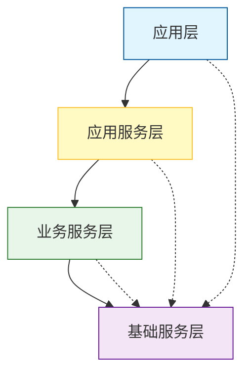

## 应用架构设计规范

### 1. 概述

#### 1.1 规范定位

应用架构设计规范是指导应用系统进行**分层架构、微服务拆分、组件管理及架构图绘制**的标准操作指南。它确保系统具备可维护性、可扩展性、可复用性，是架构评审的核心依据。

#### 1.2 适用角色

- 架构师（主责）
- 技术负责人
- 研发工程师
- 产品经理（参与评审）

#### 1.3 输入

- 业务架构文档（业务域、业务能力、业务流程）
- 业务对象清单（来自第一阶段的业务模型设计）
- 公司技术架构基线库
- 可复用组件清单

#### 1.4 输出

- 应用架构图（整体+四侧分层视图）
- 微服务拆分方案（含服务清单、拆分理由）
- 应用组件登记表（新增组件入库）
- 服务依赖关系图
- 架构评审记录

### 2. 核心原则

| 原则               | 说明                                                         |
| :----------------- | :----------------------------------------------------------- |
| **分层清晰**       | 严格遵循应用层、应用服务层、业务服务层、基础服务层的职责划分，不允许跨层调用 |
| **高内聚低耦合**   | 同一服务内功能高度相关，服务间通过API/事件交互，禁止直接访问其他服务数据库 |
| **可复用性**       | 通用能力沉淀为应用组件，纳入公司组件库，新项目优先查询复用   |
| **业务与技术分离** | 业务服务层实现核心业务规则，与技术实现无关；基础服务层仅提供技术支撑 |
| **独立可部署**     | 每个微服务拥有独立代码库、数据库和部署流水线                 |
| **团队边界对齐**   | 每个核心服务对应一个独立团队（或虚拟团队），通用服务由平台团队维护 |

### 3. 应用分层规范

#### 3.1 分层定义与职责

| 层级           | 定义                           | 职责                                       | 禁止事项                       | 示例                         |
| :------------- | :----------------------------- | :----------------------------------------- | :----------------------------- | :--------------------------- |
| **应用层**     | 直接面向用户的交互界面层       | 请求接收、协议转换、结果渲染；界面配置功能 | 不包含任何业务逻辑处理         | 登录页、角色管理、公告查看   |
| **应用服务层** | 协调多个领域服务完成端到端流程 | 服务编排、事务管理、聚合多服务             | 不实现具体业务规则             | 统一管理后台服务、工作台服务 |
| **业务服务层** | 实现核心业务规则的逻辑层       | 领域模型维护、业务验证、业务状态管理       | 不处理技术细节（如缓存、消息） | 用户中心、订单服务、客户管理 |
| **基础服务层** | 提供技术实现和通用能力的支撑层 | 技术工具、中间件封装、通用能力             | 不包含任何业务规则             | 文件服务、消息推送、短信网关 |

#### 3.2 分层调用关系

> 实线表示必须通过，虚线表示允许直接调用（但原则上应避免）

#### 3.3 跨层调用约束

- 应用层只能调用应用服务层或基础服务层（如工具类），禁止直接调用业务服务层。
- 应用服务层可调用业务服务层和基础服务层。
- 业务服务层只能调用基础服务层和自身领域内的其他服务，禁止跨业务服务层直接调用（应通过应用服务层编排）。

### 4. 微服务设计规范

#### 4.1 基于DDD的领域划分

**步骤**：业务需求 → 领域识别（子领域划分） → 限界上下文定义 → 领域模型设计 → 服务拆分

##### 4.1.1 子领域类型

| 类型         | 说明                                   | 拆分策略                                   | 负责团队        |
| :----------- | :------------------------------------- | :----------------------------------------- | :-------------- |
| **核心子域** | 决定系统核心竞争力，包含独特业务规则   | 独立微服务，高可用保障                     | 职能业务团队    |
| **通用子域** | 跨领域通用的标准化功能（如认证、日志） | 复用公司已有基础服务，或独立建设为通用组件 | 平台/中间件团队 |
| **支撑子域** | 非核心但必要的功能（如数据报表）       | 可独立微服务或合并到相近服务               | 业务团队        |

##### 4.1.2 限界上下文映射模式

| 模式        | 适用场景           | 实现方式              |
| :---------- | :----------------- | :-------------------- |
| 完全独立    | 上下文无任何依赖   | 各自独立开发部署      |
| 共享内核    | 共用部分模型       | 共享代码库或公共Jar包 |
| 客户-供应商 | 一方依赖另一方服务 | API调用，需定义防腐层 |
| 合作        | 紧密协作           | 事件驱动或双工通信    |
| 大泥球      | 避免出现，需重构   | 逐步解耦              |

#### 4.2 微服务拆分原则

##### 4.2.1 垂直拆分（业务驱动）

- **按业务域拆分**：每个服务对应一个完整的业务能力（如订单、库存、用户）。
- **按业务对象拆分**：每个核心业务对象（有独立生命周期）一个服务（如客户服务、商品服务）。
- **数据独立性**：每个服务拥有独立数据库，不允许其他服务直接访问。

##### 4.2.2 水平拆分（应用驱动）

- **按四侧拆分**：消费端（C端）、服务端（B端员工）、运营端（管理员）、监管端（政府/监管）。
- **按用户角色拆分**：不同角色使用不同应用层服务，避免逻辑混杂。

##### 4.2.3 基于稳定性拆分

- **稳定服务**：基础数据、主数据等变化频率低，可沉淀为基础服务。
- **易变服务**：营销活动、促销规则等变化频繁，独立微服务，便于快速迭代。

##### 4.2.4 基于核心/非核心拆分

- **核心业务服务**：交易链路、支付等，要求高可用，可部署多副本、独立资源。
- **非核心服务**：日志、报表等，可降级，使用较低资源配置。

#### 4.3 服务拆分决策模板

| 微服务名称 | 所属限界上下文 | 拆分理由                                           | 技术实现建议                      |
| :--------- | :------------- | :------------------------------------------------- | :-------------------------------- |
| 用户中心   | 用户上下文     | ① 核心子域，全系统依赖；② 数据独立，被多个业务复用 | Redis缓存用户信息，读写分离       |
| 订单服务   | 订单上下文     | ① 核心业务流程主链路；② 事务性强，需独立数据库     | 使用分布式事务（Seata）或事件驱动 |

#### 4.4 可复用服务管理

##### 4.4.1 服务复用流程

1. 设计前查询【集团可复用服务清单】。
2. 若存在匹配服务，优先复用，并填写复用映射表。
3. 若无匹配服务，且该能力为通用能力，申请新增可复用组件。
4. 新增组件提交产品技术委员会评审，评审通过后入库。

##### 4.4.2 可复用服务清单（示例）

| 服务名称 | 类型（业务/基础） | 所属层级   | 提供方     | 使用方       |
| :------- | :---------------- | :--------- | :--------- | :----------- |
| 用户认证 | 基础              | 基础服务层 | 平台组     | 所有业务系统 |
| 文件服务 | 基础              | 基础服务层 | 公共组件组 | 所有业务系统 |
| 短信网关 | 基础              | 基础服务层 | 公共组件组 | 所有业务系统 |

### 5. 应用组件规范

#### 5.1 组件入库材料清单

| 层级           | 必填材料                                                     |
| :------------- | :----------------------------------------------------------- |
| **应用层**     | 组件信息（名称、分类、描述、入口）、负责人信息、调用服务清单、服务清单（英文名、类型、版本、代码仓库）、业务说明文档 |
| **应用服务层** | 组件信息、调用服务清单、服务清单、负责人信息、接口文档、快速入门、实践案例、依赖清单、详细设计 |
| **业务服务层** | 组件信息、调用服务清单、服务清单、业务域信息、业务对象梳理、数据标准入库证明、业务规则配置说明、部署文档 |
| **基础服务层** | 组件信息、服务清单、负责人信息、接口文档、快速入门、资源需求、部署文档 |

#### 5.2 组件登记表示例

| 字段       | 示例                                           |
| :--------- | :--------------------------------------------- |
| 组件名称   | 文件服务                                       |
| 组件分类   | 基础服务                                       |
| 组件描述   | 提供文件上传、下载、预览、统计、管理能力       |
| 入口       | /api/file/upload                               |
| 调用服务   | 无（自身为基础服务）                           |
| 服务英文名 | file-service                                   |
| 当前版本   | v2.1.0                                         |
| 代码仓库   | git@gitlab.company.com/common/file-service.git |
| 负责人     | 张三（基础平台组）                             |
| 登记日期   | 2025-01-01                                     |

### 6. 架构图规范

#### 6.1 整体架构图

应包含四侧（消费端、服务端、运营端、监管端）及平台整体，标注各服务所属层级及调用关系。

#### 6.2 分层视图

分别绘制消费端、服务端、运营端的应用分层图，每张图需包含：

- 应用层（前端组件、H5、小程序等）
- 应用服务层（聚合服务、BFF）
- 业务服务层（核心微服务）
- 基础服务层（中间件、通用服务）

#### 6.3 图例要求

- 不同层级使用不同颜色或形状区分。
- 实线表示同步调用，虚线表示异步消息/事件。
- 注明外部依赖系统。

### 7. 架构评审要点

| 评审项           | 检查内容                                                     |
| :--------------- | :----------------------------------------------------------- |
| 分层合规性       | 是否存在跨层调用？是否按职责划分？                           |
| 微服务拆分合理性 | 是否过度拆分？是否形成分布式单体？是否遵循高内聚低耦合？     |
| 可复用性         | 是否查询并复用了已有组件？新增组件是否符合入库条件？         |
| 数据边界         | 每个服务是否有独立数据库？是否存在跨服务数据库访问？         |
| 依赖管理         | 依赖关系是否清晰？是否存在循环依赖？外部依赖是否有降级方案？ |